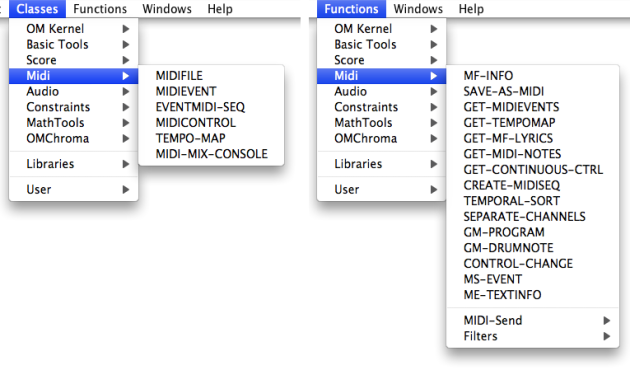

Navigation générale : 

  - [Guide](OM-Documentation.md)
  - [Plan](OM-Documentation_1.md)
  - [Glossaire](OM-Documentation_2.md)

OpenMusic
DocumentationHiérarchie
de section : [OM 6.6 User
Manual](OM-User-Manual.md) \>
[MIDI](MIDI.md) \>
Introduction

Navigation : [page
précédente](MIDI.md "page précédente(MIDI)")
| [page
suivante](MIDI-Concepts.md "page suivante(Important MIDI Concepts)")

# Introduction to MIDI in OpenMusic

## The MIDI Protocol

MIDI stands for Musical Instrument Digital Interface. It is a music
industry standard **communication protocol** that lets MIDI instruments,
sequencers, computers and other electronic equipment to synchronize and
communicate with each other in order to play and record music. MIDI
**does not transmit any audio signal**: It can be considered as a set of
musical **command messages** (note on/off, volume or other effect
control, clock signals, etc.), which electronic instruments send to
control each other.

MIDI data are commonly stored and interchanged in files following the
MIDI Standard Format.

About MIDI

[http://www.midi.org/aboutmidi/](http://www.midi.org/aboutmidi/ "http://www.midi.org/aboutmidi/ (nouvelle fenêtre)")

## MIDI in OpenMusic

The MidiShare Library

In OpenMusic, musical objects are played or recorded with MIDI using the
**MidiShare library**. In a basic configuration, MIDI messages are sent
by OpenMusic via MidiShare to the default built-in MIDI device of the
computer. However, other MIDI instruments, such as synthesizers,
expanders, samplers can be connected to the application – see
[MIDI ports setup](MIDI-Ports.md)).

About MIDIShare

[http://midishare.sourceforge.net/](http://midishare.sourceforge.net/ "http://midishare.sourceforge.net/ (nouvelle fenêtre)")

The OpenMusic MIDI Tools

The MIDI classes and functions allow the control of the communication
between OpenMusic and MIDI instruments or applications from OM patches.

It includes MIDI data analysis, filter, conversion tools.

All MIDI items are accessed via the `Classes - Functions / MIDI` menu.

Références : 

Plan :

  - [OpenMusic Documentation](OM-Documentation.md)
  - [OM 6.6 User Manual](OM-User-Manual.md)
      - [Introduction](00-Sommaire.md)
      - [System Configuration and
        Installation](Installation.md)
      - [Going Through an OM Session](Goingthrough.md)
      - [The OM Environment](Environment.md)
      - [Visual Programming I](BasicVisualProgramming.md)
      - [Visual Programming
        II](AdvancedVisualProgramming.md)
      - [Basic Tools](BasicObjects.md)
      - [Score Objects](ScoreObjects.md)
      - [Maquettes](Maquettes.md)
      - [Sheet](Sheet.md)
      - [MIDI](MIDI.md)
          - Introduction
          - [Important MIDI Concepts](MIDI-Concepts.md)
          - [Rendering and Playback](MIDI-Playback.md)
          - [MIDI Objects](MIDI-Objects.md)
      - [Audio](Audio.md)
      - [SDIF](SDIF.md)
      - [Lisp Programming](Lisp.md)
      - [Errors and Problems](errors.md)
  - [OpenMusic QuickStart](QuickStart-Chapters.md)

Navigation : [page
précédente](MIDI.md "page précédente(MIDI)")
| [page
suivante](MIDI-Concepts.md "page suivante(Important MIDI Concepts)")

[A propos...](OM-Documentation_3.md)(c) Ircam - Centre
Pompidou

