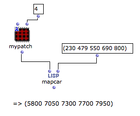

Navigation générale : 

  - [Guide](OM-Documentation.md)
  - [Plan](OM-Documentation_1.md)
  - [Glossaire](OM-Documentation_2.md)

OpenMusic
DocumentationHiérarchie
de section : [OM 6.6 User
Manual](OM-User-Manual.md) \>
[Visual Programming
II](AdvancedVisualProgramming.md) \>
[Higher-Order
Functions](HighOrder.md) \>
Lambda
Patches

Navigation : [page
précédente](Mapcar.md "page précédente(Mapcar - Iterations)")
| [page
suivante](LambdaTest.md "page suivante(Test Functions)")

# Lambda Mode Examples: Lambda Patches

Predefined functions on "lambda" mode may not always be adapted for
higher-order processes. [Patch boxes](AbsBoxes.md) can also
be set on [ "lambda" evaluation mode](LambdaMode.md) : they
can represent more flexible functional arguments.

**Any patch** designed to process data can be used as a lambda function
and perform its process in a higher-order function.

Example

<table>
<colgroup>
<col style="width: 50%" />
<col style="width: 50%" />
</colgroup>
<tbody>
<tr class="odd">
<td>

</td>
<td>

This patch converts a frequency (Hz) in a midicent value and rounds it to the closest fraction of a tone expressed in midicents. Note that a tone represents 200 midicents.

<ul>
<li>
The frequency value is assigned to the first input.
</li>
<li>
The fraction is defined in the second input.
</li>
</ul>

In this case, 479Hz = 7048. This value is rounded to the closest 1/4 tone, that is, 200/4 = 50.

</td>
</tr>
</tbody>
</table>

<table>
<colgroup>
<col style="width: 50%" />
<col style="width: 50%" />
</colgroup>
<tbody>
<tr class="odd">
<td>

The same patch box can be used on lambda mode with mapcar in order to process a list of input values. Mapcar applies a function to the items of one or more lists, successively.

</td>
<td>

</td>
</tr>
</tbody>
</table>

The mapcar function

  - [Lambda Mode Examples: Mapcar - Iterations](Mapcar.md)

Références : 

Plan :

  - [OpenMusic Documentation](OM-Documentation.md)
  - [OM 6.6 User Manual](OM-User-Manual.md)
      - [Introduction](00-Sommaire.md)
      - [System Configuration and
        Installation](Installation.md)
      - [Going Through an OM Session](Goingthrough.md)
      - [The OM Environment](Environment.md)
      - [Visual Programming I](BasicVisualProgramming.md)
      - [Visual Programming
        II](AdvancedVisualProgramming.md)
          - [Abstraction](Abstraction.md)
          - [Evaluation Modes](EvalModes.md)
          - [Higher-Order Functions](HighOrder.md)
              - [Using Functions as Data](Funcall.md)
              - [Mapcar - Iterations](Mapcar.md)
              - Lambda
                Patches
              - [Test Functions](LambdaTest.md)
          - [Control Structures](Control.md)
          - [Iterations: OMLoop](OMLoop.md)
          - [Instances](Instances.md)
          - [Interface Boxes](InterfaceBoxes.md)
          - [Files](Files.md)
      - [Basic Tools](BasicObjects.md)
      - [Score Objects](ScoreObjects.md)
      - [Maquettes](Maquettes.md)
      - [Sheet](Sheet.md)
      - [MIDI](MIDI.md)
      - [Audio](Audio.md)
      - [SDIF](SDIF.md)
      - [Lisp Programming](Lisp.md)
      - [Errors and Problems](errors.md)
  - [OpenMusic QuickStart](QuickStart-Chapters.md)

Navigation : [page
précédente](Mapcar.md "page précédente(Mapcar - Iterations)")
| [page
suivante](LambdaTest.md "page suivante(Test Functions)")

[A propos...](OM-Documentation_3.md)(c) Ircam - Centre
Pompidou

