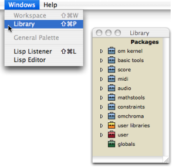

Navigation générale : 

  - [Guide](OM-Documentation.md)
  - [Plan](OM-Documentation_1.md)
  - [Glossaire](OM-Documentation_2.md)

OpenMusic
DocumentationHiérarchie
de section : [OM 6.6 User
Manual](OM-User-Manual.md) \>
[The OM
Environment](Environment.md) \>
Library

Navigation : [page
précédente](WS-ImportExport.md "page précédente(Import / Export)")
| [page
suivante](Packages.md "page suivante(Packages)")

# Library

<table>
<colgroup>
<col style="width: 50%" />
<col style="width: 50%" />
</colgroup>
<tbody>
<tr class="odd">
<td>

The Library window encloses the OM programming tools, which are organized in <strong>packages</strong> and <strong>sub packages</strong> . They can be used in various OM documents. These tools are classes<a href="#kFootBsktc1871">[1]</a>, functions<a href="#kFootBsktc1872">[2]</a> and methods<a href="#kFootBsktc1873">[3]</a>, among which a number can be created by the user.

To open the Library window, use the main menu or shortcut :

<ul>
<li> select <code class="menuPath_tl">Windows / Library</code> </li>
<li> press <code class="keyboard_tl">SHIFT</code>+ <code class="keyboard_tl">Cmd</code> + <code class="keyboard_tl">p</code>.</li>
</ul>

</td>
<td>

</td>
</tr>
</tbody>
</table>

Références : 

1.  
    
    

    
    

    
    Class
    
    

    
    

    
    

    
    

    
    A category of objects sharing common properties – characteristics
    and behaviour. A class specifies the internal structure and
    behaviour of an object. In OM, it is represented in a patch by a
    factory box that can produce an instance of a class.
    
    See also : Object, Instance
    
    

    
    

    
    

    
    

2.  
    
    

    
    

    
    Function
    
    

    
    

    
    

    
    

    
    A  portion of code within a larger program, which performs a
    specific task. Operates upon 0 or more parameters and returns a
    value.
    
    

    
    

    
    

    
    

3.  
    
    

    
    

    
    Method
    
    

    
    

    
    

    
    

    
    An elementary function or part of a generic function defining rules
    for its behaviour depending on a type of argument. Defining a
    generic function amounts to defining at least one method.
    
    For instance, the OM+ function is made of four methods : 1. number +
    list / 2. list + number / 3. number + number / 4. list + list
    
    

    
    

    
    

    
    

Plan :

  - [OpenMusic Documentation](OM-Documentation.md)
  - [OM 6.6 User Manual](OM-User-Manual.md)
      - [Introduction](00-Sommaire.md)
      - [System Configuration and
        Installation](Installation.md)
      - [Going Through an OM Session](Goingthrough.md)
      - [The OM Environment](Environment.md)
          - [Environment Windows](MainWindows.md)
          - [Preferences](Preferences.md)
          - [Workspace](Workspace.md)
          - Library
              - [Packages](Packages.md)
              - [Extra Libraries](UserLibraries.md)
          - [Tutorials](Tutorials.md)
          - [Resources](resources.md)
      - [Visual Programming I](BasicVisualProgramming.md)
      - [Visual Programming
        II](AdvancedVisualProgramming.md)
      - [Basic Tools](BasicObjects.md)
      - [Score Objects](ScoreObjects.md)
      - [Maquettes](Maquettes.md)
      - [Sheet](Sheet.md)
      - [MIDI](MIDI.md)
      - [Audio](Audio.md)
      - [SDIF](SDIF.md)
      - [Lisp Programming](Lisp.md)
      - [Errors and Problems](errors.md)
  - [OpenMusic QuickStart](QuickStart-Chapters.md)

Navigation : [page
précédente](WS-ImportExport.md "page précédente(Import / Export)")
| [page
suivante](Packages.md "page suivante(Packages)")

[A propos...](OM-Documentation_3.md)(c) Ircam - Centre
Pompidou

