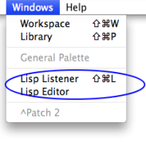

Navigation générale : 

  - [Guide](OM-Documentation.md)
  - [Plan](OM-Documentation_1.md)
  - [Glossaire](OM-Documentation_2.md)

OpenMusic
DocumentationHiérarchie
de section : [OM 6.6 User
Manual](OM-User-Manual.md) \>
Lisp
Programming

Navigation : [page
précédente](SDIF-Write.md "page précédente(Writing SDIF Files)")
| [page
suivante](LispIntro.md "page suivante(Introduction to Lisp)")

# Lisp Programming

OpenMusic is a visual programming language entirely built on top of the
[Common
Lisp](http:/www.cs.cmu.edu/Groups/AI/html/cltl/cltl2.md "http://www.cs.cmu.edu/Groups/AI/html/cltl/cltl2.html (nouvelle fenêtre)")
programming language. Hence, the visual environment can be linked with
this underlying language in many different ways.

Programming in Lisp is sometimes a convenient and efficient way to work
with OM, where all Lisp-programmed tools and modules can be accessed and
used.

<table>
<colgroup>
<col style="width: 50%" />
<col style="width: 50%" />
</colgroup>
<tbody>
<tr class="odd">
<td>

</td>
<td>

OM has two main interfaces to Lisp : The Listener<a href="#kFootBsktc1817">[1]</a> window and the Lisp editor. These two windows are accessible from the <code class="menuPath_tl">Windows</code> menu.

</td>
</tr>
</tbody>
</table>

Références : 

1.  
    
    

    
    

    
    Lisp Listener
    
    

    
    

    
    

    
    

    
    A Lisp communication interface displaying results of computations,
    warnings or error messages, and where Lisp expressions – programs –
    can be evaluated.
    
    

    
    

    
    

    
    

Plan :

  - [OpenMusic Documentation](OM-Documentation.md)
  - [OM 6.6 User Manual](OM-User-Manual.md)
      - [Introduction](00-Sommaire.md)
      - [System Configuration and
        Installation](Installation.md)
      - [Going Through an OM Session](Goingthrough.md)
      - [The OM Environment](Environment.md)
      - [Visual Programming I](BasicVisualProgramming.md)
      - [Visual Programming
        II](AdvancedVisualProgramming.md)
      - [Basic Tools](BasicObjects.md)
      - [Score Objects](ScoreObjects.md)
      - [Maquettes](Maquettes.md)
      - [Sheet](Sheet.md)
      - [MIDI](MIDI.md)
      - [Audio](Audio.md)
      - [SDIF](SDIF.md)
      - Lisp
        Programming
          - [Introduction to Lisp](LispIntro.md)
          - [The Lisp Editor](LispEditor.md)
          - [The Listener](LispListener.md)
          - [Lisp Code in OM](LispInOM.md)
          - [Lisp Function Boxes](LispFunctions.md)
          - [Lisp Tools](LowLevel.md)
          - [Writing an OM Library](LispUserLib.md)
          - [Writing Code for OM](LispForOM.md)
      - [Errors and Problems](errors.md)
  - [OpenMusic QuickStart](QuickStart-Chapters.md)

Navigation : [page
précédente](SDIF-Write.md "page précédente(Writing SDIF Files)")
| [page
suivante](LispIntro.md "page suivante(Introduction to Lisp)")

[A propos...](OM-Documentation_3.md)(c) Ircam - Centre
Pompidou

