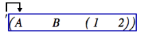

Navigation générale : 

  - [Guide](OM-Documentation.md)
  - [Plan](OM-Documentation_1.md)
  - [Glossaire](OM-Documentation_2.md)

OpenMusic
DocumentationHiérarchie
de section : [OM 6.6 User
Manual](OM-User-Manual.md) \>
[Lisp Programming](Lisp.md) \>
Introduction to
Lisp

Navigation : [page
précédente](Lisp.md "page précédente(Lisp Programming)")
| [page
suivante](LispEditor.md "page suivante(The Lisp Editor)")

# Introduction to Lisp

This section is **not** a Common Lisp tutorial, but just expounds a few
important notions.

## Origins

A Bit of History

Lisp is a functional language influenced by the lambda calculus that was
specified in 1958. It is one of the oldest high-level programming
languages.

[Common
Lisp](http:/www.cs.cmu.edu/Groups/AI/html/cltl/cltl2.md "http://www.cs.cmu.edu/Groups/AI/html/cltl/cltl2.html (nouvelle fenêtre)")
is a Lisp dialect, among others such as Scheme .

An Interpreted Language

Lisp is an **"interpreted" language** : it works on top of a low-level
process, or underlying **interpreter**, which evaluates Lisp code.
Functions and data are defined and evaluated by this process, which
incrementally enriches the running environment with new functionalities.
Each time a new function, variable or class is defined, it becomes part
of the environment. This characteristics makes Lisp programming very
flexible and dynamic, since code can still be interpreted while Lisp
programs are running.

Links of Interest

For a more complete overview of the language, the reader should consult
specialized books or references. Here are some links of interest :

  -  [Common Lisp the Language, 2nd
    edition](http:/www.cs.cmu.edu/Groups/AI/html/cltl/cltl2.md "http://www.cs.cmu.edu/Groups/AI/html/cltl/cltl2.html (nouvelle fenêtre)")
     : a reference book on the common Lisp standard by Guy L.
    Steele
  -  [Lisp as a second language, composing programs and
    music](http:/recherche.ircam.fr/equipes/repmus/LispSecondLanguage/index.md "http://recherche.ircam.fr/equipes/repmus/LispSecondLanguage/index.html (nouvelle fenêtre)")
     : a music-oriented tutorial by Peter Desain and Henkjan
    Honing

## S-expressions

S-expression stands for "symbolic expression". S-expressions are
**list-based representations**. They are typically represented in text
by parenthesized, whitespace-separated sequences of character strings.

Prefix Notation

Lisp expressions are written as lists with a **prefix notation**. The
first element in the list is an **operator or a function**, while the
remaining elements are treated as data : they are the
arguments[\[1\]](#kFootBsktc2051)
of this operator.

When an expression is
evaluated[\[2\]](#kFootBsktc2030),
the first element is applied to the arguments. For instance :

  - An addition such as 1 + 2 + 3 is expressed **(+ 1 2 3)** , which
    evaluates to : **6**. The + function is applied to 1 2 and 3.

  - In the **(list 1 2 3)** expression, the list operator creates a list
    with the other elements in the expression, which evaluates to : **(1
    2 3)**

Quoted Expressions : QUOTE Operator

The **QUOTE** operator **" ' "** allows to get a list from a lisp
expression without evaluating it. This operator must be put **before the
targetted list first parenthesis**, and applies to all the elements
located between the pair of parenthesis.

For instance :

When the following expression : '(+ 5 6) is evaluated, (+ 5 6) is
returned. The list is merely quoted.When the following expression (+ 5
6) is evaluated, 11 is returned. The list is evaluated, because there is
no quote.

Lambda Expressions : the LAMBDA Operator

The **LAMBDA operator** binds – associates – variables to values in an
expression. In other words, it allows to define functions.

The syntax of a lambda expression is : **(lambda (arg1 arg2 ...) \[body
of the function\] )** . This expression evaluates to a function, which
can be applied to arguments. At application time, these arguments are
bound to variables represented by arg1 , arg2 , ...

For instance, the lambda expression that defines (4 + (a \* b)) with a
and b as variables is written :

(lambda (a b) (+ 4 (\* a b))) .

## Functions

Defining Functions : DEFUN

Most Lisp programming consists into defining functions. **DEFUN** is a
particular operator that defines a function bound to a name  :

(defun my-function-name (arg1 arg2 arg3)

       \[ Lisp expression(s) \]

            result )

Once the function is defined, its name represents the function.

Defining Local Variables within a Function : LET

**LET** is a special operator that "declares" local variables in the
body of the function. The declaration and the content of the declaration
must both be delineated by parenthesis.

For instance, the following expression declares an x local variable :

**(let (( x (+ a 5)) )** means : x is a local variable, such as x = a +
5.

Example : Defining My-Function

<table>
<tbody>
<tr class="odd">
<td>
Let's define "my-function".

<strong>(defun my-function (a b c) (let ((x (+ a 5))) (* x (/ b c))))</strong>
</td>
<td>
We can also write it :

<strong>(defun my-function (a b c)</strong>

<strong>     (let ((x (+ a 5)))</strong>

<strong>          (* x (/ b c))</strong>

<strong>      )</strong> <strong>)</strong>
</td>
</tr>
</tbody>
</table>

<table>
<colgroup>
<col style="width: 50%" />
<col style="width: 50%" />
</colgroup>
<tbody>
<tr class="odd">
<td>

<ul>
<li>
A , b and c are the <strong>arguments</strong> of the function, the variables that are bound to values, when the function is called . We also have a local variable : (x = a + 5) .
</li>
<li>
The last expression is the <strong>result</strong> returned by the function itself : ( x * (b / c )).
</li>
</ul>

In other words, the expression means : " my-function applies to a , b and c . Besides x = ( a + 5). This function is : x * (b / c) ."

My-function is called when its name followed by the relevant set of arguments is evaluated : <strong>(my-function 1 2 3)</strong> =&gt; 4

</td>
<td>

</td>
</tr>
</tbody>
</table>

Références : 

1.  
    
    

    
    

    
    Argument
    
    

    
    

    
    

    
    

    
    An argument represents a parameter upon which a function operates.
    For instance, the (om+ x y) function has two arguments : x and y.
    
    

    
    

    
    

    
    

2.  
    
    

    
    

    
    Evaluation
    
    

    
    

    
    

    
    

    
    In Lisp, evaluating an expression amounts to interpreting and
    reducing its contents in order to return a result.
    
    In OM, visual programs represent Lisp expressions and evaluating a
    box triggers the calculus that will determine the value of these
    expressions.
    
    Any kind of box can be evaluated and return something. To evaluate a
    box, ⤷ Click and press `v` or `Cmd` click on an outlet.
    
    

    
    

    
    

    
    

Plan :

  - [OpenMusic Documentation](OM-Documentation.md)
  - [OM 6.6 User Manual](OM-User-Manual.md)
      - [Introduction](00-Sommaire.md)
      - [System Configuration and
        Installation](Installation.md)
      - [Going Through an OM Session](Goingthrough.md)
      - [The OM Environment](Environment.md)
      - [Visual Programming I](BasicVisualProgramming.md)
      - [Visual Programming
        II](AdvancedVisualProgramming.md)
      - [Basic Tools](BasicObjects.md)
      - [Score Objects](ScoreObjects.md)
      - [Maquettes](Maquettes.md)
      - [Sheet](Sheet.md)
      - [MIDI](MIDI.md)
      - [Audio](Audio.md)
      - [SDIF](SDIF.md)
      - [Lisp Programming](Lisp.md)
          - Introduction to
            Lisp
          - [The Lisp Editor](LispEditor.md)
          - [The Listener](LispListener.md)
          - [Lisp Code in OM](LispInOM.md)
          - [Lisp Function Boxes](LispFunctions.md)
          - [Lisp Tools](LowLevel.md)
          - [Writing an OM Library](LispUserLib.md)
          - [Writing Code for OM](LispForOM.md)
      - [Errors and Problems](errors.md)
  - [OpenMusic QuickStart](QuickStart-Chapters.md)

Navigation : [page
précédente](Lisp.md "page précédente(Lisp Programming)")
| [page
suivante](LispEditor.md "page suivante(The Lisp Editor)")

[A propos...](OM-Documentation_3.md)(c) Ircam - Centre
Pompidou

