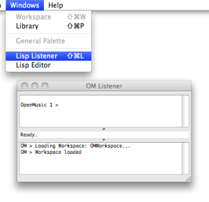
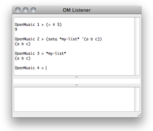
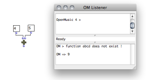
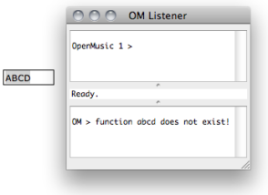
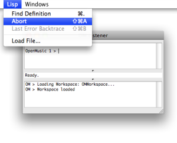
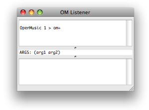

Navigation générale : 

  - [Guide](OM-Documentation.md)
  - [Plan](OM-Documentation_1.md)
  - [Glossaire](OM-Documentation_2.md)

OpenMusic
DocumentationHiérarchie
de section : [OM 6.6 User
Manual](OM-User-Manual.md) \>
[Lisp Programming](Lisp.md) \>
The Listener

Navigation : [page
précédente](LispEditor.md "page précédente(The Lisp Editor)")
| [page
suivante](LispInOM.md "page suivante(Lisp Code in OM)")

# The Listener

## The Listener Window

<table>
<colgroup>
<col style="width: 50%" />
<col style="width: 50%" />
</colgroup>
<tbody>
<tr class="odd">
<td>

The Listener window is the main interface with the Lisp under OM. It can be used for evaluating Lisp expressions or reading results and messages.

To open or bring the Listener window to the front, select <code class="menuPath_tl">Windows/Lisp Listener</code> or type <code class="keyboard_tl">CMD</code> + <code class="keyboard_tl">l</code>.

</td>
<td>

</td>
</tr>
</tbody>
</table>

Listener Window

The OM Listener window is made of two main frames, or "panes".

<table>
<colgroup>
<col style="width: 50%" />
<col style="width: 50%" />
</colgroup>
<tbody>
<tr class="odd">
<td>

The <strong>input</strong> pane – upper part –allows to enter Lisp expressions. These expressions will be evaluated by the Lisp interpreter. They can be either simple variables, calls to Lisp functions, or definitions of new variables or functions.

</td>
<td>

</td>
</tr>
</tbody>
</table>

<table>
<colgroup>
<col style="width: 50%" />
<col style="width: 50%" />
</colgroup>
<tbody>
<tr class="odd">
<td>

The <strong>output</strong> pane – lower part – displays the results returned by the boxes evaluated in OM patches

</td>
<td>

</td>
</tr>
</tbody>
</table>

<table>
<colgroup>
<col style="width: 50%" />
<col style="width: 50%" />
</colgroup>
<tbody>
<tr class="odd">
<td>

</td>
<td>

It also prints the results of different processes in OM patches or environment.

</td>
</tr>
</tbody>
</table>

## Lisp Files

Use

Lisp files generally have a ".lisp" or ".lsp" extension. They can also
be compiled, that is interpreted and converted to optimized binary
instructions for a given platform. They will then be loaded in their
compiled form.

Loading Files

To **load** a file that contains Lisp code, select `Lisp/Load File`.

The Lisp code it contains is evaluated : all the functions and data
defined in this file are added to the current Lisp environment, so that
they can be used subsequently.

## Control of Execution

The Listener is also a fundamental tool for controlling the execution of
OM programs.

Abort Command

<table>
<colgroup>
<col style="width: 50%" />
<col style="width: 50%" />
</colgroup>
<tbody>
<tr class="odd">
<td>

</td>
<td>

To abort an ongoing evaluation, select the Listener, choose <code class="menuPath_tl">Lisp / Abort</code> or type <code class="keyboard_tl">Cmd</code>+<code class="keyboard_tl">a</code>.

The message displayed in return is often very useful for debugging or understanding the process at stake.

</td>
</tr>
</tbody>
</table>

Additional Information

<table>
<colgroup>
<col style="width: 50%" />
<col style="width: 50%" />
</colgroup>
<tbody>
<tr class="odd">
<td>

A small text field located between the two panes displays additional info, such as

<ul>
<li>
the status of the evaluation process – "Running", "Ready", "Aborted" –
</li>
<li>
completion hints about the functions typed in the input pane.
</li>
</ul>

</td>
<td>

To get information about an item, type its name and add a space.

</td>
</tr>
</tbody>
</table>

Références : 

Plan :

  - [OpenMusic Documentation](OM-Documentation.md)
  - [OM 6.6 User Manual](OM-User-Manual.md)
      - [Introduction](00-Sommaire.md)
      - [System Configuration and
        Installation](Installation.md)
      - [Going Through an OM Session](Goingthrough.md)
      - [The OM Environment](Environment.md)
      - [Visual Programming I](BasicVisualProgramming.md)
      - [Visual Programming
        II](AdvancedVisualProgramming.md)
      - [Basic Tools](BasicObjects.md)
      - [Score Objects](ScoreObjects.md)
      - [Maquettes](Maquettes.md)
      - [Sheet](Sheet.md)
      - [MIDI](MIDI.md)
      - [Audio](Audio.md)
      - [SDIF](SDIF.md)
      - [Lisp Programming](Lisp.md)
          - [Introduction to Lisp](LispIntro.md)
          - [The Lisp Editor](LispEditor.md)
          - The
            Listener
          - [Lisp Code in OM](LispInOM.md)
          - [Lisp Function Boxes](LispFunctions.md)
          - [Lisp Tools](LowLevel.md)
          - [Writing an OM Library](LispUserLib.md)
          - [Writing Code for OM](LispForOM.md)
      - [Errors and Problems](errors.md)
  - [OpenMusic QuickStart](QuickStart-Chapters.md)

Navigation : [page
précédente](LispEditor.md "page précédente(The Lisp Editor)")
| [page
suivante](LispInOM.md "page suivante(Lisp Code in OM)")

[A propos...](OM-Documentation_3.md)(c) Ircam - Centre
Pompidou

