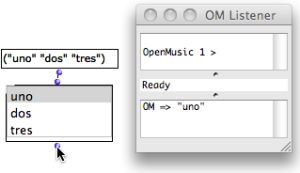

Navigation générale : 

  - [Guide](OM-Documentation.md)
  - [Plan](OM-Documentation_1.md)
  - [Glossaire](OM-Documentation_2.md)

OpenMusic
DocumentationHiérarchie
de section : [OM 6.6 User
Manual](OM-User-Manual.md) \>
[Visual Programming
II](AdvancedVisualProgramming.md) \>
[Interface
Boxes](InterfaceBoxes.md) \>
List Boxes

Navigation : [page
précédente](CheckBox.md "page précédente(Check Box)")
| [page suivante](Button.md "page suivante(Button)")

# Selection : List Boxes

List selection boxes allow to select one or several items among a list,
return and use it/them in downstream computations.

There exist two list selection boxes :

  - **single-item-list**

  - **multi-item-list**

## Features

Inputs and Outputs

<table>
<colgroup>
<col style="width: 50%" />
<col style="width: 50%" />
</colgroup>
<tbody>
<tr class="odd">
<td>

</td>
<td>

List selection boxes have one input and one output :

<ul>
<li>
the "items" input is a <strong>list of atoms or strings</strong> to be displayed in the list
</li>
<li>
the output returns the selected item(s).
</li>
</ul>

</td>
</tr>
</tbody>
</table>

<table>
<colgroup>
<col style="width: 50%" />
<col style="width: 50%" />
</colgroup>
<tbody>
<tr class="odd">
<td>

</td>
<td>

To set the content of a box :

<ul>
<li>
click or <code class="keyboard_tl">SHIFT</code> click on the box's input,
</li>
<li>
enter a list of items in the argument's data box.
</li>
</ul>

When evaluated, the box returns the selected item.

</td>
</tr>
</tbody>
</table>

Default Item

By default, the first item is selected and reset when the box is
initialized.

Lock the Box to Preserve Its Items

If the box is not locked, the selected item as well as the list of items
will be reinitialized when the box is evaluated.

## Boxes

Single-Item-List

The **single-item-list** allows to select only one item at a time.

To select an item,

1.  press `b` to lock the box,

2.  click on an item.

Multi-Item-List

This box allows to select one or more items, which are returned as a
list.

The **multi-item-list** is edited and used as as single-item-list .

  - To select consecutive items or all the items of the box, `SHIFT`
    click on the items or click and drag them.

  - To select independent items, `Cmd` click on them.

## A Musical Application : an Extended Example

Building a Triad with an Item-List-Box, a Button-Box, and a Check
Box

  - [Using the Interface Boxes :
    Example](InterfaceExample.md)

Références : 

Plan :

  - [OpenMusic Documentation](OM-Documentation.md)
  - [OM 6.6 User Manual](OM-User-Manual.md)
      - [Introduction](00-Sommaire.md)
      - [System Configuration and
        Installation](Installation.md)
      - [Going Through an OM Session](Goingthrough.md)
      - [The OM Environment](Environment.md)
      - [Visual Programming I](BasicVisualProgramming.md)
      - [Visual Programming
        II](AdvancedVisualProgramming.md)
          - [Abstraction](Abstraction.md)
          - [Evaluation Modes](EvalModes.md)
          - [Higher-Order Functions](HighOrder.md)
          - [Control Structures](Control.md)
          - [Iterations: OMLoop](OMLoop.md)
          - [Instances](Instances.md)
          - [Interface Boxes](InterfaceBoxes.md)
              - [General Features](GeneralFeatures.md)
              - [Text Boxes](TextBoxes.md)
              - [Check Box](CheckBox.md)
              - List
                Boxes
              - [Button](Button.md)
              - [Slider Box](Slider.md)
              - [Pop-Up Menu Box](MenuBoxes.md)
              - [Examples of Use](InterfaceExample.md)
          - [Files](Files.md)
      - [Basic Tools](BasicObjects.md)
      - [Score Objects](ScoreObjects.md)
      - [Maquettes](Maquettes.md)
      - [Sheet](Sheet.md)
      - [MIDI](MIDI.md)
      - [Audio](Audio.md)
      - [SDIF](SDIF.md)
      - [Lisp Programming](Lisp.md)
      - [Errors and Problems](errors.md)
  - [OpenMusic QuickStart](QuickStart-Chapters.md)

Navigation : [page
précédente](CheckBox.md "page précédente(Check Box)")
| [page suivante](Button.md "page suivante(Button)")

[A propos...](OM-Documentation_3.md)(c) Ircam - Centre
Pompidou

