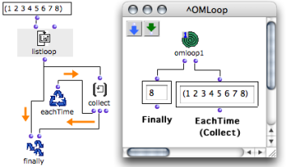
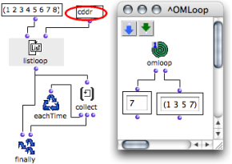
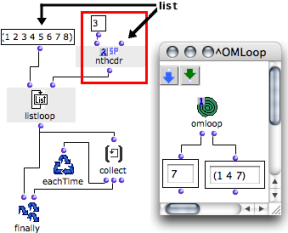

Navigation générale : 

  - [Guide](OM-Documentation.md)
  - [Plan](OM-Documentation_1.md)
  - [Glossaire](OM-Documentation_2.md)

OpenMusic
DocumentationHiérarchie
de section : [OM 6.6 User
Manual](OM-User-Manual.md) \>
[Visual Programming
II](AdvancedVisualProgramming.md) \>
[Iterations: OMLoop](OMLoop.md)
\>
[Iterators](LoopIterators.md)
\> List Loop

Navigation : [page
précédente](LoopIterators.md "page précédente(Iterators)")
| [page
suivante](OnListLoop.md "page suivante(OnList Loop)")

# ListLoop : Enumerating the Elements of a List

## General Properties

**Listloop** enumerates and returns the elements of a list one by one.

In other words, at each step of the iteration, listloop takes a smaller
chunk of the list, and returns its first element. The execution ends
once the list is exhausted.

<table>
<colgroup>
<col style="width: 50%" />
<col style="width: 50%" />
</colgroup>
<tbody>
<tr class="odd">
<td>

</td>
<td>

Listloop has one default input and one optional input :

<ul>
<li>"list" : a list</li>
<li>"by" : a box defining <strong>the way the list is exhausted</strong> . </li>
</ul>

</td>
</tr>
</tbody>
</table>

Here, listloop enumerates a list and returns its items one by one.

1.  At each step of the loop, EachtTime evaluates collect.

2.  Collect stores the items of the list.

3.    - The first input of Finally returns the last value of the
        iteration.
      - Its second input returns the result of collect. 

## "By" : Changing Enumeration Modalities

"By"

The default value of the " **by** " optional input is a
cdr[\[1\]](#kFootBsktc2375)
.

This means that, at each loop, listloop returns :

1.  the first element of the list,

2.  and then, the first element of the remaining chunk,

3.  and so on.

In Lisp, this means that listloop returns successive
cadrs[\[1\]](#kFootBsktc2375)
.

"By" can be replaced by another function meant to return a smaller chunk
of a list, such as :  cddr
[\[1\]](#kFootBsktc2375)
or nthcdr for instance.

It can be either a function box on ["lambda"
mode](LambdaMode.md), or a function name.

Examples : Selecting Items to Return

<table>
<colgroup>
<col style="width: 50%" />
<col style="width: 50%" />
</colgroup>
<tbody>
<tr class="odd">
<td>

</td>
<td>

If "by" is a cddr, listloop returns

<ol>
<li>
the first element of the list,
</li>
<li>
then, the first element of the cddr,
</li>
<li>
and repeats the operation until the list is exhausted.
</li>
</ol>

</td>
</tr>
</tbody>
</table>

<table>
<colgroup>
<col style="width: 50%" />
<col style="width: 50%" />
</colgroup>
<tbody>
<tr class="odd">
<td>

If "by" is an nthcdr, listloop returns

<ol>
<li>
the first element of the list,
</li>
<li>
then the first element of the nthcdr,
</li>
<li>
and repeats the operation until the list is exhausted.
</li>
</ol>

</td>
<td>

</td>
</tr>
</tbody>
</table>

Choosing the Right Function

Applying an irrelevant "by" argument to listloop may prevent the list
from being exhausted. In this case, if no other iterator is present, the
loop may go on for infinite iterations.

Références : 

1.  
    
    

    
    

    
    CAR, CDR, CADR, CDDR, CADDR...
    
    

    
    

    
    

    
    

    
    Elementary Lisp functions, allowing the access to one or more
    elements in a list.
    
    Lisp fonctions are actually linked list. Lists are actually "conses"
    (or "pairs") made of a first element and a pointer to the rest (or
    "tail") of the list (another cons). These two parts of the list are
    accessed with the CAR and CDR functions, respectively.
    
    Let the following list be : (A B C D).
    
    CAR (A B C D) = A.
    
    CDR (A B C D) = (B C D).
    
    CDR (B) =\> NIL \[this list has no CDR\]
    
    "CAR" and "CDR" are technical terms which originally refer to the
    way data is handled by the computer. CAR is the acronym of "Contents
    of the Address part of Register number". CDR is the acronym of
    "Contents of the Decrement part of Register number".
    
    The rest of the functions below are built upon these two kernel
    accessors.
    
    CADR (A B C D) = B. CADR means CAR of the CDR.
    
    CDDR (A B C D) = (C D). CDDR means CDR of the CDR.
    
    CADDR (A B C D) = C. CADDR means CAR of the CDDR.
    
    NTHCDR (A B C D) = NTH CDR of the list – N must be specified as
    argument. NTHCDR 3 (A B C D) = (D).
    
    And so on...
    
    

    
    

    
    

    
    

Plan :

  - [OpenMusic Documentation](OM-Documentation.md)
  - [OM 6.6 User Manual](OM-User-Manual.md)
      - [Introduction](00-Sommaire.md)
      - [System Configuration and
        Installation](Installation.md)
      - [Going Through an OM Session](Goingthrough.md)
      - [The OM Environment](Environment.md)
      - [Visual Programming I](BasicVisualProgramming.md)
      - [Visual Programming
        II](AdvancedVisualProgramming.md)
          - [Abstraction](Abstraction.md)
          - [Evaluation Modes](EvalModes.md)
          - [Higher-Order Functions](HighOrder.md)
          - [Control Structures](Control.md)
          - [Iterations: OMLoop](OMLoop.md)
              - [Iteration](LoopIntro.md)
              - [General Features](LoopGeneral.md)
              - [Evaluators](LoopEvaluators.md)
              - [Iterators](LoopIterators.md)
                  - List
                    Loop
                  - [OnList Loop](OnListLoop.md)
                  - [For Loop](ForLoop.md)
                  - [While Loop](WhileLoop.md)
                  - [Infinite Loops](InfiniteLoops.md)
              - [Accumulators](LoopAccumulators.md)
              - [Example : A Random Series](LoopExample.md)
          - [Instances](Instances.md)
          - [Interface Boxes](InterfaceBoxes.md)
          - [Files](Files.md)
      - [Basic Tools](BasicObjects.md)
      - [Score Objects](ScoreObjects.md)
      - [Maquettes](Maquettes.md)
      - [Sheet](Sheet.md)
      - [MIDI](MIDI.md)
      - [Audio](Audio.md)
      - [SDIF](SDIF.md)
      - [Lisp Programming](Lisp.md)
      - [Errors and Problems](errors.md)
  - [OpenMusic QuickStart](QuickStart-Chapters.md)

Navigation : [page
précédente](LoopIterators.md "page précédente(Iterators)")
| [page
suivante](OnListLoop.md "page suivante(OnList Loop)")

[A propos...](OM-Documentation_3.md)(c) Ircam - Centre
Pompidou

