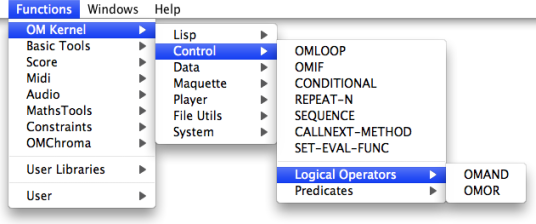
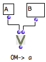
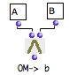
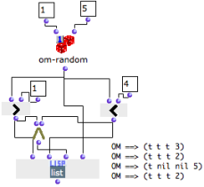
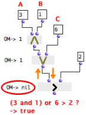
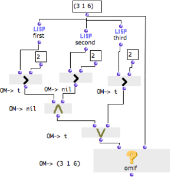

Navigation générale : 

  - [Guide](OM-Documentation.md)
  - [Plan](OM-Documentation_1.md)
  - [Glossaire](OM-Documentation_2.md)

OpenMusic
DocumentationHiérarchie
de section : [OM 6.6 User
Manual](OM-User-Manual.md) \>
[Visual Programming
II](AdvancedVisualProgramming.md) \>
[Control
Structures](Control.md) \>
Logical
Operators

Navigation : [page
précédente](Conditional.md "page précédente(Conditional)")
| [page
suivante](Sequencial.md "page suivante(Sequential Operators)")

# Logical Operators

Omor, Omand

Omor
and
omand

are **boolean logical operators** that stand for the "and" and "or"
coordinating conjunctions.

  - A proposition that contains an "and" is true if **all** its
    elements are true. 
  - A proposition that contains an "or" is true if **at least
    one** of its elements is true. 

For instance, the following propositions are respectively true and false
:

  - A : "Men are living creatures". B : "Cats are living
    creatures". "A and B" is true, and "A or B" is true.
  - A : "Men are human beings." B : "Cats are human beings". "A or
    B" is true, but "A and B" is not true. 

In OM

  -  the omand box returns "true" if **all** its inputs return
    "true". Otherwise, it returns "nil". 
  - the omor box returns "true" if one of its inputs return
    "true". Otherwise, it returns "nil".

Logical operators are accessed via the  `Functions / OM Kernel / Control
/ Logical Operators`, menu.

## Functionalities and Behaviour

Inputs

Operators have one default input, "self" and as many additional "rest"
inputs as necessary

  - "self" : any data
  - "rest" : any data.

Their output returns data, or "nil".

Use

  - Logical operators evaluate their inputs successively. Any non "nil"
    data is "true".
    
    Consequently, operators don't have to verify the truth-value of a
    proposition, to return "true". Numbers, as well as symbols and other
    non nil values are always "true" for logical operators.

  - Logical operators are also used for associating **several
    predicates** in a single proposition.

Behaviour

Inputs are evaluated from left to right.

<table>
<tbody>
<tr class="odd">
<td>

</td>
<td>
Omor <strong>tests a first input</strong> , and stops if <strong>it is true</strong> .

If not, it goes on until it gets "true". As a consequence, omor returns the first non-nil value, or "nil" if all inputs return "nil".

In this example, omor will always return the first input, "A".
</td>
</tr>
<tr class="even">
<td>

</td>
<td>
Omand <strong></strong> stops the evaluation if <strong>one of its inputs is not true</strong> . It goes on until it gets "nil", or until it reaches the last input.

<strong></strong> All inputs have to be true for the condition to be verified, and omand then returns the last non-nil value.

In this example, omand will always return the last input, "B".
</td>
</tr>
</tbody>
</table>

Example

The following program tests if a random number between 1 and 5 is
superior to 1 and inferior to 4.

<table>
<colgroup>
<col style="width: 50%" />
<col style="width: 50%" />
</colgroup>
<tbody>
<tr class="odd">
<td>

<ol>
<li>
The number returned by om-random is compared with 1 and 3 by the om&gt; and om&lt; predicates.
</li>
<li>
Omand evaluates the predicates and returns "true" or "nil".
</li>
<li>
List makes a list with :

<ul>
<li>the result of both predicates evaluation, </li>
<li>the result of the omand operator,</li>
<li>the number returned by om-random.</li>
</ul></li>
</ol>

</td>
<td>

</td>
</tr>
</tbody>
</table>

Note that om-random is on "evaluate-once" mode, so that the same result
is sent to all boxes during the same evaluation.

About EvalOnce Mode :

  - [Evaluate-Once Mode](EvOnceMode.md)

## Composing Propositions : Associating Logical Operators with Predicates

Operators behave with predicates **like with any other boxes**.
Predicates are evaluated **one by one,** from left to right and return
"true" or  "nil".

  -  Omand returns "true" if all predicates return "true", and
    returns "nil" if one predicate returns "nil".
  -  Omor returns "true" as soon as one predicate passes "true",
    and returns "nil" if all predicates return "nil".

An Incorrect Formalization

We might use logical operators to compare more than one value to
another, as in the following proposition : "If A **and** B **or** C are
superior to D, then return A, B, and C."

If we formalize the proposition **literally**, the program will be
ineffective and will lead to a miscalculation.

<table>
<colgroup>
<col style="width: 50%" />
<col style="width: 50%" />
</colgroup>
<tbody>
<tr class="odd">
<td>

</td>
<td>

Let's test if 3 and 1 or 6 are superior to 2 :

<ol>
<li>
Omand is evaluated and returns <strong>the numeric value</strong> of its last input
</li>
<li>
Omor is evaluated and returns <strong>the numeric value</strong> of its first input
</li>
<li>
Om&gt; compares the numeric value of its first input with 2, and returns "nil".
</li>
</ol>

</td>
</tr>
</tbody>
</table>

6 should be compared with 2, and 6 is superior to 2. Om\> should return
"true". The error comes from the way predicates have been applied with
logical operators.

Basic Formalization Principles

Formalizing a comparison with predicates and logical operators implies
that :

1.  First, **predicates** must compare values by **pairs.**

2.  Then, **logical operators** must be applied to **the result** **of
    each comparison** .

A correct Formalization

<table>
<colgroup>
<col style="width: 50%" />
<col style="width: 50%" />
</colgroup>
<tbody>
<tr class="odd">
<td>

</td>
<td>

Be a list. Each number of the list is compared with a number.

<ol>
<li>
Omif evaluates omor.
</li>
<li>
Omand is evaluated and returns the value of the two om&gt; predicates on the left.

It gets "nil" and "t", so it returns "nil". 3 and 1 are not <strong>both</strong> superior to 2.
</li>
<li>
The last om&gt; predicate is evaluated. It returns "true".
</li>
<li>
Omor gets "nil" and "t", so it returns "t" . 6 is <strong>at least</strong> superior to 2.
</li>
<li>
Omif gets the result of omor : "t", and hence returns the list.
</li>
</ol>

</td>
</tr>
</tbody>
</table>

Références : 

Plan :

  - [OpenMusic Documentation](OM-Documentation.md)
  - [OM 6.6 User Manual](OM-User-Manual.md)
      - [Introduction](00-Sommaire.md)
      - [System Configuration and
        Installation](Installation.md)
      - [Going Through an OM Session](Goingthrough.md)
      - [The OM Environment](Environment.md)
      - [Visual Programming I](BasicVisualProgramming.md)
      - [Visual Programming
        II](AdvancedVisualProgramming.md)
          - [Abstraction](Abstraction.md)
          - [Evaluation Modes](EvalModes.md)
          - [Higher-Order Functions](HighOrder.md)
          - [Control Structures](Control.md)
              - [Predicates](Predicates.md)
              - [Conditional Operators](ConditionalOps.md)
              - Logical
                Operators
              - [Sequential Operators](Sequencial.md)
          - [Iterations: OMLoop](OMLoop.md)
          - [Instances](Instances.md)
          - [Interface Boxes](InterfaceBoxes.md)
          - [Files](Files.md)
      - [Basic Tools](BasicObjects.md)
      - [Score Objects](ScoreObjects.md)
      - [Maquettes](Maquettes.md)
      - [Sheet](Sheet.md)
      - [MIDI](MIDI.md)
      - [Audio](Audio.md)
      - [SDIF](SDIF.md)
      - [Lisp Programming](Lisp.md)
      - [Errors and Problems](errors.md)
  - [OpenMusic QuickStart](QuickStart-Chapters.md)

Navigation : [page
précédente](Conditional.md "page précédente(Conditional)")
| [page
suivante](Sequencial.md "page suivante(Sequential Operators)")

[A propos...](OM-Documentation_3.md)(c) Ircam - Centre
Pompidou

