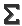
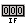
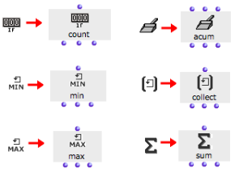
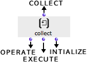

Navigation générale : 

  - [Guide](OM-Documentation.md)
  - [Plan](OM-Documentation_1.md)
  - [Glossaire](OM-Documentation_2.md)

OpenMusic
DocumentationHiérarchie
de section : [OM 6.6 User
Manual](OM-User-Manual.md) \>
[Visual Programming
II](AdvancedVisualProgramming.md) \>
[Iterations: OMLoop](OMLoop.md)
\>
Accumulators

Navigation : [page
précédente](InfiniteLoops.md "page précédente(Infinite Loops)")
| [page
suivante](Collect.md "page suivante(Collect)")

# Accumulators

## Function

At each step of an iteration, resulting data can be memorized and stored
with the OMLoop **accumulators** . Accumulators execute storage or other
operation upon the elements they are returned successively.

There are six accumulators :

  - :
    **Collect** gathers the result of each step of a loop into a list.

  - 
    : **Sum** returns the sum of the collected elements.

  - 
    : **Min** and **max** return the lowest and highest value among a
    set of collected elements.

  - :
    **Counter** counts the number of non-nil collected elements.

  - :
    **Acum** allows to define specific accumulation procedures.

## Adding Iterators

<table>
<colgroup>
<col style="width: 50%" />
<col style="width: 50%" />
</colgroup>
<tbody>
<tr class="odd">
<td>

</td>
<td>

To add an accumulator in the OMLoop editor .

<ul>
<li>
click on an icon
</li>
<li>
<code class="keyboard_tl">Cmd</code> click and type a name directly in the editor.
</li>
</ul>

</td>
</tr>
</tbody>
</table>

## Inputs and Outputs

  - All accumulators but acum have a single input : this input is used
    for **collecting the successive values** during a loop.

  - All accumulator have three outputs, allowing to access their current
    "memory"  :
    
      - first output : **executes a specific operation** with each
        new collected element.
      - second output : **returns the current stat** e of the
        accumulator's memory,
      - third output : **reinitializes** the memory.

Références : 

Plan :

  - [OpenMusic Documentation](OM-Documentation.md)
  - [OM 6.6 User Manual](OM-User-Manual.md)
      - [Introduction](00-Sommaire.md)
      - [System Configuration and
        Installation](Installation.md)
      - [Going Through an OM Session](Goingthrough.md)
      - [The OM Environment](Environment.md)
      - [Visual Programming I](BasicVisualProgramming.md)
      - [Visual Programming
        II](AdvancedVisualProgramming.md)
          - [Abstraction](Abstraction.md)
          - [Evaluation Modes](EvalModes.md)
          - [Higher-Order Functions](HighOrder.md)
          - [Control Structures](Control.md)
          - [Iterations: OMLoop](OMLoop.md)
              - [Iteration](LoopIntro.md)
              - [General Features](LoopGeneral.md)
              - [Evaluators](LoopEvaluators.md)
              - [Iterators](LoopIterators.md)
              - Accumulators
                  - [Collect](Collect.md)
                  - [Sum](Sum.md)
                  - [Min / Max](MinMax.md)
                  - [Count](Count.md)
                  - [Acum](Acum.md)
              - [Example : A Random Series](LoopExample.md)
          - [Instances](Instances.md)
          - [Interface Boxes](InterfaceBoxes.md)
          - [Files](Files.md)
      - [Basic Tools](BasicObjects.md)
      - [Score Objects](ScoreObjects.md)
      - [Maquettes](Maquettes.md)
      - [Sheet](Sheet.md)
      - [MIDI](MIDI.md)
      - [Audio](Audio.md)
      - [SDIF](SDIF.md)
      - [Lisp Programming](Lisp.md)
      - [Errors and Problems](errors.md)
  - [OpenMusic QuickStart](QuickStart-Chapters.md)

Navigation : [page
précédente](InfiniteLoops.md "page précédente(Infinite Loops)")
| [page
suivante](Collect.md "page suivante(Collect)")

[A propos...](OM-Documentation_3.md)(c) Ircam - Centre
Pompidou

