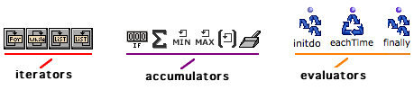
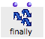

Navigation générale : 

  - [Guide](OM-Documentation.md)
  - [Plan](OM-Documentation_1.md)
  - [Glossaire](OM-Documentation_2.md)

OpenMusic
DocumentationHiérarchie
de section : [OM 6.6 User
Manual](OM-User-Manual.md) \>
[Visual Programming
II](AdvancedVisualProgramming.md) \>
[Iterations: OMLoop](OMLoop.md)
\> General
Features

Navigation : [page
précédente](LoopIntro.md "page précédente(Iteration)")
| [page
suivante](LoopEvaluators.md "page suivante(Evaluators)")

# General Features

|                                                                                   |                                                                                                                                                                                                                     |
| --------------------------------------------------------------------------------- | ------------------------------------------------------------------------------------------------------------------------------------------------------------------------------------------------------------------- |
|  | The OMLoop module is a specific type of abstraction – or patch. It encloses a number of specialized components, which allow to design iterative programs. Programming takes place in the internal editor of OMLoop. |

## OMLoop Editor and Components

Editor

To open the OMLoop editor, double click on the OMLoop box.

The OMLoop editor resembles a patch editor.

Components

OMLoop provides three types of programming components :

  - **iterators** : determine and stop the iteration process.

  - **accumulators** : gather the result at each step of the iteration
    in the ongoing process until the iteration is over.
    
    Iterators and accumulators are visible at the top of the OMLoop
    editor and can be added with a click. The choice of iterators and
    accumulators depends on the iteration program.

<!-- end list -->

  - **evaluators** : trigger the evaluation and return the results, at
    each step or at the end of the iteration.
    
    The eachtime and finally evaluators are essential components which
    are displayed by default in the editor. Initdo can be added typing
    its name in the editor.

## Adding Inputs and Outputs

<table>
<tbody>
<tr class="odd">
<td>

</td>
<td>
Initially, the OMLoop box has only <strong>one output</strong> <strong>and no input</strong> : programming can be done without the use of external data, like with a patch.

Additional outputs and inputs can be added using the following procedures.
</td>
</tr>
</tbody>
</table>

Inputs

|                                                                                       |                                                                                                                                        |
| ------------------------------------------------------------------------------------- | -------------------------------------------------------------------------------------------------------------------------------------- |
|  | **Inputs** transfer incoming data to the programming functions of OMLoop. They are represented green top-down arrow inside the editor. |

The OMLoop editor shows additional inputs, as well as a number of
default internal components.

<table>
<colgroup>
<col style="width: 50%" />
<col style="width: 50%" />
</colgroup>
<tbody>
<tr class="odd">
<td>

</td>
<td>

<strong></strong> To add or delete an input in the OMLoop box,

<ul>
<li>
press <code class="keyboard_tl">Alt</code> +  <code class="keyboard_tl">→</code> or <code class="keyboard_tl">←</code>
</li>
<li>
press  <code class="keyboard_tl">&gt;</code> or <code class="keyboard_tl">&lt;</code>.
</li>
</ul>

</td>
</tr>
</tbody>
</table>

Outputs

OMLoop outputs are managed with another procedure.

<table>
<tbody>
<tr class="odd">
<td>

</td>
<td>
The finally evaluator represents the <strong>visible output(s)</strong> of OMLoop. It returns the results of the iteration. <strong>Outputs</strong> can therefore be added and deleted by adding or deleting <strong>optional inputs</strong> to and from Finally.
</td>
</tr>
<tr class="even">
<td>

</td>
<td>
To add or delete inputs to finally :

<ul>
<li>
press <code class="keyboard_tl">Alt</code> + <code class="keyboard_tl">→</code> or <code class="keyboard_tl">← </code>
</li>
<li>
press <code class="keyboard_tl">&gt;</code> or <code class="keyboard_tl">&lt;</code> .
</li>
</ul></td>
</tr>
<tr class="odd">
<td>

</td>
<td>
Outputs also represented on the OMLoop icon once added.
</td>
</tr>
</tbody>
</table>

About Evaluators :

  - [Evaluators : Eachtime, Finally,
    Initdo](LoopEvaluators.md)

About Evaluation in OMLoops

  - An OMLoop can't be evaluated from the inside of its editor. It will
    be ineffective until its internal program is defined correctly.

  - Do not evaluate it before it is completed : an infinite loop might
    get OM stuck for a while...

Références : 

Plan :

  - [OpenMusic Documentation](OM-Documentation.md)
  - [OM 6.6 User Manual](OM-User-Manual.md)
      - [Introduction](00-Sommaire.md)
      - [System Configuration and
        Installation](Installation.md)
      - [Going Through an OM Session](Goingthrough.md)
      - [The OM Environment](Environment.md)
      - [Visual Programming I](BasicVisualProgramming.md)
      - [Visual Programming
        II](AdvancedVisualProgramming.md)
          - [Abstraction](Abstraction.md)
          - [Evaluation Modes](EvalModes.md)
          - [Higher-Order Functions](HighOrder.md)
          - [Control Structures](Control.md)
          - [Iterations: OMLoop](OMLoop.md)
              - [Iteration](LoopIntro.md)
              - General
                Features
              - [Evaluators](LoopEvaluators.md)
              - [Iterators](LoopIterators.md)
              - [Accumulators](LoopAccumulators.md)
              - [Example : A Random Series](LoopExample.md)
          - [Instances](Instances.md)
          - [Interface Boxes](InterfaceBoxes.md)
          - [Files](Files.md)
      - [Basic Tools](BasicObjects.md)
      - [Score Objects](ScoreObjects.md)
      - [Maquettes](Maquettes.md)
      - [Sheet](Sheet.md)
      - [MIDI](MIDI.md)
      - [Audio](Audio.md)
      - [SDIF](SDIF.md)
      - [Lisp Programming](Lisp.md)
      - [Errors and Problems](errors.md)
  - [OpenMusic QuickStart](QuickStart-Chapters.md)

Navigation : [page
précédente](LoopIntro.md "page précédente(Iteration)")
| [page
suivante](LoopEvaluators.md "page suivante(Evaluators)")

[A propos...](OM-Documentation_3.md)(c) Ircam - Centre
Pompidou

