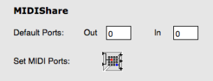
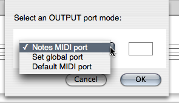
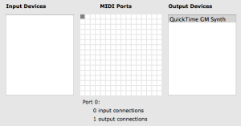

Navigation générale : 

  - [Guide](OM-Documentation.md)
  - [Plan](OM-Documentation_1.md)
  - [Glossaire](OM-Documentation_2.md)

OpenMusic
DocumentationHiérarchie
de section : [OM 6.6 User
Manual](OM-User-Manual.md) \>
[MIDI](MIDI.md) \>
[Rendering and
Playback](MIDI-Playback.md) \>
Managing MIDI
Ports

Navigation : [page
précédente](MIDI-Utils.md "page précédente(MIDI Selection Tools)")
| [page
suivante](Microintervals.md "page suivante(Microintervals)")

# Managing MIDI Ports

The MIDI port selection determines how MIDI events are directed to one
or several synthesizers.

This can be configured at several levels.

## Default MIDI Ports

<table>
<colgroup>
<col style="width: 50%" />
<col style="width: 50%" />
</colgroup>
<tbody>
<tr class="odd">
<td>

In the OM <code class="textTab_tl">MIDI</code> Preferences tab, the default <strong>IN</strong> and <strong>OUT</strong> ports allow to set a default port where MIDI events are sent if no other port is specified explicitely.

</td>
<td>

</td>
</tr>
</tbody>
</table>

The `Set MIDI Ports` button allows to set the different MIDI ports to
the devices connected (and detected) on the computer (see below).

## MIDI Port Setting for Score Objects

In the score objects, it is possible to assign a MIDI Port to each
individual note. A global behavior for the object can however be
controlled.

<table>
<colgroup>
<col style="width: 50%" />
<col style="width: 50%" />
</colgroup>
<tbody>
<tr class="odd">
<td>

<ul>
<li>
<strong>Notes MIDI port</strong> : this option just respects the port assigned to the different notes (or use the default MIDI Port from the preferences if no port is specified).
</li>
<li>
<strong>Set global port</strong> : this option allows you to set a single port to apply to the whole object, whatever the note ports are
</li>
<li>
<strong>Default MIDI port </strong>: this option uses the MIDI port specified in the OM Preferences.
</li>
</ul>

</td>
<td>

</td>
</tr>
</tbody>
</table>

<table>
<colgroup>
<col style="width: 50%" />
<col style="width: 50%" />
</colgroup>
<tbody>
<tr class="odd">
<td>

</td>
<td>

These options are available at selecting the MidiShare player for a given box (in a patch or in a maquette) or in the score editors via the <code class="textButton_tl">...</code> button next to the player selection menu.

</td>
</tr>
</tbody>
</table>

## MidiShare Setup

OM MIDI Preferences

MidiShare is OM's default MIDI player. The input / output connections to
the various devices of the system are defined in the OM `MIDI`
preferences tab via the `Set MIDI Ports` button.

<table>
<colgroup>
<col style="width: 50%" />
<col style="width: 50%" />
</colgroup>
<tbody>
<tr class="odd">
<td>

By default, port #0 is the only input and output connection to the system's MIDI inbuilt synthesizer (when available).

The notes in the score objects (if directed to port 0) are therefore sent to this synthesizer.

To change the input/output devices connected to a given port, select the corresponding cell in the <code class="label_tl">MIDI Ports</code> table and then check/uncheck the desired items in the <code class="label_tl">Input Devices</code> and <code class="label_tl">Output Devices</code> lists.

</td>
<td>

</td>
</tr>
</tbody>
</table>

Références : 

Plan :

  - [OpenMusic Documentation](OM-Documentation.md)
  - [OM 6.6 User Manual](OM-User-Manual.md)
      - [Introduction](00-Sommaire.md)
      - [System Configuration and
        Installation](Installation.md)
      - [Going Through an OM Session](Goingthrough.md)
      - [The OM Environment](Environment.md)
      - [Visual Programming I](BasicVisualProgramming.md)
      - [Visual Programming
        II](AdvancedVisualProgramming.md)
      - [Basic Tools](BasicObjects.md)
      - [Score Objects](ScoreObjects.md)
      - [Maquettes](Maquettes.md)
      - [Sheet](Sheet.md)
      - [MIDI](MIDI.md)
          - [Introduction](Intro.md)
          - [Important MIDI Concepts](MIDI-Concepts.md)
          - [Rendering and Playback](MIDI-Playback.md)
              - [MIDI Parameters](MIDI-Params.md)
              - [MIDI Player Controls](MIDI-Controls.md)
              - [MIDI Selection Tools](MIDI-Utils.md)
              - Managing MIDI
                Ports
              - [Microintervals](Microintervals.md)
              - [Recording / MIDI In](Record%20MIDI.md)
          - [MIDI Objects](MIDI-Objects.md)
      - [Audio](Audio.md)
      - [SDIF](SDIF.md)
      - [Lisp Programming](Lisp.md)
      - [Errors and Problems](errors.md)
  - [OpenMusic QuickStart](QuickStart-Chapters.md)

Navigation : [page
précédente](MIDI-Utils.md "page précédente(MIDI Selection Tools)")
| [page
suivante](Microintervals.md "page suivante(Microintervals)")

[A propos...](OM-Documentation_3.md)(c) Ircam - Centre
Pompidou

