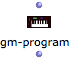
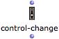
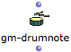
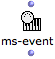
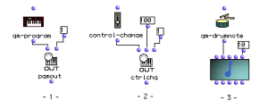

Navigation générale : 

  - [Guide](OM-Documentation.md)
  - [Plan](OM-Documentation_1.md)
  - [Glossaire](OM-Documentation_2.md)

OpenMusic
DocumentationHiérarchie
de section : [OM 6.6 User
Manual](OM-User-Manual.md) \>
[MIDI](MIDI.md) \>
[Rendering and
Playback](MIDI-Playback.md) \>
MIDI Selection
Tools

Navigation : [page
précédente](MIDI-Controls.md "page précédente(MIDI Player Controls)")
| [page
suivante](MIDI-Ports.md "page suivante(Managing MIDI Ports)")

# MIDI Selection Tools

In order to make Midi objects and functions easier to set, some
"menu-functions" allow to choose parameters with their standard names
(according to General MIDI specifications) internally converted into
corresponding integer values.

About General MIDI

[http://www.midi.org/techspecs/gm.php](http://www.midi.org/techspecs/gm.php "http://www.midi.org/techspecs/gm.php (nouvelle fenêtre)")

This functions can be used to parameterize the "MIDI Send" control boxes
or to instanciate MIDI objects in OM patches.

MIDI Controls

  - [MIDI Player Controls](MIDI-Controls.md)

MIDI Objects in OM

  - [MIDI Objects](MIDI-Objects.md)

|                                                                                         |                    |                                                                                                 |
| --------------------------------------------------------------------------------------- | ------------------ | ----------------------------------------------------------------------------------------------- |
|          | **GM-PROGRAM**     | Selects a MIDI program and returns the corresponding General MIDI program number.               |
|  | **CONTROL-CHANGE** | Selects a control change and returns the corresponding General MIDI control number.             |
|          | **GM-DRUMNOTE**    | Selects a note and return the corresponding drum element pitch value according to General MIDI. |
|        | **MS-EVENT**       | Selects an Event type and returns the corresponding MidiShare event number.                     |

<table>
<colgroup>
<col style="width: 50%" />
<col style="width: 50%" />
</colgroup>
<tbody>
<tr class="odd">
<td>

</td>
<td>

1) GM-PROGRAM is used to select the program number for changing the timbre of channel 1 with PGMOUT.

2) CONTROL-CHANGE is used to select the control number to modify on channel 1 with CTRLCHG

3) GM-DRUMNOTE is used to select the correct pitch to assign to a NOTE object in order to get the desired drum sound (Note that the MIDI channel is 10, which is generally the channel reserved for drums in MIDI synthesizers).

</td>
</tr>
</tbody>
</table>

Références : 

Plan :

  - [OpenMusic Documentation](OM-Documentation.md)
  - [OM 6.6 User Manual](OM-User-Manual.md)
      - [Introduction](00-Sommaire.md)
      - [System Configuration and
        Installation](Installation.md)
      - [Going Through an OM Session](Goingthrough.md)
      - [The OM Environment](Environment.md)
      - [Visual Programming I](BasicVisualProgramming.md)
      - [Visual Programming
        II](AdvancedVisualProgramming.md)
      - [Basic Tools](BasicObjects.md)
      - [Score Objects](ScoreObjects.md)
      - [Maquettes](Maquettes.md)
      - [Sheet](Sheet.md)
      - [MIDI](MIDI.md)
          - [Introduction](Intro.md)
          - [Important MIDI Concepts](MIDI-Concepts.md)
          - [Rendering and Playback](MIDI-Playback.md)
              - [MIDI Parameters](MIDI-Params.md)
              - [MIDI Player Controls](MIDI-Controls.md)
              - MIDI
                Selection Tools
              - [Managing MIDI Ports](MIDI-Ports.md)
              - [Microintervals](Microintervals.md)
              - [Recording / MIDI In](Record%20MIDI.md)
          - [MIDI Objects](MIDI-Objects.md)
      - [Audio](Audio.md)
      - [SDIF](SDIF.md)
      - [Lisp Programming](Lisp.md)
      - [Errors and Problems](errors.md)
  - [OpenMusic QuickStart](QuickStart-Chapters.md)

Navigation : [page
précédente](MIDI-Controls.md "page précédente(MIDI Player Controls)")
| [page
suivante](MIDI-Ports.md "page suivante(Managing MIDI Ports)")

[A propos...](OM-Documentation_3.md)(c) Ircam - Centre
Pompidou

