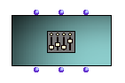

Navigation générale : 

  - [Guide](OM-Documentation.md)
  - [Plan](OM-Documentation_1.md)
  - [Glossaire](OM-Documentation_2.md)

OpenMusic
DocumentationHiérarchie
de section : [OM 6.6 User
Manual](OM-User-Manual.md) \>
[MIDI](MIDI.md) \>
[MIDI Objects](MIDI-Objects.md)
\> MIDI
Containers

Navigation : [page
précédente](MIDIEvent.md "page précédente(MIDI Events)")
| [page suivante](Audio.md "page suivante(Audio)")

# MIDI Containers

The MIDI containers are objects constituted of a set of simultaneous or
sequencial MIDI events representing intermediate-level musical objects.

General Properties of MIDI Containers

All these objects can be played and processed as musical object.

The list of MIDIEvents can be extracted (and possibly filtered) using
**get-MidiEvents**.

## MIDI Events Sequences : EventMidi-seq

The **EventMidi-seq** object represents a sequence of MIDI events. Its
slots are lists of the corresponding MidiEvent slots (types, dates,
tracks, ports, channels, fields).

It can store all types of MidiEvents (notes, controllers, etc..) and in
this way can be compared to a buffered version of the MidiFile object.
The main difference is that EventMidi-seq is a not written on hard disk
as a file, so it can be manipulated more easily.

**EventMidi-seq** will be usefull for temporary storage of filtered or
processed MIDI data.

An **EventMidi-seq** can be constructed by setting its input slots or
from a list of **MidiEvents**, hence from the result of
**get-MidiEvents** applyed to an object.

An equivalent "shortcut" procedure, except if MIDIEvents are to be
filtered, is to connect the objects directly to the first () slot of the
**EventMIDI-seq**.

About MIDI Event Objects and Extracting/Filtering

  - [MIDI Events](MIDIEvent.md)

Using EventMIDI-seqs

In this example, MidiEvents are extracted from a MidiFile, and then
filtered to separateand process channels. The resulting sequences are
put in a new EventMidi-seq with a midi-mix-console object to add the
initial settings events to the sequence.

**Note :** Using the function c**reate-midiseq**, a list of MIDI events
or an object is simply converted into EventMidi-seq, but the second
(optional) input allows to set a name to the newly created sequence.
This name will appear in the EventMidi-seq's miniview.

<table>
<colgroup>
<col style="width: 50%" />
<col style="width: 50%" />
</colgroup>
<tbody>
<tr class="odd">
<td>

Events are normally automatically time-sorted in each <strong>EventMidi-seq</strong> conversion. However, manually created sequences can be sorted using the <strong>temporal-sort</strong> method.

</td>
<td>

</td>
</tr>
</tbody>
</table>

Using EventMIDI-seqs for Score Object Processing

All OpenMusic score objects can be converted into MIDI sequences.
Notes,a s well as tempo, measure markers for voice and poly objects, are
converted in MIDI events. This conversion may allow special treatments
(such as filters with **get-midievents** method, etc.) and operations on
MidiEvents.

<table>
<colgroup>
<col style="width: 50%" />
<col style="width: 50%" />
</colgroup>
<tbody>
<tr class="odd">
<td>

The function <strong>separate-channels</strong> processes all Events of the EventMidi-seq and put each channel on a diferent track.

In the following example, we separate notes of different channels in a chord-seq into diferent multi-seq tracks via MidiEvents processing.

</td>
<td>

</td>
</tr>
</tbody>
</table>

## MIDI Controllers : MIDIControl / MIDI-Mix-Console

MIDI Controllers send messages changing the state of one or several MIDI
Channels. There exist two main MIDI Controller containers in OM.

About MIDI Control Messages

  - [Important MIDI Concepts](MIDI-Concepts.md)

MIDIControl

<table>
<colgroup>
<col style="width: 50%" />
<col style="width: 50%" />
</colgroup>
<tbody>
<tr class="odd">
<td>

<strong>MidiControl</strong> is a special case of Midi Sequence representing a single MIDI <strong>continuous controller</strong> evolution. Such controller can be PitchBend, or any kind of Control Change. It contains a single event type, a single channel, port and track, and a list of dates and values.

MidiControl is actually a sub-class of <strong>BPF</strong> controlling a given MIDI parameter.

</td>
<td>

</td>
</tr>
</tbody>
</table>

A List of controllers is proposed as an input menu for the first input
(controller type) of the **MidiControl** box.

Channel, port an track can be numbers or lists : In this case the same
continuous controller (dates/values) applies to all the
channels/ports/tracks of the lists.

Dates/values can be edited with the BPF editor.

BPFs and BPF Editor

  - [2D Objects : BPF / BPC](BPF-BPC.md)
  - [BPFs and BPCs Editors](BPFEditors.md)

Using a MIDIControl in a Maquette

The following example shows a Channel Volume controller in a maquette.

About the Maquette

  - [Maquettes](Maquettes.md)

Continuous Controllers values

Most of the controllers are classical MIDI ControlChange controllers for
which values must be given in 0 – 127 range (7 bits).

(For On/Off switch controllers, value \< 64 means "off", and value \>=
64 means "on".)

Some of them (controllers 0 to 31) have a corresponding "Fine"
controller (32 to 63) for which values must be set in 0 – 16384 range
(14 bits).

The PitchBend controller is value range is –64 to 63, and –8182 to 8191
for "fine" pitchbend (also called pitchwheel).

Extracting Controllers

<table>
<colgroup>
<col style="width: 50%" />
<col style="width: 50%" />
</colgroup>
<tbody>
<tr class="odd">
<td>

A <strong>MidiControl</strong> object can be extracted from Midifile or EventMidi-seq using the <strong>get-continuous-ctrl</strong> method.

</td>
<td>

Channel volume controller extracted from a MidiFile

</td>
</tr>
</tbody>
</table>

Resampling a MIDI Controller

The **MidiControl** dates-values BPF can be resampled using
**OM-SAMPLE** method. This function create a new control BPF with a
regular given sample rate.

Resampling and Other Operations of BPF Objects

  - [BPF and BPC Tools](Tools.md)

MIDI-Mix-Console

<table>
<colgroup>
<col style="width: 50%" />
<col style="width: 50%" />
</colgroup>
<tbody>
<tr class="odd">
<td>

MIDI-Mix-Console represents a set of simultaneous MIDI Events set at once to a given port.

It can be set manually thanks to a multi-channel mixing console interface and used as MIDI setup storage for playback or creation of MIDI objects.

</td>
<td>

</td>
</tr>
</tbody>
</table>

More About the MIDI-Mix-Console

  - [MIDI Player Controls](MIDI-Controls.md)

## Tempo and Metrics

The Tempo-Map Box

<table>
<colgroup>
<col style="width: 50%" />
<col style="width: 50%" />
</colgroup>
<tbody>
<tr class="odd">
<td>

<strong>Tempo-Map</strong> allows the separation of tempo and metric information for works on quantification and analysis.

It contains a list of tempo changes (date , tempo), and a list of measure markers (date, MIDI time signature).

</td>
<td>

</td>
</tr>
</tbody>
</table>

<table>
<colgroup>
<col style="width: 50%" />
<col style="width: 50%" />
</colgroup>
<tbody>
<tr class="odd">
<td>

<strong>Tempo-Map</strong> can be extracted from any type of musical or MIDI containers (provided it contains tempo or metric information : MidiFile, EventMidi-seq, Voice, Poly, Measure) using <strong>get-tempomap</strong> method.

</td>
<td>

</td>
</tr>
</tbody>
</table>

It can be processed like other MIDI objects (conversions,
get-midievents,...)

Improving Quantification

With **Tempo-Map**, Chord-seq to Voice conversion can be improved via
the **cseq+tempo-\>voice** method. The tempo and measure informations
will be used to quantify chords.

<table>
<colgroup>
<col style="width: 50%" />
<col style="width: 50%" />
</colgroup>
<tbody>
<tr class="odd">
<td>

In this example, notes and tempo map are extracted from a MIDIFile (could be from a voice, for example). Notes are processed as chord-seq and then re-written in a voice using the initial tempo and metric informations.

However, tempo information is used with some limits :

<ul>
<li>
A MIDI file cannot contain different tempo maps for each track : if a poly with different tempo is saved, all tracks are set to tempo 60.
</li>
<li>
Voice and poly conversions do not (yet ?) accept tempo changes. If a MidiFile with variable tempo is conevrted to a voice, only the first tempo will be taken in account.
</li>
</ul>

</td>
<td>

</td>
</tr>
</tbody>
</table>

Références : 

Plan :

  - [OpenMusic Documentation](OM-Documentation.md)
  - [OM 6.6 User Manual](OM-User-Manual.md)
      - [Introduction](00-Sommaire.md)
      - [System Configuration and
        Installation](Installation.md)
      - [Going Through an OM Session](Goingthrough.md)
      - [The OM Environment](Environment.md)
      - [Visual Programming I](BasicVisualProgramming.md)
      - [Visual Programming
        II](AdvancedVisualProgramming.md)
      - [Basic Tools](BasicObjects.md)
      - [Score Objects](ScoreObjects.md)
      - [Maquettes](Maquettes.md)
      - [Sheet](Sheet.md)
      - [MIDI](MIDI.md)
          - [Introduction](Intro.md)
          - [Important MIDI Concepts](MIDI-Concepts.md)
          - [Rendering and Playback](MIDI-Playback.md)
          - [MIDI Objects](MIDI-Objects.md)
              - [MIDI File](MIDIFile.md)
              - [MIDI Events](MIDIEvent.md)
              - MIDI
                Containers
      - [Audio](Audio.md)
      - [SDIF](SDIF.md)
      - [Lisp Programming](Lisp.md)
      - [Errors and Problems](errors.md)
  - [OpenMusic QuickStart](QuickStart-Chapters.md)

Navigation : [page
précédente](MIDIEvent.md "page précédente(MIDI Events)")
| [page suivante](Audio.md "page suivante(Audio)")

[A propos...](OM-Documentation_3.md)(c) Ircam - Centre
Pompidou

