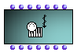
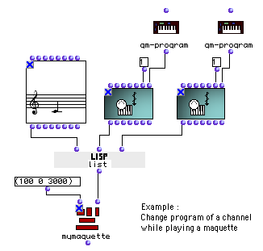
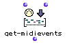
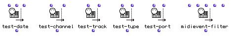
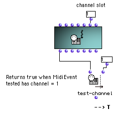
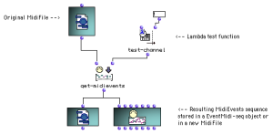
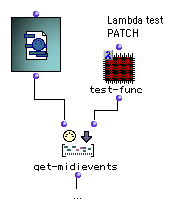
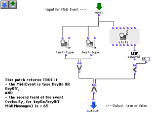
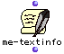

Navigation générale : 

  - [Guide](OM-Documentation.md)
  - [Plan](OM-Documentation_1.md)
  - [Glossaire](OM-Documentation_2.md)

OpenMusic
DocumentationHiérarchie
de section : [OM 6.6 User
Manual](OM-User-Manual.md) \>
[MIDI](MIDI.md) \>
[MIDI Objects](MIDI-Objects.md)
\> MIDI
Events

Navigation : [page
précédente](MIDIFile.md "page précédente(MIDI File)")
| [page
suivante](MIDIContainer.md "page suivante(MIDI Containers)")

# MIDI Events

All OM score and MIDI objects can be traduced (with more or less
precision or data loss) into a list of time-tagged MIDI events.

The **MIDIEvent** box represents this basic MIDI element as an object in
OM visual programs.

## The MIDIEvent Box

<table>
<colgroup>
<col style="width: 50%" />
<col style="width: 50%" />
</colgroup>
<tbody>
<tr class="odd">
<td>

The <strong>MidiEvent</strong> box represents a single MIDI event in OpenMusic.

The slots of the MidiEvent class are type, date, track, port, channel, and fields.

In-popup menus and MIDI selection tools can help setting the MidiEvent box inputs.

</td>
<td>

</td>
</tr>
</tbody>
</table>

Attributes of MIDI Events

  - [Important MIDI Concepts](MIDI-Concepts.md)

Selection Tools for Setting MIDI Event Inputs

  - [MIDI Selection Tools](MIDI-Utils.md)

A "Musical" Object

As other musical objects, MIDIEvent can be "played", that is, sent to a
MIDI output port. It can also be used and send MIDI messages at a given
time in a maquette.

Playing Objects

  - [Playback and Players](1-Play.md)

Delay

If a date is set for a **MidiEvent**, it will be sent at the
corresponding time (in miliseconds) after playing starts.

## Extracting / Processing MIDI Events

<table>
<colgroup>
<col style="width: 50%" />
<col style="width: 50%" />
</colgroup>
<tbody>
<tr class="odd">
<td>

Any types of MIDI or musical object (chord-seq, voice, note, eventmidi-seq, midifile, midicontrol, midi-mix-console,...) can be converted into a list of MidiEvents using the method <strong>get-midievents</strong>. It's a very useful function, allowing all kinds of conversions and "MIDI processing" of the objects.

</td>
<td>

</td>
</tr>
</tbody>
</table>

This function has an optional input where a lambda function can be
connected to test and filter the MidiEvents.

Some predefined functions in the `MIDI / Filters` menu can be used for
this purpose :

**test-date** : tests if the MidiEvents occurs beween a min date and a
max date.

**test-type** : tests the MidiEvent type.

**test-track** : tests the MidiEvent track.

**test-port** : tests the MidiEvent port.

**test-channel** : tests the MidiEvent channel.

**MidiEvent-filter** : test various of the MidiEvent slots (type, track,
port, channel).

Test on a MIDI Event

Filter MIDI Events from a Container Object

<table>
<colgroup>
<col style="width: 50%" />
<col style="width: 50%" />
</colgroup>
<tbody>
<tr class="odd">
<td>

In this example, we filter all MidiEvents from a MidiFile with the same test as in the previous example. <strong>Get-midievents</strong> outputs a list containing all MidiEvents which channel = 1.

The resulting list can be saved as a new MidiFile, or stored in a EventMidi-seq object.

</td>
<td>

</td>
</tr>
</tbody>
</table>

About EventMidi-seqs

  - [MIDI Containers](MIDIContainer.md)

Tests as Lambda Boxes

The test function is a parameter of **get-midievent**; it must be a
lambda function and have only one free input (for the MidiEvents to be
tested).

More About Lambda Boxes

  - [Lambda Mode](LambdaMode.md)
  - [Lambda Mode Examples: Test Functions](LambdaTest.md)

Designing Filter Functions

<table>
<colgroup>
<col style="width: 50%" />
<col style="width: 50%" />
</colgroup>
<tbody>
<tr class="odd">
<td>

For more complex filtering functions, a patch (also set as a lambda box, with a single free input) can also be plugged to the <strong>get-midievents</strong> test input :

</td>
<td>

</td>
</tr>
</tbody>
</table>

<table>
<colgroup>
<col style="width: 50%" />
<col style="width: 50%" />
</colgroup>
<tbody>
<tr class="odd">
<td>

This is an example of what could be inside the patch test-func :

</td>
<td>

</td>
</tr>
</tbody>
</table>

textual Events

<table>
<colgroup>
<col style="width: 50%" />
<col style="width: 50%" />
</colgroup>
<tbody>
<tr class="odd">
<td>

Some MIDI events types are called "textual" (e.g. SeqName, InstrumentName, Lyrics, Copyright, ...). It means that their contents (or "fields") are a encoded textual data. To translate these fields into text (strings), use the <strong>me-textinfo</strong> method (can be applyed to MidiEvents or MidiEvents lists).

</td>
<td>

</td>
</tr>
</tbody>
</table>

Références : 

Plan :

  - [OpenMusic Documentation](OM-Documentation.md)
  - [OM 6.6 User Manual](OM-User-Manual.md)
      - [Introduction](00-Sommaire.md)
      - [System Configuration and
        Installation](Installation.md)
      - [Going Through an OM Session](Goingthrough.md)
      - [The OM Environment](Environment.md)
      - [Visual Programming I](BasicVisualProgramming.md)
      - [Visual Programming
        II](AdvancedVisualProgramming.md)
      - [Basic Tools](BasicObjects.md)
      - [Score Objects](ScoreObjects.md)
      - [Maquettes](Maquettes.md)
      - [Sheet](Sheet.md)
      - [MIDI](MIDI.md)
          - [Introduction](Intro.md)
          - [Important MIDI Concepts](MIDI-Concepts.md)
          - [Rendering and Playback](MIDI-Playback.md)
          - [MIDI Objects](MIDI-Objects.md)
              - [MIDI File](MIDIFile.md)
              - MIDI
                Events
              - [MIDI Containers](MIDIContainer.md)
      - [Audio](Audio.md)
      - [SDIF](SDIF.md)
      - [Lisp Programming](Lisp.md)
      - [Errors and Problems](errors.md)
  - [OpenMusic QuickStart](QuickStart-Chapters.md)

Navigation : [page
précédente](MIDIFile.md "page précédente(MIDI File)")
| [page
suivante](MIDIContainer.md "page suivante(MIDI Containers)")

[A propos...](OM-Documentation_3.md)(c) Ircam - Centre
Pompidou

