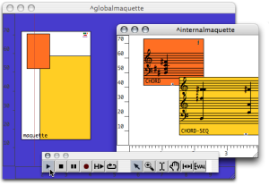
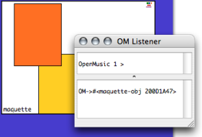

Navigation générale : 

  - [Guide](OM-Documentation.md)
  - [Plan](OM-Documentation_1.md)
  - [Glossaire](OM-Documentation_2.md)

OpenMusic
DocumentationHiérarchie
de section : [OM 6.6 User
Manual](OM-User-Manual.md) \>
[Maquettes](Maquettes.md) \>
[TemporalBoxes](TemporalBoxes.md)
\> [TemporalBoxes
Value](TempValues.md) \>
Sub Maquettes

Navigation : [page
précédente](PatchValue.md "page précédente(Patches)")
| [page
suivante](InstancesValue.md "page suivante(Instances)")

# Sub Maquettes

<table>
<colgroup>
<col style="width: 50%" />
<col style="width: 50%" />
</colgroup>
<tbody>
<tr class="odd">
<td>

Like patches, maquettes can be dropped or created in a maquette editor.

</td>
<td>

</td>
</tr>
</tbody>
</table>

## Sub Maquettes Value

<table>
<colgroup>
<col style="width: 50%" />
<col style="width: 50%" />
</colgroup>
<tbody>
<tr class="odd">
<td>

</td>
<td>

Maquettes are like "containers", whose value is the produce of the whole set of values returned by its inner components. This container is called "maquetteobj", as shown in the Listener at the evaluation.

A maquette doesn't need a Tempout to express its value.

</td>
</tr>
</tbody>
</table>

Calculation Procedure

However, the calculation procedure of this value can be modified.

Calculating the Value of a Maquette : Alternate Tools

  - [Calculating the Value of a
    Maquette](Synthesispatch.md)

## Maquettes and Musical Content

Maquettes can also exist **without being expressed musically** . This is
the case when a maquette contains elements with no musical expression.
Consequently, nothing happens when the maquette is played.

Références : 

Plan :

  - [OpenMusic Documentation](OM-Documentation.md)
  - [OM 6.6 User Manual](OM-User-Manual.md)
      - [Introduction](00-Sommaire.md)
      - [System Configuration and
        Installation](Installation.md)
      - [Going Through an OM Session](Goingthrough.md)
      - [The OM Environment](Environment.md)
      - [Visual Programming I](BasicVisualProgramming.md)
      - [Visual Programming
        II](AdvancedVisualProgramming.md)
      - [Basic Tools](BasicObjects.md)
      - [Score Objects](ScoreObjects.md)
      - [Maquettes](Maquettes.md)
          - [Creating a Maquette](Maquette.md)
          - [TemporalBoxes](TemporalBoxes.md)
              - [Adding TemporalBoxes](AddingTempbox.md)
              - [Elementary Manipulations](elementary.md)
              - [Temporalboxes Appearance](Appearance.md)
              - [TemporalBoxes Value](TempValues.md)
                  - [Patches](PatchValue.md)
                  - Sub
                    Maquettes
                  - [Instances](InstancesValue.md)
          - [The Maquette Editor](Editor.md)
          - [Maquette
            Programming](Programming%20Maquette.md)
          - [Maquettes in
            Patches](Maquettes%20in%20Patches.md)
      - [Sheet](Sheet.md)
      - [MIDI](MIDI.md)
      - [Audio](Audio.md)
      - [SDIF](SDIF.md)
      - [Lisp Programming](Lisp.md)
      - [Errors and Problems](errors.md)
  - [OpenMusic QuickStart](QuickStart-Chapters.md)

Navigation : [page
précédente](PatchValue.md "page précédente(Patches)")
| [page
suivante](InstancesValue.md "page suivante(Instances)")

[A propos...](OM-Documentation_3.md)(c) Ircam - Centre
Pompidou

