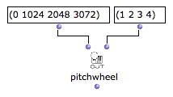
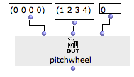

Navigation générale : 

  - [Guide](OM-Documentation.md)
  - [Plan](OM-Documentation_1.md)
  - [Glossaire](OM-Documentation_2.md)

OpenMusic
DocumentationHiérarchie
de section : [OM 6.6 User
Manual](OM-User-Manual.md) \>
[MIDI](MIDI.md) \>
[Rendering and
Playback](MIDI-Playback.md) \>
Microintervals

Navigation : [page
précédente](MIDI-Ports.md "page précédente(Managing MIDI Ports)")
| [page
suivante](Record%20MIDI.md "page suivante(Recording / MIDI In)")

# Playing Microintervals with MIDI

The MIDI pitch unit correspond to 1 semi-tone, so microintervals, in
principle, are not handled by this format.

In OM however, pitches are expressed in **midicents**, which corresponds
to MIDI pitch \* 100.

Writing Microintervals

  - [Microintervals Notation](Editor-Microintervals.md)

Two possibilities exist to play microintervals in OM :

## Using MidiShare (The Default MIDI Player)

When playing microintervals, OpebnMusic uses a "trick" consisting in
dispatching the notes on different MIDI channels depending on their
micro-intervallic pitch.

  - 1/8 tones are sent to channel \#2

  - 1/4 tones are sent to channel \#3

  - 3/8 tones are sent to channel \#4

As a consequence, you just need to "depitch" the corresponding channels
to the right values in order to obtain the right microintervalling
rendering.

Modifying Pitches in MIDI : PitchBend

  - [Important MIDI Concepts](MIDI-Concepts.md)

Limitations of the Microintervals Playback

1\) This techniques works **ONLY** for 1/4 and 1/8th tones (other or
smaller microintervals are not considered)

2\) MIDI channels must not be set or used for other purposes : they will
be changed automatically by the OM player, so all the notes should
initially be on channel 1.

Setting the MIDI Channels for Microintervals

In order to play 1/ or 1/8th tones in OM, channels 1, 2 and 3 must be
depitched :

  - Channel 2 of 1/8 tone

  - Channel 3 of 2/8 tones (or 1/4 tone)

  - Channel 4 of 3/8 tones

Channel 1

Channel 1 does not need to be modified since 1/2 tones only will be kept
on this channel.

Procedure

The **pitchbend** and **pitchwheel** functions can be use to set the
pitch of the "microintervallic channels".

PitchBend/PitchWheel : MIDI-Send boxes

  - [MIDI Player Controls](MIDI-Controls.md)

Depitching with PitchWheel

<table>
<colgroup>
<col style="width: 50%" />
<col style="width: 50%" />
</colgroup>
<tbody>
<tr class="odd">
<td>

The <strong>pitchweel</strong> function has more precision than pitchbend (this is the main difference between the two functions).

The value range for the pitchwheel are 0 - 8192, which usually correspond to 1 tone pitch deviation.

As a consequence, 1/8th tone corresponds to pitchwheel = 1024, 2/8th tones = 2048, and 3/8th tones = 3072.

These values must be assigned respectively to channels 2, 3 and 4.

</td>
<td>

</td>
</tr>
</tbody>
</table>

At evaluating the **pitchwheel** box, the MIDI channels will be
modified and subsequent MIDI playback will render miucrotones
accordingly.

Reset

<table>
<colgroup>
<col style="width: 50%" />
<col style="width: 50%" />
</colgroup>
<tbody>
<tr class="odd">
<td>

To reset the pitchbend values pitchweel again with values = 0 for every channel:

</td>
<td>

</td>
</tr>
</tbody>
</table>

## Using Another Player

The MicroPlayer allows to play MIDI objects with no microintervallic
restriction.

Changing the Player / About MicroPlayer

  - [Score Players](ScorePlayer.md)

Références : 

Plan :

  - [OpenMusic Documentation](OM-Documentation.md)
  - [OM 6.6 User Manual](OM-User-Manual.md)
      - [Introduction](00-Sommaire.md)
      - [System Configuration and
        Installation](Installation.md)
      - [Going Through an OM Session](Goingthrough.md)
      - [The OM Environment](Environment.md)
      - [Visual Programming I](BasicVisualProgramming.md)
      - [Visual Programming
        II](AdvancedVisualProgramming.md)
      - [Basic Tools](BasicObjects.md)
      - [Score Objects](ScoreObjects.md)
      - [Maquettes](Maquettes.md)
      - [Sheet](Sheet.md)
      - [MIDI](MIDI.md)
          - [Introduction](Intro.md)
          - [Important MIDI Concepts](MIDI-Concepts.md)
          - [Rendering and Playback](MIDI-Playback.md)
              - [MIDI Parameters](MIDI-Params.md)
              - [MIDI Player Controls](MIDI-Controls.md)
              - [MIDI Selection Tools](MIDI-Utils.md)
              - [Managing MIDI Ports](MIDI-Ports.md)
              - Microintervals
              - [Recording / MIDI In](Record%20MIDI.md)
          - [MIDI Objects](MIDI-Objects.md)
      - [Audio](Audio.md)
      - [SDIF](SDIF.md)
      - [Lisp Programming](Lisp.md)
      - [Errors and Problems](errors.md)
  - [OpenMusic QuickStart](QuickStart-Chapters.md)

Navigation : [page
précédente](MIDI-Ports.md "page précédente(Managing MIDI Ports)")
| [page
suivante](Record%20MIDI.md "page suivante(Recording / MIDI In)")

[A propos...](OM-Documentation_3.md)(c) Ircam - Centre
Pompidou

