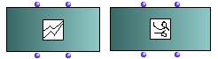
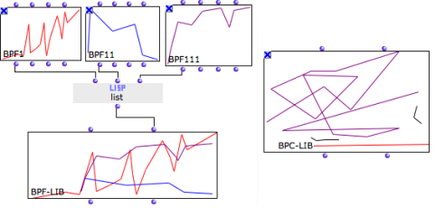

Navigation générale : 

  - [Guide](OM-Documentation.md)
  - [Plan](OM-Documentation_1.md)
  - [Glossaire](OM-Documentation_2.md)

OpenMusic
DocumentationHiérarchie
de section : [OM 6.6 User
Manual](OM-User-Manual.md) \>
[Basic Tools](BasicObjects.md)
\> [Curves and
Functions](CurvesAndFunctions.md) \>
BPF/BPC-Libs

Navigation : [page
précédente](BPF-BPC.md "page précédente(BPF / BPC)")
| [page
suivante](BPFEditors.md "page suivante(Editors)")

# Multiple Objects : BPF/BPC-Lib

<table>
<colgroup>
<col style="width: 50%" />
<col style="width: 50%" />
</colgroup>
<tbody>
<tr class="odd">
<td>

</td>
<td>

<strong>BPC-lib</strong> and <strong>BPF-lib</strong> objects are collections of BPFs and BPCs.

</td>
</tr>
</tbody>
</table>

## Properties

BPF-libs and BPC-libs have two inputs and outputs :

1.  "self" : the object itself, a BPF-Lib or BPC-Lib

2.  "bpf / bpc list" : a list of BPFs or BPCs.

## Creating BPF-Libs or BPF-Libs in a patch

BPF-lib and BPC-lib instances can be created

  - out of existing BPFs or BPCs gathered in lists.
  - via their respective
    [editors](BPFEditors.md).

Abscissa Scale

The BPF-lib or BPC-lib precision is automatically adapted to the highest
"decimal" value of the BPF or BPC objects of the list.

Références : 

Plan :

  - [OpenMusic Documentation](OM-Documentation.md)
  - [OM 6.6 User Manual](OM-User-Manual.md)
      - [Introduction](00-Sommaire.md)
      - [System Configuration and
        Installation](Installation.md)
      - [Going Through an OM Session](Goingthrough.md)
      - [The OM Environment](Environment.md)
      - [Visual Programming I](BasicVisualProgramming.md)
      - [Visual Programming
        II](AdvancedVisualProgramming.md)
      - [Basic Tools](BasicObjects.md)
          - [Curves and Functions](CurvesAndFunctions.md)
              - [BPF / BPC](BPF-BPC.md)
              - BPF/BPC-Libs
              - [Editors](BPFEditors.md)
              - [BPF / BPC Tools](Tools.md)
              - [3D Objects](3D.md)
          - [Array](ClassArray.md)
          - [TextFile](textfile.md)
          - [Picture](Picture.md)
      - [Score Objects](ScoreObjects.md)
      - [Maquettes](Maquettes.md)
      - [Sheet](Sheet.md)
      - [MIDI](MIDI.md)
      - [Audio](Audio.md)
      - [SDIF](SDIF.md)
      - [Lisp Programming](Lisp.md)
      - [Errors and Problems](errors.md)
  - [OpenMusic QuickStart](QuickStart-Chapters.md)

Navigation : [page
précédente](BPF-BPC.md "page précédente(BPF / BPC)")
| [page
suivante](BPFEditors.md "page suivante(Editors)")

[A propos...](OM-Documentation_3.md)(c) Ircam - Centre
Pompidou

