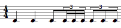

Navigation générale : 

  - [Guide](OM-Documentation.md)
  - [Plan](OM-Documentation_1.md)
  - Glossaire

OpenMusic
Documentation

# Glossaire

Sommaire :  |

[A-B](#categlh_mh_nh_M0M2) |
[C](#categlh_mh_nh_M0M3)
|
[D-F](#categlh_mh_nh_M0M4)
|
[G-H](#categlh_mh_nh_M0M5)
|
[I](#categlh_mh_nh_M0M6)
|
[J-L](#categlh_mh_nh_M0M7)
|
[M](#categlh_mh_nh_M0M8)
|
[N-O](#categlh_mh_nh_M0M9)
|
[P](#categlh_mh_nh_M0Ma)
|
[Q-R](#categlh_mh_nh_M0Mb)
|
[S](#categlh_mh_nh_M0Mc)
|
[T-Z](#categlh_mh_nh_M0Md)
| 

## A-B

[Référents...](# "Cliquez ici pour voir les référents...")

  - [Pathnames](Pathnames.html#i8)

Absoluate Pathname

An absolute pathname, also referred to as an absolute path or a full
path, is the location of a filesystem object – file, directory or link–
relative to the **root directory**.

[Référents...](# "Cliquez ici pour voir les référents...")

  - [Pathnames](Pathnames.html#i3)

Abstraction

Abstraction is a procedure that permits to abstract a program, that is,
a process, a patch, into a box that can then be used into another
program. In other words, an abstraction box represents a patch in
another patch and acts as a function.

[Référents...](# "Cliquez ici pour voir les référents...")

  - [Abstraction Boxes](AbsBoxesIntro.html#i4)

Abstraction

A program or patch can be more or less complex, and comprise one or
several components "layers", like a tree structure. Such structures
consist of patches embedded into other patches. Processes embedded in
higher-level programs are called **abstractions**.

Abstraction aims at using a program as a **function** within another
program.

  - From a formal view, an abstraction results from the
    **conversion of one or several elements of a program into
    variables** . 
  - Consequently, in practical terms, an abstraction must have at
    least one outlet to **communicate with the external environment** .
    

[Référents...](# "Cliquez ici pour voir les référents...")

  - [Abstraction](Abstraction.html#i0)

Argument

An argument represents a parameter upon which a function operates. For
instance, the (om+ x y) function has two arguments : x and y.

[Référents...](# "Cliquez ici pour voir les référents...")

  - [Function Boxes](FunctionBoxes.html#i5)
  - [Function Boxes](FunctionBoxes.html#i6)
  - [Function Boxes](FunctionBoxes.html#i10)
  - [Instantiating Objects](2-Instanciation.html#i7)
  - [Introduction to Lisp](LispIntro.html#i3)
  - [Programming a Simple Patch](2_progpatch.html#i4)

Atom

An elementary item, number, symbol, string. An atom can be part of a
list.

[Référents...](# "Cliquez ici pour voir les référents...")

  - [Formalizing a Process](4cApplication.html#i2)

Break Point Function

A "break-point" function is a function defined by a finite number of
points (x,y).

[Référents...](# "Cliquez ici pour voir les référents...")

  - [BPF / BPC](BPF-BPC.html#i2)

## C

CAR, CDR, CADR, CDDR, CADDR...

Elementary Lisp functions, allowing the access to one or more elements
in a list.

Lisp fonctions are actually linked list. Lists are actually "conses" (or
"pairs") made of a first element and a pointer to the rest (or "tail")
of the list (another cons). These two parts of the list are accessed
with the CAR and CDR functions, respectively.

Let the following list be : (A B C D).

CAR (A B C D) = A.

CDR (A B C D) = (B C D).

CDR (B) =\> NIL \[this list has no CDR\]

"CAR" and "CDR" are technical terms which originally refer to the way
data is handled by the computer. CAR is the acronym of "Contents of the
Address part of Register number". CDR is the acronym of "Contents of the
Decrement part of Register number".

The rest of the functions below are built upon these two kernel
accessors.

CADR (A B C D) = B. CADR means CAR of the CDR.

CDDR (A B C D) = (C D). CDDR means CDR of the CDR.

CADDR (A B C D) = C. CADDR means CAR of the CDDR.

NTHCDR (A B C D) = NTH CDR of the list – N must be specified as
argument. NTHCDR 3 (A B C D) = (D).

And so on...

[Référents...](# "Cliquez ici pour voir les référents...")

  - [Type Predicates](PredTypes.html#i2)
  - [Type Predicates](PredTypes.html#i3)
  - [List Loop](ListLoop.html#i2)
  - [List Loop](ListLoop.html#i3)
  - [List Loop](ListLoop.html#i4)

Chord-Seq

OM name of a chord sequence. By extension, a note sequence, since a
single note can be considered a chord.

[Référents...](# "Cliquez ici pour voir les référents...")

  - [Instantiating Objects](2-Instanciation.html#i6)

Class

A category of objects sharing common properties – characteristics and
behaviour. A class specifies the internal structure and behaviour of an
object. In OM, it is represented in a patch by a factory box that can
produce an instance of a class.

See also : Object, Instance

[Référents...](# "Cliquez ici pour voir les référents...")

  - [Workspace(s) Management](Workspace\(s\).html#i8)
  - [Library](Library.html#i0)
  - [Packages](Packages.html#i5)
  - [Packages](Packages.html#i8)
  - [Adding Boxes Into a Patch](AddingBoxes.html#i4)
  - [Boxes Features](GraphicFeatures.html#i5)
  - [Objects – Factory Boxes](FactoryBoxes.html#i0)
  - [Instantiating Objects](2-Instanciation.html#i5)
  - [Global Variables](GlobalVariables.html#i6)
  - [Chord & Musical Objects](4aApplication.html#i1)

CLOS – Common Lisp Object System –

CLOS is an object-oriented programming protocol defined in the Common
Lisp language specification. It is based on classes, instances of
classes, generic functions and methods to be used in Lisp programs.

See also : Class, Function, Generic Function, Method, Instance.

[Référents...](# "Cliquez ici pour voir les référents...")

  - [Function Boxes](FunctionBoxes.html#i9)

Conditional Operators

Conditional operators execute an operation if one or more preconditions
are fulfilled. If these conditions are not fulfilled, they can possibly
execute another operation.

OM offers two conditional operators : **omif** and ****
****conditional**** **** , which operate according to the following
paradigm : "IF A, THEN do B, ELSE do C".

[Référents...](# "Cliquez ici pour voir les référents...")

  - [Conditional Operators](ConditionalOps.html#i0)

Container

In OM, a container is an object that contains a number of sub objects,
including other containers as well. For instance, a chord-seq that
contains chords, a chord that contains notes, a maquette that contains
temporal objects, etc.

[Référents...](# "Cliquez ici pour voir les référents...")

  - [Maquettes](Maquettes.html#i0)

Contextual menu

A pop up menu that allows to choose actions to be performed upon an
object.

⤷ `Ctrl` click or right click in an OM window or on one of its item.

[Référents...](# "Cliquez ici pour voir les référents...")

  - [Comments](5dComplete.html#i1)

Currying

Reducing the number of arguments of a lambda function by assigning
values to some of them.

[Référents...](# "Cliquez ici pour voir les référents...")

  - [Higher-Order Functions](HighOrder.html#i3)

## D-F

Directory

Corresponds to the "directory'' concept in many host file systems: the
name of a group of related files (typically those belonging to a single
user or project).

[Référents...](# "Cliquez ici pour voir les référents...")

  - [Pathnames](Pathnames.html#i9)

Evaluation

In Lisp, evaluating an expression amounts to interpreting and reducing
its contents in order to return a result.

In OM, visual programs represent Lisp expressions and evaluating a box
triggers the calculus that will determine the value of these
expressions.

Any kind of box can be evaluated and return something. To evaluate a
box, ⤷ Click and press `v` or `Cmd` click on an outlet.

[Référents...](# "Cliquez ici pour voir les référents...")

  - [Boxes Features](GraphicFeatures.html#i6)
  - [Introduction to Lisp](LispIntro.html#i4)
  - [Programming a Simple Patch](2_progpatch.html#i1)
  - [Programming a Simple Patch](2_progpatch.html#i5)
  - [Creating an Instance](4bApplication.html#i1)

Factory Box

A box used for creating an instance, or exemplar, of a given class
within a visual program.

[Référents...](# "Cliquez ici pour voir les référents...")

  - [Boxes](Boxes.html#i1)
  - [Boxes Features](GraphicFeatures.html#i3)
  - [Chord & Musical Objects](4aApplication.html#i3)

First Class Object

A first-class object is an entity which can be passed as a parameter to
a function, returned from a function, or assigned into the variable of a
program.

[Référents...](# "Cliquez ici pour voir les référents...")

  - [Higher-Order Functions](HighOrder.html#i2)

Function

A  portion of code within a larger program, which performs a specific
task. Operates upon 0 or more parameters and returns a value.

[Référents...](# "Cliquez ici pour voir les référents...")

  - [Workspace(s) Management](Workspace\(s\).html#i9)
  - [Library](Library.html#i1)
  - [Packages](Packages.html#i6)
  - [Adding Boxes Into a Patch](AddingBoxes.html#i3)
  - [Boxes](Boxes.html#i0)
  - [Boxes Features](GraphicFeatures.html#i4)
  - [Programming a Simple Patch](2_progpatch.html#i2)

Functional Abstraction

A functional abstraction is a program whose some elements can become
variables, via connections to the outside environment. Hence, this
program must have inputs or outputs that can be connected to external
variable elements. The resulting functional abstraction can then be
embedded into other programs to be used as a functional component.

[Référents...](# "Cliquez ici pour voir les référents...")

  - [Abstraction Boxes](AbsBoxesIntro.html#i2)
  - [Abstraction Boxes](AbsBoxesIntro.html#i3)
  - [Visual Programming
    II](AdvancedVisualProgramming.html#i0)
  - [Inputs / Outputs](AbsInOuts.html#i2)

## G-H

Generic Function

In object oriented programming, a generic function is a collection of
methods – elementary specialized functions – with the same name and
argument structure, but with arguments typed differently.

See also : Method

[Référents...](# "Cliquez ici pour voir les référents...")

  - [Packages](Packages.html#i9)
  - [Function Boxes](FunctionBoxes.html#i8)

Global variable

An instance of OM object that has been saved in order to be used in
other programs. Global variables are visible from the `Library` window
and stored as .omi files in the `Globals` folder of the workspace.

[Référents...](# "Cliquez ici pour voir les référents...")

  - [Workspace(s) Management](Workspace\(s\).html#i6)
  - [Packages](Packages.html#i7)
  - [Import/Export](4-ImportExport.html#i3)
  - [Visual Programming
    II](AdvancedVisualProgramming.html#i3)
  - [Instance Boxes](InstanceBoxes.html#i3)
  - [The Store Object](Store.html#i3)

Group

An internal subdivision, that is, a list of proportions within a
measure. A group can enclose a sub group. Basic examples are tuplets,
groups of eighth, sixteenth notes. Groups of quarter, semibreves, whole
notes or any other values are also admitted in rhythm trees.

For instance :

(? ((4//4 ( (2 ( 1 1)) (1 ( 1 (1 (1 1 1)))) (1 (1 1 1 1 1)) )))).

This one measure tree has one group – two quarter notes – , one group
with a sub group – one eighth note and a sixteenth notes triplet, and a
last group – a quintuplet.

[Référents...](# "Cliquez ici pour voir les référents...")

  - [Rhythm Trees Structure](RT1.html#i3)

## I

Instance

An actual object created at runtime, out of a given class. In OM, more
specifically, an object created when evaluating a factory box. An
instance can be saved as a global variable.

⤷ `SHIFT` click on an outlet – especially the first outlet representing
the self, the whole object – of a factory box to materialize an
instance.

[Référents...](# "Cliquez ici pour voir les référents...")

  - [Workspace(s) Management](Workspace\(s\).html#i7)
  - [Objects – Factory Boxes](FactoryBoxes.html#i1)
  - [Instantiating Objects](2-Instanciation.html#i3)
  - [Instantiating Objects](2-Instanciation.html#i8)
  - [Import/Export](4-ImportExport.html#i2)
  - [Visual Programming
    II](AdvancedVisualProgramming.html#i2)
  - [Global Variables](GlobalVariables.html#i4)
  - [Global Variables](GlobalVariables.html#i5)
  - [Chord & Musical Objects](4aApplication.html#i4)

Instantiation

An instance is an exemplar of a class of objects. Instantiation is the
process of creating an instance of a class using a factory box.

[Référents...](# "Cliquez ici pour voir les référents...")

  - [Instantiating Objects](2-Instanciation.html#i2)

Internal Evaluation

Evaluation of a box by OM, triggered by a user evaluation, or by the
internal evaluation of an upstream box connected to it.

[Référents...](# "Cliquez ici pour voir les référents...")

  - [Evaluate-Once Mode](EvOnceMode.html#i2)
  - [Evaluate-Once Mode](EvOnceMode.html#i4)

Iteration

The repetition of a process within a computer program.

See also : Recursion.

[Référents...](# "Cliquez ici pour voir les référents...")

  - [Visual Programming
    II](AdvancedVisualProgramming.html#i1)

Iteration

Iteration is the repetition of a process in order to apply it to a
series of items.

[Référents...](# "Cliquez ici pour voir les référents...")

  - [Iteration](LoopIntro.html#i0)

## J-L

Library

A library is a set of tools, or framework, used by an application – like
OM – to execute specific tasks.

[Référents...](# "Cliquez ici pour voir les référents...")

  - [Mac OS X](InstallationMac.html#i4)
  - [Windows](InstallationWindows.html#i4)

Lisp Listener

A Lisp communication interface displaying results of computations,
warnings or error messages, and where Lisp expressions – programs – can
be evaluated.

[Référents...](# "Cliquez ici pour voir les référents...")

  - [Function Boxes](FunctionBoxes.html#i7)
  - [Lisp Programming](Lisp.html#i0)
  - [Starting a Session](1_StartSession.html#i3)

Lisp Package

In Lisp, a package is a means to gather symbols, such as functions,
variables or class names, within a same specific name space. You are
always working in a "current" package, which can be changed with the
command (in-package "my-package").

In orde to use items defined in other packages (unless these item's
names are "exported" to the current package), it is generally necessary
to type the package name (or "nickname"), separated by " : :", before
the usual name ( Ex. : om : :om+ ).

The default package in OM is "OPENMUSIC" or "OM". The default package in
Common Lisp is "CL-USER".

[Référents...](# "Cliquez ici pour voir les référents...")

  - [The Lisp Editor](LispEditor.html#i5)

List

A finite ordered sequence of elements delineated by two parenthesis,
where each element itself is an atom or a list.

See also : Atom.

[Référents...](# "Cliquez ici pour voir les référents...")

  - [Formalizing a Process](4cApplication.html#i1)

## M

Maquette

A hybrid of visual program and sequencer, a programming unit provided
with a time dimension, where musical material is organized in a time
oriented structure.

[Référents...](# "Cliquez ici pour voir les référents...")

  - [Workspace(s) Management](Workspace\(s\).html#i5)
  - [The Workspace Window](WS-Window.html#i3)

Matrix

A matrix is a rectangular array of m\*n numbers, with m rows and n
columns, such as :

1 2 3

4 5 6

[Référents...](# "Cliquez ici pour voir les référents...")

  - [Array](ClassArray.html#i0)

Method

An elementary function or part of a generic function defining rules for
its behaviour depending on a type of argument. Defining a generic
function amounts to defining at least one method.

For instance, the OM+ function is made of four methods : 1. number +
list / 2. list + number / 3. number + number / 4. list + list

[Référents...](# "Cliquez ici pour voir les référents...")

  - [Workspace(s) Management](Workspace\(s\).html#i10)
  - [Library](Library.html#i2)
  - [Function Boxes](FunctionBoxes.html#i11)
  - [The Lisp Editor](LispEditor.html#i3)
  - [The Lisp Editor](LispEditor.html#i4)

Midicent

A midicent is a unit representing one cent of the usual MIDI pitch unit,
that is, a half-tone. For instance, a C4 corresponds to 60 in MIDI, and
to 6000 midicents, C4\# to 61, i.e. 6100 midicents, and so on.

[Référents...](# "Cliquez ici pour voir les référents...")

  - [Patch Introduction](ProgrammingIntro.html#i3)
  - [Completing the Edition](5bComplete.html#i1)

Modulo

In computing, the modulo operation finds the **remainder** of division
of one number by another. If two numbers, a and b , when divided by the
same n **divisor**, have the same remainder, they are **"equal modulo n
".**

\-\> If remainder ( a  / n ) = remainder ( b / n ), a = b , modulo n .

[Référents...](# "Cliquez ici pour voir les référents...")

  - [Test Functions](LambdaTest.html#i0)

## N-O

n-\>mc

Converts a note name or list of note names into corresponding midi cents
values. The reference is the standard notation, where the medium C (6000
midicents) = C3.

[Référents...](# "Cliquez ici pour voir les référents...")

  - [Examples of Use](InterfaceExample.html#i2)

Name

The name of a group of files that can be thought of as the "same'' file

[Référents...](# "Cliquez ici pour voir les référents...")

  - [Pathnames](Pathnames.html#i7)

Object

A thing provided with properties – characteristics and behaviour. An
object is defined by a class and shares the same characteristics with
other objects belonging to the same class.

An exemplar of a class.

For instance, the class of Note defines all possible notes by listing
the characteristics and behaviors they can have. The object A4 is a
particular note : it is an instance of the Class note, with particular
versions of its characteristics. A note has a pitch. An A4 is a 440 Hz
note.

See also : Class, Instance, Object Oriented Programming.

[Référents...](# "Cliquez ici pour voir les référents...")

  - [Chord & Musical Objects](4aApplication.html#i2)

Offset

Temporal position of an object.

In a chord, each note can have a specific offset.

[Référents...](# "Cliquez ici pour voir les référents...")

  - [Chord & Musical Objects](4aApplication.html#i5)

OM Function

A function that has been specifically designed for OpenMusic, and that
doesn't belong to Lisp.

[Référents...](# "Cliquez ici pour voir les référents...")

  - [Programming a Simple Patch](2_progpatch.html#i3)

Omor, Omand

Omor
and
omand

are **boolean logical operators** that stand for the "and" and "or"
coordinating conjunctions.

  - A proposition that contains an "and" is true if **all** its
    elements are true. 
  - A proposition that contains an "or" is true if **at least
    one** of its elements is true. 

For instance, the following propositions are respectively true and false
:

  - A : "Men are living creatures". B : "Cats are living
    creatures". "A and B" is true, and "A or B" is true.
  - A : "Men are human beings." B : "Cats are human beings". "A or
    B" is true, but "A and B" is not true. 

In OM

  -  the omand box returns "true" if **all** its inputs return
    "true". Otherwise, it returns "nil". 
  - the omor box returns "true" if one of its inputs return
    "true". Otherwise, it returns "nil".

[Référents...](# "Cliquez ici pour voir les référents...")

  - [Logical Operators](Logical.html#i2)

## P

Package

Contains functions or classes components belonging to a common category
of programming items. Packages are provided at the installation of OM,
but the can also be loaded dynamically or added by the user.

[Référents...](# "Cliquez ici pour voir les référents...")

  - [Environment Windows](MainWindows.html#i4)
  - [Adding Boxes Into a Patch](AddingBoxes.html#i5)

Package

A package represents a category of programming tools that encloses
related functions and classes. It can be organized in sub packages.

[Référents...](# "Cliquez ici pour voir les référents...")

  - [Packages](Packages.html#i4)

Parent Directory

A parent directory is the directory in which a given directory is
located. In an absolute path, the parent directoy is the predecessor of
the current directory.

[Référents...](# "Cliquez ici pour voir les référents...")

  - [Pathnames](Pathnames.html#i5)

Patch

A programming unit where objects and functions – boxes – are
interconnected to build a musical algorithm, that is, a sequence of
instructions. A patch can also be embedded as a box within another
patch.

[Référents...](# "Cliquez ici pour voir les référents...")

  - [Workspace(s) Management](Workspace\(s\).html#i4)
  - [The Workspace Window](WS-Window.html#i2)
  - [Starting a Session](1_StartSession.html#i1)

Persistent object/document, Persistence

A persistent object corresponds to a "real" file that is kept somewhere
in the hard drive of the computer. Examples of persistent objects in OM
are patches, maquettes, or global variables. The corresponding documents
are kept in the Workspace folder. Conversely, a "non-persistent" object
lays within a program but cannot be manipulated as an independent file.

[Référents...](# "Cliquez ici pour voir les référents...")

  - [Workspace(s) Management](Workspace\(s\).html#i3)
  - [Instances](Instances.html#i0)

Predicate

The concept of predicate refers to a **property**, or to a **relation**
between the terms of a proposition.

A predicates is a boolean operators : it is a function which tests for a
condition involving its arguments. If the condition is fulfilled, the
operator returns "true" or "false" – "yes" or "no".

In Lisp, "nil" means "false", and "t" means "true". As a convention, any
non nil value is also interpreted as "true".

There are several types of predicates. Among these, algebraic predicates
compare numbers, equality predicates test if two objects are identical,
type predicates that test if an object belongs to a specific type, and
so on.

In OM, predicates are often used as ****conditions**** **** for the
execution of a program.

[Référents...](# "Cliquez ici pour voir les référents...")

  - [Predicates](Predicates.html#i0)

Predicate

A predicate verifies the property of a thing or a relation between two
things. It has two possible answers : "true", and "false", that is, "t",
or "nil" in Lisp.

[Référents...](# "Cliquez ici pour voir les référents...")

  - [While Loop](WhileLoop.html#i2)

## Q-R

Recursion

In computer science, recursion is the application of a function within
its own definition. This method allows to solve complex problems.

In order no to "call itself" infinitely, a recursive function must
include a **termination condition** . A termination condition is a
necessary condition so that the function doesn't call itself.

[Référents...](# "Cliquez ici pour voir les référents...")

  - [Recursive Patches](Recursion.html#i1)

Relative Pathname

A relative pathname tells the location of a filesystem object relative
to the directory **in which the user is currently working**.

[Référents...](# "Cliquez ici pour voir les référents...")

  - [Pathnames](Pathnames.html#i4)

Rhythm Tree

A rhythm tree expresses a rhythmic structure as a list.

This list is made of :

  - a duration, or number of measures,

  - a list of measures.

Each measure is made of

  - a time signature

  - a list or proportions, or rhythmic values.

For instance : (1 (((4 4) (1 1 2))) is a rhythm of one measure,
signature 4/4, with two quarter and one half note (proportions = 1/4 1/4
2/4 = 1/4 1/4 1/2).

The term of "tree" refers to a recusrive structure: each item in the
proportions list can in turn be expressed as a duration with a list of
subdivisions.

For instance the second beat in our measure could be subdivided as
follows : ((4 4) (1 (1 (2 3)) 2)).

[Référents...](# "Cliquez ici pour voir les référents...")

  - [Presentation](Score-Objects-Intro.html#i4)
  - [Rhythmic Objects](RhythmicObjects.html#i2)
  - [Rhythmic Objects](RhythmicObjects.html#i3)

## S

Slot

In object oriented programming, a slot represents and attribute of a
class. For instance, the class "note" in OM has 4 slots : pitch,
duration, velocity, and MIDI channel.

[Référents...](# "Cliquez ici pour voir les référents...")

  - [Instantiating Objects](2-Instanciation.html#i4)
  - [Instantiating Objects](2-Instanciation.html#i9)
  - [Editors](3-Editors.html#i3)

String

A characters chain between two inverted commas.

[Référents...](# "Cliquez ici pour voir les référents...")

  - [Text Boxes](TextBoxes.html#i2)
  - [Pathnames](Pathnames.html#i6)
  - [Pathnames](Pathnames.html#i10)

Subclass

A subclass is derived from a preexisting class, by inheritance. In
object-oriented programming, objects are defined by classes. New objects
can be created from existing objects. As objects are defined by classes,
classes can inherit other classes. Sub-classes inherit attributes and
behavior of the pre-existing classes, or super-classes. Code is
compartmentalized and reused by creating collections of attributes and
behaviors called objects which can be based on previously created
objects.

[Référents...](# "Cliquez ici pour voir les référents...")

  - [Class-Array Object](ArrayObject.html#i4)

Subdivisions of the Whole Note

Memento :

=
1, 
= 2,
=
4,
=
8,
=
16,
=
32,
=
64

[Référents...](# "Cliquez ici pour voir les référents...")

  - [Rulers and Grid](Grid%20and%20Rulers.html#i3)

## T-Z

Temporal object

In a maquette, any object provided with an explicit or computable
duration, such as an audio file, a chord object or a patch.

See also : Maquette.

[Référents...](# "Cliquez ici pour voir les référents...")

  - [Resources](resources.html#i3)

TemporalBox

A TemporalBox refers to an object in a maquette : an instance, a patch,
or another maquette.

[Référents...](# "Cliquez ici pour voir les référents...")

  - [Creating a Maquette](Maquette.html#i5)

User Evaluation

A user evaluation triggers one or more internal evaluation of the box
and of possible upstream boxes connected to it.

[Référents...](# "Cliquez ici pour voir les référents...")

  - [Evaluate-Once Mode](EvOnceMode.html#i3)

Workspace

OpenMusic's working environment. Each session starts with choosing a
workspace, the equivalent of a desktop where programs are created and
organized, and where items can be stored.

[Référents...](# "Cliquez ici pour voir les référents...")

  - [Launching OM](Launching%20OM.html#i2)
  - [Patch Introduction](ProgrammingIntro.html#i2)
  - [Starting a Session](1_StartSession.html#i2)

[A propos...](OM-Documentation_3.md)(c) Ircam - Centre
Pompidou

