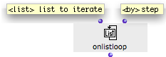
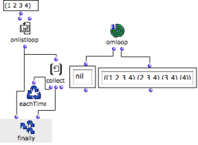
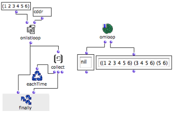

Navigation générale : 

  - [Guide](OM-Documentation.md)
  - [Plan](OM-Documentation_1.md)
  - [Glossaire](OM-Documentation_2.md)

OpenMusic
DocumentationHiérarchie
de section : [OM 6.6 User
Manual](OM-User-Manual.md) \>
[Visual Programming
II](AdvancedVisualProgramming.md) \>
[Iterations: OMLoop](OMLoop.md)
\>
[Iterators](LoopIterators.md)
\> OnList
Loop

Navigation : [page
précédente](ListLoop.md "page précédente(List Loop)")
| [page
suivante](ForLoop.md "page suivante(For Loop)")

# OnListLoop : Enumerating Subsets of Lists

## General Properties

**OnListLoop** returns a list and then **successive smaller chunks** of
the list. The execution ends once the list is exhausted.

<table>
<colgroup>
<col style="width: 50%" />
<col style="width: 50%" />
</colgroup>
<tbody>
<tr class="odd">
<td>

</td>
<td>

Onlistloop has one default input and one optional input :

<ul>
<li> "list" : a list</li>
<li> "by" : a box defining <strong>the way the list is exhausted</strong> .</li>
</ul>

</td>
</tr>
</tbody>
</table>

## Controling Subsets Enumeration

"By"

The default value of "by" is a cdr. This means that, at each loop, the
cdr of the list is returned.

This default value can be replaced by any other Lisp function meant to
return a small chunk of list, just as
[listloop](ListLoop.md) .

Examples

<table>
<colgroup>
<col style="width: 50%" />
<col style="width: 50%" />
</colgroup>
<tbody>
<tr class="odd">
<td>

Here, onlistloop successively returns smaller chunks of the list, by taking away <strong>the first element</strong> of the list : it returns cdrs.

The result of each loop is collected by collect and returned by the second input of finally.

</td>
<td>

</td>
</tr>
</tbody>
</table>

The value of "by" is switched to cddr. Onlistloop successively returns
cdrs of cdrs : at each step, the **two first elements** of the list are
left aside.

Note that the first input of finally always returns "nil" at the end of
the loop.

Références : 

Plan :

  - [OpenMusic Documentation](OM-Documentation.md)
  - [OM 6.6 User Manual](OM-User-Manual.md)
      - [Introduction](00-Sommaire.md)
      - [System Configuration and
        Installation](Installation.md)
      - [Going Through an OM Session](Goingthrough.md)
      - [The OM Environment](Environment.md)
      - [Visual Programming I](BasicVisualProgramming.md)
      - [Visual Programming
        II](AdvancedVisualProgramming.md)
          - [Abstraction](Abstraction.md)
          - [Evaluation Modes](EvalModes.md)
          - [Higher-Order Functions](HighOrder.md)
          - [Control Structures](Control.md)
          - [Iterations: OMLoop](OMLoop.md)
              - [Iteration](LoopIntro.md)
              - [General Features](LoopGeneral.md)
              - [Evaluators](LoopEvaluators.md)
              - [Iterators](LoopIterators.md)
                  - [List Loop](ListLoop.md)
                  - OnList
                    Loop
                  - [For Loop](ForLoop.md)
                  - [While Loop](WhileLoop.md)
                  - [Infinite Loops](InfiniteLoops.md)
              - [Accumulators](LoopAccumulators.md)
              - [Example : A Random Series](LoopExample.md)
          - [Instances](Instances.md)
          - [Interface Boxes](InterfaceBoxes.md)
          - [Files](Files.md)
      - [Basic Tools](BasicObjects.md)
      - [Score Objects](ScoreObjects.md)
      - [Maquettes](Maquettes.md)
      - [Sheet](Sheet.md)
      - [MIDI](MIDI.md)
      - [Audio](Audio.md)
      - [SDIF](SDIF.md)
      - [Lisp Programming](Lisp.md)
      - [Errors and Problems](errors.md)
  - [OpenMusic QuickStart](QuickStart-Chapters.md)

Navigation : [page
précédente](ListLoop.md "page précédente(List Loop)")
| [page
suivante](ForLoop.md "page suivante(For Loop)")

[A propos...](OM-Documentation_3.md)(c) Ircam - Centre
Pompidou

