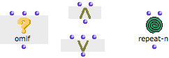

Navigation générale : 

  - [Guide](OM-Documentation.md)
  - [Plan](OM-Documentation_1.md)
  - [Glossaire](OM-Documentation_2.md)

OpenMusic
DocumentationHiérarchie
de section : [OM 6.6 User
Manual](OM-User-Manual.md) \>
[Visual Programming
I](BasicVisualProgramming.md) \>
[Boxes](Boxes.md) \>
Other Boxes

Navigation : [page
précédente](AbsBoxesIntro.md "page précédente(Abstraction Boxes)")
| [page
suivante](BoxInputs.md "page suivante(Box Inputs)")

# Other Boxes

Other types of OM boxes, related to more advanced programming concepts
are detailed in specifically sections of the [Advanced
Programming](AdvancedVisualProgramming.md) section.

## Control Boxes

[Control boxes](Control.md) are specific functions, which
allow to choose between several operations to execute, and or to control
the execution of a patch :

About Control Boxes

  - [Conditional Operators](ConditionalOps.md)

## Instance Boxes and Global Variables

[Instance boxes](InstanceBoxes.md) and [global
variables](GlobalVariables.md) refer to permanent objects used as
reference material.

About Instances and Global Variables

  - [Instances](Instances.md)

Références : 

Plan :

  - [OpenMusic Documentation](OM-Documentation.md)
  - [OM 6.6 User Manual](OM-User-Manual.md)
      - [Introduction](00-Sommaire.md)
      - [System Configuration and
        Installation](Installation.md)
      - [Going Through an OM Session](Goingthrough.md)
      - [The OM Environment](Environment.md)
      - [Visual Programming I](BasicVisualProgramming.md)
          - [Patch Introduction](ProgrammingIntro.md)
          - [Adding Boxes Into a Patch](AddingBoxes.md)
          - [Elementary Manipulations](ElementaryManips.md)
          - [Boxes](Boxes.md)
              - [Boxes Features](GraphicFeatures.md)
              - [Data Boxes](DataBox.md)
              - [Function Boxes](FunctionBoxes.md)
              - [Objects – Factory Boxes](FactoryBoxes.md)
              - [Abstraction Boxes](AbsBoxesIntro.md)
              - Other
                Boxes
          - [Box Inputs](BoxInputs.md)
          - [Connections](Connections.md)
          - [Evaluation](Evaluation.md)
          - [Documentation and Info](DocAndInfo.md)
          - [Comments](Comments.md)
          - [Pictures](Pictures.md)
          - [Saving / Reloading a Patch](SavingPatch.md)
          - [Dead Boxes](DeadBox.md)
      - [Visual Programming
        II](AdvancedVisualProgramming.md)
      - [Basic Tools](BasicObjects.md)
      - [Score Objects](ScoreObjects.md)
      - [Maquettes](Maquettes.md)
      - [Sheet](Sheet.md)
      - [MIDI](MIDI.md)
      - [Audio](Audio.md)
      - [SDIF](SDIF.md)
      - [Lisp Programming](Lisp.md)
      - [Errors and Problems](errors.md)
  - [OpenMusic QuickStart](QuickStart-Chapters.md)

Navigation : [page
précédente](AbsBoxesIntro.md "page précédente(Abstraction Boxes)")
| [page
suivante](BoxInputs.md "page suivante(Box Inputs)")

[A propos...](OM-Documentation_3.md)(c) Ircam - Centre
Pompidou

