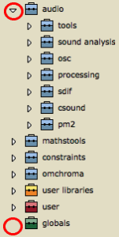
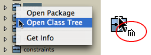
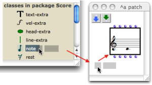

Navigation générale : 

  - [Guide](OM-Documentation.md)
  - [Plan](OM-Documentation_1.md)
  - [Glossaire](OM-Documentation_2.md)

OpenMusic
DocumentationHiérarchie
de section : [OM 6.6 User
Manual](OM-User-Manual.md) \>
[The OM
Environment](Environment.md) \>
[Library](Library.md) \>
Packages

Navigation : [page
précédente](Library.md "page précédente(Library)")
| [page
suivante](UserLibraries.md "page suivante(Extra Libraries)")

# Packages

[Sommaire ](#)

1.  [Packages of the Library Window](#mN1d)
2.  [Packages Content](#mN18d)
3.  [Using Classes and Functions from the Libary](#mN2a8)
4.  [Creating / Editing the Library Items](#mN315)

Package

A package represents a category of programming tools that encloses
related functions and classes. It can be organized in sub packages.

## Packages of the Library Window

Each package is represented by a small suitcase.

<table>
<colgroup>
<col style="width: 50%" />
<col style="width: 50%" />
</colgroup>
<tbody>
<tr class="odd">
<td>

 The OM Packages are the most numerous. They contain classes<a href="#kFootBsktc1871">[1]</a> and functions<a href="#kFootBsktc1872">[2]</a> predefined in OM. OM Packages are defined thematically.

For instance, the Score package contains classes that are literally dedicated to the score domain, such as chords, notes, polyphonies, and functions that can perform operations upon these classes.

These packages and their content are "protected" and cannot be modified by the user.

 The User Package can receive user-defined classes and functions, which can be dispatched in dedicated sub packages. These classes and functions can be modified.

  The User Libraries package encloses a set of additional libraries that can be added or loaded dynamically.

 The Globals package is a special folder that contains user-defined global variables<a href="#kFootBsktc1805">[3]</a>. It cannot contain sub packages.

If a package is supposed to contain sub packages, it features an adjacent triangle that allows to open a package on <strong>List mode</strong> . When this triangle is clicked, the package unfolds and displays its inner sub packages – see below.

</td>
<td>

</td>
</tr>
</tbody>
</table>

About Global Variables

  - [Global Variables](GlobalVariables.md)

About User Libraries

  - [Extra Libraries](UserLibraries.md)

Getting Information

To get information about a select package, class or function of the
library, use the `Info` window :

  -  `Ctrl` / right click on an item and choose ` Get Info
     `
  - select `File / Get Info`
  -  press `Cmd` + `i` .

Information related to the items of the User package can also be edited.

## Packages Content

A package gives access to both functions and classes of a common
"theme", or category of tools. Packages contents can be displayed in
**'Package' mode** or ' **Class Tree' mode** .

<table>
<colgroup>
<col style="width: 50%" />
<col style="width: 50%" />
</colgroup>
<tbody>
<tr class="odd">
<td>

The default presentation allows to get a global view of a package whole organization in sub packages.

Classes and functions contained in the sub packages cannot be accessed, though.

</td>
<td>

Displaying packages in the Library window. We can see sub packages, but classes and functions cannot be accessed.

</td>
</tr>
</tbody>
</table>

Opening Packages in Package Mode

The Package mode allows to access the set of tools contained in a
package as a whole : sub packages cannot be visualized.

  -  `Ctrl` / right click on the suitcase and choose `Open
    Package`.
  - Double click on the **lower part** of the suitcase.

The window extends to display two side panels, respectively containing
the package's functions and classes.

Their content is refreshed at the selection of another package.

Opening Packages in Class Tree Mode

<table>
<colgroup>
<col style="width: 50%" />
<col style="width: 50%" />
</colgroup>
<tbody>
<tr class="odd">
<td>

A " <strong>class tree</strong> " shows the inheritance between the classes of a common package.

<ul>
<li> <code class="keyboard_tl">Ctrl</code> / right click on the suitcase and choose <code class="menuPath_tl">Open Class Tree</code></li>
<li>click on the <strong>upper part</strong> of the suitcase. </li>
</ul>

</td>
<td>

</td>
</tr>
</tbody>
</table>

The class tree is displayed in a new window. Class trees of the User sub
packages can be created and modified graphically.

More Information about Class Trees and User Defined
Material

  - [Object Oriented Programming](OOP.md)

## Using Classes and Functions from the Libary

Dropping Items in Patches

<table>
<colgroup>
<col style="width: 50%" />
<col style="width: 50%" />
</colgroup>
<tbody>
<tr class="odd">
<td>

</td>
<td>

Tools can be dropped in patches from the library window.

</td>
</tr>
</tbody>
</table>

Using the OM menus

Note that the OM Functions and Classes menus are organized following the
Library packages structure, and can also be used to select items from
the different OM packages.

Adding boxes into a patch

  - [Adding Boxes Into a Patch](AddingBoxes.md)

## Creating / Editing the Library Items

New
Classes[\[1\]](#kFootBsktc1871)
and Generic
Functions[\[4\]](#kFootBsktc1960)
can be created in the

user package or its sub-packages.

Additional methods can also be added to the existing functions of the OM
packages.

Creating/Editing Classes and Functions

  - [Object Oriented Programming](OOP.md)

Références : 

1.  
    
    

    
    

    
    Class
    
    

    
    

    
    

    
    

    
    A category of objects sharing common properties – characteristics
    and behaviour. A class specifies the internal structure and
    behaviour of an object. In OM, it is represented in a patch by a
    factory box that can produce an instance of a class.
    
    See also : Object, Instance
    
    

    
    

    
    

    
    

2.  
    
    

    
    

    
    Function
    
    

    
    

    
    

    
    

    
    A  portion of code within a larger program, which performs a
    specific task. Operates upon 0 or more parameters and returns a
    value.
    
    

    
    

    
    

    
    

3.  
    
    

    
    

    
    Global variable
    
    

    
    

    
    

    
    

    
    An instance of OM object that has been saved in order to be used in
    other programs. Global variables are visible from the `Library`
    window and stored as .omi files in the `Globals` folder of the
    workspace.
    
    

    
    

    
    

    
    

4.  
    
    

    
    

    
    Generic Function
    
    

    
    

    
    

    
    

    
    In object oriented programming, a generic function is a collection
    of methods – elementary specialized functions – with the same name
    and argument structure, but with arguments typed differently.
    
    See also : Method
    
    

    
    

    
    

    
    

Plan :

  - [OpenMusic Documentation](OM-Documentation.md)
  - [OM 6.6 User Manual](OM-User-Manual.md)
      - [Introduction](00-Sommaire.md)
      - [System Configuration and
        Installation](Installation.md)
      - [Going Through an OM Session](Goingthrough.md)
      - [The OM Environment](Environment.md)
          - [Environment Windows](MainWindows.md)
          - [Preferences](Preferences.md)
          - [Workspace](Workspace.md)
          - [Library](Library.md)
              - Packages
              - [Extra Libraries](UserLibraries.md)
          - [Tutorials](Tutorials.md)
          - [Resources](resources.md)
      - [Visual Programming I](BasicVisualProgramming.md)
      - [Visual Programming
        II](AdvancedVisualProgramming.md)
      - [Basic Tools](BasicObjects.md)
      - [Score Objects](ScoreObjects.md)
      - [Maquettes](Maquettes.md)
      - [Sheet](Sheet.md)
      - [MIDI](MIDI.md)
      - [Audio](Audio.md)
      - [SDIF](SDIF.md)
      - [Lisp Programming](Lisp.md)
      - [Errors and Problems](errors.md)
  - [OpenMusic QuickStart](QuickStart-Chapters.md)

Navigation : [page
précédente](Library.md "page précédente(Library)")
| [page
suivante](UserLibraries.md "page suivante(Extra Libraries)")

[A propos...](OM-Documentation_3.md)(c) Ircam - Centre
Pompidou

