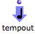
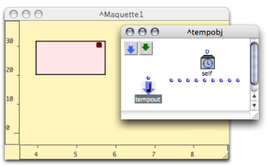
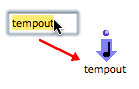
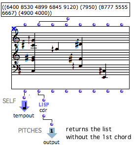
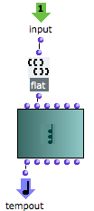

Navigation générale : 

  - [Guide](OM-Documentation.md)
  - [Plan](OM-Documentation_1.md)
  - [Glossaire](OM-Documentation_2.md)

OpenMusic
DocumentationHiérarchie
de section : [OM 6.6 User
Manual](OM-User-Manual.md) \>
[Maquettes](Maquettes.md) \>
[TemporalBoxes](TemporalBoxes.md)
\> [TemporalBoxes
Value](TempValues.md) \>
Patches

Navigation : [page
précédente](TempValues.md "page précédente(TemporalBoxes Value)")
| [page
suivante](MaquetteValue.md "page suivante(Sub Maquettes)")

# Patches

The " value" of a patch is produced by the patches itself, but this
value has to be expressed in the maquette. The **Tempout is a specific
outlet which allows to express this value.** "Tempout" stands for
"Temporal Output".

## The TempOut

|                                                                                   |                                                                                            |
| --------------------------------------------------------------------------------- | ------------------------------------------------------------------------------------------ |
|  | The **Tempout** is used for expressing the musical value of the patch within the maquette. |

  -  When a patch is created directly in a maquette, a tempout is
    automatically added in its internal editor. 
  - If a patch is dropped in the maquette editor, this box can be
    added manually.

Adding a TempOut in a Patch

<table>
<colgroup>
<col style="width: 50%" />
<col style="width: 50%" />
</colgroup>
<tbody>
<tr class="odd">
<td>

To add a tempout :

<ul>
<li>
<code class="keyboard_tl">Cmd</code> click and type "tempout",
</li>
</ul>
<ul>
<li><ol>
<li>
<code class="keyboard_tl">Ctrl</code> / right click in the patch editor,
</li>
<li>
select <code class="menuPath_tl">TemporalBoxes / Temporal Output</code> in the contextual menu.
</li>
</ol></li>
</ul>

</td>
<td>

</td>
</tr>
</tbody>
</table>

Instances and Maquettes Don't Have a TempOut

TemporalBoxes representing **instances,** **global variables** or
**factory boxes** only have **one standard output** , as a matter of
course, since they are a value.

TemporalBoxes representing **maquettes** only have standard inputs and
outputs, their potential musical value being expressed by the maquette
itself.

Using a Patch Without a TempOut

Sub patches don't have to be integrated in the musical structure of a
maquette to be used there. Therefore, a Tempout can be deleted. To
display and express the value of the object, though, a connection to a
Tempout still remains necessary.

Here, the temporal object just performs an addition. It is not connected
to any item, and its value is not displayed in the maquette.

This patch can return / get data to / from other boxes via its inputs
and outputs.

## Setting the TempOut Value

The value of a sub patch is the value connected to the **Tempout** . The
user can select the value(s) to express in the maquette.

Example

<table>
<colgroup>
<col style="width: 50%" />
<col style="width: 50%" />
</colgroup>
<tbody>
<tr class="odd">
<td>

In the upper TemporalBox :

<ol>
<li>
the value of a chord-seq is expressed via the Tempout, which is connected to the "self" output of the chord-seq
</li>
<li>
the last chords of the chord-seq are returned by the cdr function to the standard <strong>output</strong> of the TemporalBox
</li>
</ol>

</td>
<td>

</td>
</tr>
</tbody>
</table>

<table>
<colgroup>
<col style="width: 50%" />
<col style="width: 50%" />
</colgroup>
<tbody>
<tr class="odd">
<td>

</td>
<td>

The value of the lower TemporalBox is calculated from the resulting list :

<ol>
<li>
The input of the patch returns the list to flat .
</li>
<li>
All sub-lists are then concatenated in a single list, which is returned to the"midics" input of the chord.
</li>
<li>
The "self" output of the chord is connected to a <strong>Tempout</strong> .The chord becomes the value of the TemporalBox.
</li>
</ol>

</td>
</tr>
</tbody>
</table>

## The Tempin / Self Input Box

A patch created directly in a maquette has another default box : the
**Tempin** , or **Self Input Box** .

<table>
<tbody>
<tr class="odd">
<td>

</td>
<td>
The <strong>Tempin</strong> , or <strong>Self Input Box</strong> allows to control and use the <strong>relation</strong> between the patch and the maquette wherein it is located as <strong>programming parameters</strong> .

Hence, the Tempin is not compulsary for using a patch within a maquette, and can be deleted.
</td>
</tr>
</tbody>
</table>

Using the Self Input Box for Programming :

  - [Programming with TemporalBoxes](TempProgramming.md)

Références : 

Plan :

  - [OpenMusic Documentation](OM-Documentation.md)
  - [OM 6.6 User Manual](OM-User-Manual.md)
      - [Introduction](00-Sommaire.md)
      - [System Configuration and
        Installation](Installation.md)
      - [Going Through an OM Session](Goingthrough.md)
      - [The OM Environment](Environment.md)
      - [Visual Programming I](BasicVisualProgramming.md)
      - [Visual Programming
        II](AdvancedVisualProgramming.md)
      - [Basic Tools](BasicObjects.md)
      - [Score Objects](ScoreObjects.md)
      - [Maquettes](Maquettes.md)
          - [Creating a Maquette](Maquette.md)
          - [TemporalBoxes](TemporalBoxes.md)
              - [Adding TemporalBoxes](AddingTempbox.md)
              - [Elementary Manipulations](elementary.md)
              - [Temporalboxes Appearance](Appearance.md)
              - [TemporalBoxes Value](TempValues.md)
                  - Patches
                  - [Sub Maquettes](MaquetteValue.md)
                  - [Instances](InstancesValue.md)
          - [The Maquette Editor](Editor.md)
          - [Maquette
            Programming](Programming%20Maquette.md)
          - [Maquettes in
            Patches](Maquettes%20in%20Patches.md)
      - [Sheet](Sheet.md)
      - [MIDI](MIDI.md)
      - [Audio](Audio.md)
      - [SDIF](SDIF.md)
      - [Lisp Programming](Lisp.md)
      - [Errors and Problems](errors.md)
  - [OpenMusic QuickStart](QuickStart-Chapters.md)

Navigation : [page
précédente](TempValues.md "page précédente(TemporalBoxes Value)")
| [page
suivante](MaquetteValue.md "page suivante(Sub Maquettes)")

[A propos...](OM-Documentation_3.md)(c) Ircam - Centre
Pompidou

