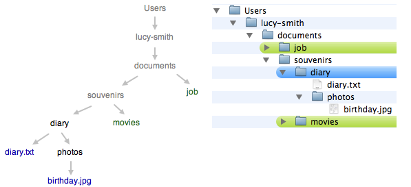
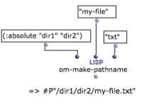
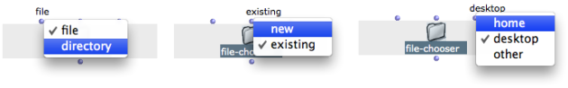
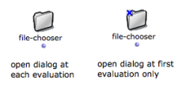

Navigation générale : 

  - [Guide](OM-Documentation.md)
  - [Plan](OM-Documentation_1.md)
  - [Glossaire](OM-Documentation_2.md)

OpenMusic
DocumentationHiérarchie
de section : [OM 6.6 User
Manual](OM-User-Manual.md) \>
[Visual Programming
II](AdvancedVisualProgramming.md) \>
[Files](Files.md) \>
Pathnames

Navigation : [page
précédente](Files.md "page précédente(Files)")
| [page
suivante](DefDirectories.md "page suivante(Default Directories)")

# Creating and Using Pathnames

## Generalities about Pathnames

**Pathnames** designate files, folders and their location on a computer
system. They are mainly used by the programs to read and write
information stored on the hard disk.

Files Names

**File names**, such as "diary.txt", are generally made of a **main
name** : "diary", and an **extension** preceeded by a **dot** : ".txt"

Representations on Unix-Based Systems and Windows

<table>
<colgroup>
<col style="width: 50%" />
<col style="width: 50%" />
</colgroup>
<tbody>
<tr class="odd">
<td>

<ul>
<li>
On Unix-based systems, including MacOSX, the successive directories of the path that leads to the file are separated by a <strong>"/"</strong>.

This slash also represents the system root directory. For instance :

/Users/lucy-smith/documents/souvenirs/old-diary/diary.txt.
</li>
</ul>
<ul>
<li>
On Windows, the successive directories are separated by a "\" .

The root directory of the disk drive is represented by a <strong>character identifier</strong> followed by ":" . For instance :

C :\Users\lucy-smith\documents\souvenirs\diary\diary.txt
</li>
</ul>

</td>
<td>

</td>
</tr>
</tbody>
</table>

Absolute and Relative Pathnames

Pathnames can be
absolute[\[1\]](#kFootBsktc2689)
or
relative[\[2\]](#kFootBsktc2690).
An aboslute pathname describes a path from the root directory to an
object. A relative pathname describes a path from the directory wherein
the user is working. This directory is called the "current directory".
Upstream directories are called "parent directories".

In relative pathnames, the **current directory** is expressed with "." .
Parent
directories[\[3\]](#kFootBsktc2691)
are expressed with "..".

The current directory is "diary".

  - **./diary.txt** leads to a file named "diary" in the current
    directory.

  - **./photos/birthday.jpg** leads to a file that is located in a
    subdirectory of the current directory.

<!-- end list -->

  - **../movies** refers to another directory, located in the parent
    directory of the current directory.

  - **../../job** refers to a directory, located in another directory,
    two levels above the current directory.

## Manipulating Pathnames in Common Lisp

Independent Use of Pathnames

In **Common Lisp**, pathnames can be handled independently from any
operating system.

A pathname is represented with **"\#P"** followed by the pathname, as
formulated in UNIX representations with a
string[\[4\]](#kFootBsktc2637).

For instance **** :
\#P"/Users/lucy-smith/documents/souvenirs/old-diary/diary.txt

Constructing and Inspecting Pathnames with Common Lisp

  - Pathnames can be constructed with the function make-pathname.
    
    A pathname can be described with several components, such as : a
    name[\[5\]](#kFootBsktc2694),
    a
    type[\[6\]](#kFootBsktc2695),
    a
    directory[\[7\]](#kFootBsktc2696)
    and so on. Pathname **components** such as names, types and
    directories are expressed with
    strings[\[4\]](#kFootBsktc2637),
    such as :name "my-file" or :type "txt"

<!-- end list -->

  - Pathnames can be inspected with the functions pathname-name ,
    pathname-directory , pathname-type , etc.

Converting Strings / Pathnames

The namestring and pathname functions alllow to convert pathnames into
simple strings and vice-versa.

Representing Directories in Lisp

To represent the directories wherein a file is located, write a list of
directory names preceeded by the :abolute or :relative symbols. For
instance, the pathname from a root directory to a file named
"my-file" is created as follows:

(make-pathname  :directory '( :absolute "Users" "my-name"
"directory1") :name "my-file" :type "txt")

Lisp Documentation

Find more information about pathnames in Common Lisp
[here](http:/www.cs.cmu.edu/Groups/AI/html/cltl/clm/node204.md "http://www.cs.cmu.edu/Groups/AI/html/cltl/clm/node204.html (nouvelle fenêtre)").

## Pathnames in OM

Creating a Pathname

<table>
<colgroup>
<col style="width: 50%" />
<col style="width: 50%" />
</colgroup>
<tbody>
<tr class="odd">
<td>

The Lisp pathname functions can be used in OM as any other Lisp functions. The <strong>om-make-pathname</strong> is an additional facility provided by OM to build pathnames.

The keywords arguments of this function allow to specify a file name, extension, and a directory separately.

</td>
<td>

</td>
</tr>
</tbody>
</table>

Using Strings in OM

In OM, many functions requiring pathnames as inputs also accept a string
representation.

The File Chooser Box

The **file-chooser** box allows to select a file or folder via a pop up
window.

It has three [optional arguments](AdditionalInputs.md),
which offer several options to define the type of object and its
location :

  - file / folder: 
  - existing / new
  - home / desktop / other

The output of the file chooser is the selected file or directory
pathname, or nil.

Locking the File-Chooser

<table>
<colgroup>
<col style="width: 50%" />
<col style="width: 50%" />
</colgroup>
<tbody>
<tr class="odd">
<td>

<strong>Note </strong>: <a href="LockMode.md">lock the box</a> to keep the selected pathname in the box. Otherwise, the file chooser dialog window will pop up at each evaluation.

</td>
<td>

</td>
</tr>
</tbody>
</table>

Références : 

1.  
    
    

    
    

    
    Absoluate Pathname
    
    

    
    

    
    

    
    

    
    An absolute pathname, also referred to as an absolute path or a full
    path, is the location of a filesystem object – file, directory or
    link– relative to the **root directory**.
    
    

    
    

    
    

    
    

2.  
    
    

    
    

    
    Relative Pathname
    
    

    
    

    
    

    
    

    
    A relative pathname tells the location of a filesystem object
    relative to the directory **in which the user is currently
    working**.
    
    

    
    

    
    

    
    

3.  
    
    

    
    

    
    Parent Directory
    
    

    
    

    
    

    
    

    
    A parent directory is the directory in which a given directory is
    located. In an absolute path, the parent directoy is the predecessor
    of the current directory.
    
    

    
    

    
    

    
    

4.  
    
    

    
    

    
    String
    
    

    
    

    
    

    
    

    
    A characters chain between two inverted commas.
    
    

    
    

    
    

    
    

5.  
    
    

    
    

    
    Name
    
    

    
    

    
    

    
    

    
    The name of a group of files that can be thought of as the "same''
    file
    
    

    
    

    
    

    
    

6.  
    
    

    
    

    
    

    
    

    
    

    
    

7.  
    
    

    
    

    
    Directory
    
    

    
    

    
    

    
    

    
    Corresponds to the "directory'' concept in many host file systems:
    the name of a group of related files (typically those belonging to a
    single user or project).
    
    

    
    

    
    

    
    

Plan :

  - [OpenMusic Documentation](OM-Documentation.md)
  - [OM 6.6 User Manual](OM-User-Manual.md)
      - [Introduction](00-Sommaire.md)
      - [System Configuration and
        Installation](Installation.md)
      - [Going Through an OM Session](Goingthrough.md)
      - [The OM Environment](Environment.md)
      - [Visual Programming I](BasicVisualProgramming.md)
      - [Visual Programming
        II](AdvancedVisualProgramming.md)
          - [Abstraction](Abstraction.md)
          - [Evaluation Modes](EvalModes.md)
          - [Higher-Order Functions](HighOrder.md)
          - [Control Structures](Control.md)
          - [Iterations: OMLoop](OMLoop.md)
          - [Instances](Instances.md)
          - [Interface Boxes](InterfaceBoxes.md)
          - [Files](Files.md)
              - Pathnames
              - [Default Directories](DefDirectories.md)
              - [File-Box](File-Box.md)
      - [Basic Tools](BasicObjects.md)
      - [Score Objects](ScoreObjects.md)
      - [Maquettes](Maquettes.md)
      - [Sheet](Sheet.md)
      - [MIDI](MIDI.md)
      - [Audio](Audio.md)
      - [SDIF](SDIF.md)
      - [Lisp Programming](Lisp.md)
      - [Errors and Problems](errors.md)
  - [OpenMusic QuickStart](QuickStart-Chapters.md)

Navigation : [page
précédente](Files.md "page précédente(Files)")
| [page
suivante](DefDirectories.md "page suivante(Default Directories)")

[A propos...](OM-Documentation_3.md)(c) Ircam - Centre
Pompidou

