

Navigation générale : 

  - [Guide](OM-Documentation.md)
  - [Plan](OM-Documentation_1.md)
  - [Glossaire](OM-Documentation_2.md)

OpenMusic
DocumentationHiérarchie
de section : [OM 6.6 User
Manual](OM-User-Manual.md) \>
[Basic Tools](BasicObjects.md)
\> [Picture](Picture.md) \>
Picture
Editor

Navigation : [page
précédente](PictureBox.md "page précédente(Picture Box)")
| [page
suivante](ScoreObjects.md "page suivante(Score Objects)")

# Picture Editor

The **picture editor** allows to edit the contents of the picture object
and to add figures or sketches.

## Background Picture

Load / Remove

<table>
<colgroup>
<col style="width: 50%" />
<col style="width: 50%" />
</colgroup>
<tbody>
<tr class="odd">
<td>

To load or remove a background picture in the object editor, go to <code class="menuPath_tl">Edit Pitch / Load Picture - Remove Picture</code>.

</td>
<td>

<a href="../res/pict-editor.png" class="overLnk" title="Cliquez pour agrandir">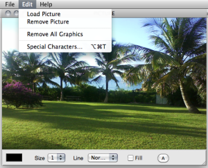</a>

</td>
</tr>
</tbody>
</table>

## Editing Graphics : Tools and Options

The picture editor opens, along with a **drawing palette** .

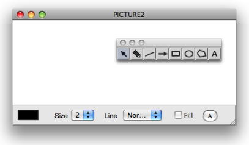

Adding Graphics : Palette

The palette provides a seven drawing tools, in addition to the standard
selection cursor

:

<table>
<tbody>
<tr class="odd">
<td>
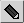 : the "pen" tool allows free drawings.

 : "line" tool

 : "arrow" tool

 : "square / rectangle" tool
</td>
<td>
 "circle / ellipse" tool

 "polygon" tool

 "text" tool
</td>
</tr>
</tbody>
</table>

Click and draw in the editor to create – additional – graphics in the
picture editor.

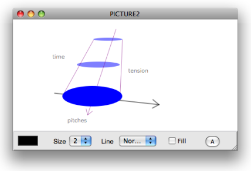

Text Tool and Polygon Tool

|     |                                                                               | Text Tool                                          |     |                                                                               | Polygon Tool                                    |
| --- | ----------------------------------------------------------------------------- | -------------------------------------------------- | --- | ----------------------------------------------------------------------------- | ----------------------------------------------- |
| 1\. | 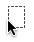 | Click somewhere in the editor then type some text. | 1\. | 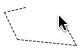 | Click in the editor to add points.              |
| 2\. | 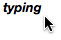 | Click again to validate.                           | 2\. | 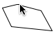 | Double click to validate and close the polygon. |

Editor Options

The lower part of the editor provides drawing options :

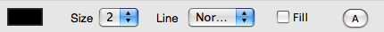

  - 
    
    : click on the coloured patch and choose a colour in the Colour
    Chooser.
  -  `Size` pop up menu : select a number of pixel for lines
    thickness.
  -  `Line` pop up menu : plain or dashed line style.
  -  `Filled` : check the option to fill figures
    automatically.
  -  `A` button : font dialog window.

## Editing Graphics : Commands and Menus

Selection / Remove

  - To select a foreground item and to switch from an item to the
    other within the editor, press the `TAB` key. The name of this item
    is visible in the upper right corner of the editor's window.
  - To remove a selected item, use the `Backspace` key.

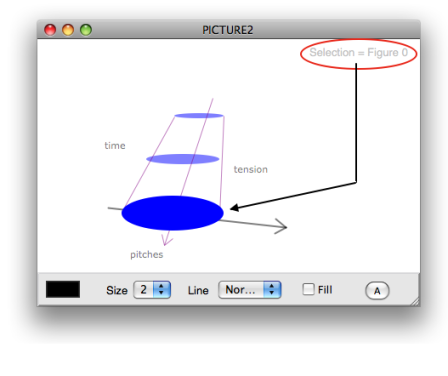

<table>
<colgroup>
<col style="width: 50%" />
<col style="width: 50%" />
</colgroup>
<tbody>
<tr class="odd">
<td>

To remove all the graphics from the editor, select <code class="menuPath_tl">Edit Pict / Remove All Graphics</code>.

</td>
<td>

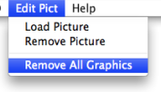

</td>
</tr>
</tbody>
</table>

Move

<table>
<colgroup>
<col style="width: 50%" />
<col style="width: 50%" />
</colgroup>
<tbody>
<tr class="odd">
<td>

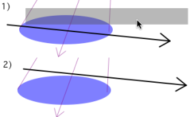

</td>
<td>

To move a selected item in the picture, drag and drop it with the pointer.

</td>
</tr>
</tbody>
</table>

Reminder

<table>
<colgroup>
<col style="width: 50%" />
<col style="width: 50%" />
</colgroup>
<tbody>
<tr class="odd">
<td>

Remember that the <code class="label_tl">Editor Command Keys</code> are available via the <code class="menuPath_tl">Help</code> menu.

</td>
<td>

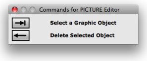

</td>
</tr>
</tbody>
</table>

Références : 

Plan :

  - [OpenMusic Documentation](OM-Documentation.md)
  - [OM 6.6 User Manual](OM-User-Manual.md)
      - [Introduction](00-Sommaire.md)
      - [System Configuration and
        Installation](Installation.md)
      - [Going Through an OM Session](Goingthrough.md)
      - [The OM Environment](Environment.md)
      - [Visual Programming I](BasicVisualProgramming.md)
      - [Visual Programming
        II](AdvancedVisualProgramming.md)
      - [Basic Tools](BasicObjects.md)
          - [Curves and Functions](CurvesAndFunctions.md)
          - [Array](ClassArray.md)
          - [TextFile](textfile.md)
          - [Picture](Picture.md)
              - [Picture Box](PictureBox.md)
              - Picture
                Editor
      - [Score Objects](ScoreObjects.md)
      - [Maquettes](Maquettes.md)
      - [Sheet](Sheet.md)
      - [MIDI](MIDI.md)
      - [Audio](Audio.md)
      - [SDIF](SDIF.md)
      - [Lisp Programming](Lisp.md)
      - [Errors and Problems](errors.md)
  - [OpenMusic QuickStart](QuickStart-Chapters.md)

Navigation : [page
précédente](PictureBox.md "page précédente(Picture Box)")
| [page
suivante](ScoreObjects.md "page suivante(Score Objects)")

[A propos...](OM-Documentation_3.md)(c) Ircam - Centre
Pompidou

