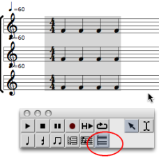
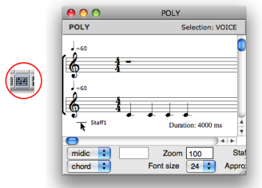
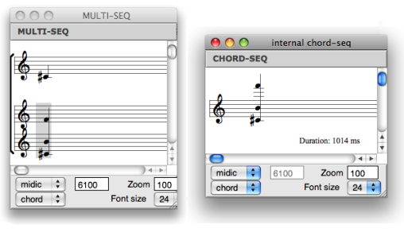

Navigation générale : 

  - [Guide](OM-Documentation.md)
  - [Plan](OM-Documentation_1.md)
  - [Glossaire](OM-Documentation_2.md)

OpenMusic
DocumentationHiérarchie
de section : [OM 6.6 User
Manual](OM-User-Manual.md) \>
[Score
Objects](ScoreObjects.md) \>
[Score
Editors](ScoreEditors.md) \>
Polyphonic
Objects

Navigation : [page
précédente](Editor-Rhythm.md "page précédente(Rhythmic Objects)")
| [page
suivante](Editor-PageMode.md "page suivante(Page Mode)")

# Polyphonic Objects : Poly and Multi-seq Editors

## Common Features

<table>
<colgroup>
<col style="width: 50%" />
<col style="width: 50%" />
</colgroup>
<tbody>
<tr class="odd">
<td>

A poly and a multi-seq objects are a superimposition of voices or chord-seqs .

They both have one additional tool : the <strong>poly tool</strong> , which allows to edit all voices at once.

</td>
<td>

</td>
</tr>
</tbody>
</table>

Add / Delete Staves

  - To add a staff :
    
    1.  select the voice
        
        or the poly tool
        
        ,
    
    2.  to add a new staff, `Cmd` click on a staff.
    
    Notice that new staves are automatically added above the "lower"
    staff .

  - To delete a staff :
    
    1.  select the voice tool,
    
    2.  click and drag a staff
    
    3.  press `backspace`.

Respacing Staves

As in voices editors, staves can be moved up of down, and consequently,
respaced.

To respace staves :

1.  click on the clefs of the staves you want to respace

2.  use the `↓` `↑` keys.

Internal Voice or Chord-Seq Edition

<table>
<colgroup>
<col style="width: 50%" />
<col style="width: 50%" />
</colgroup>
<tbody>
<tr class="odd">
<td>

</td>
<td>

To open a voice or a chord-seq as an internal object from a poly or a multi-seq  :

<ol>
<li>
select the voice tool,
</li>
<li>
click and drag a staff to select a voice or a chord-seq,
</li>
<li>
press <code class="keyboard_tl">o</code>, or double click on it.
</li>
</ol>

</td>
</tr>
</tbody>
</table>

Individual Chord-Seq and Voice Staff Configuration

<table>
<colgroup>
<col style="width: 50%" />
<col style="width: 50%" />
</colgroup>
<tbody>
<tr class="odd">
<td>

To define clefs individually :

<ol>
<li>
click on a clef
</li>
<li>
choose a configuration in the <code class="menuPath_tl">staff</code> pop up menu.
</li>
</ol>

</td>
<td>

</td>
</tr>
</tbody>
</table>

Remember that multiple staves configurations – e.g. `FF`, `GF`, `GGFF`
etc. – do not allow individual staff editing or respacing.

## Poly Editor and Multi-Seq Specific Features

Poly : Polytemporality and Polymeter

Within a poly, each voice can have its own time signatures, channel and
tempo, so as to build polytemporal and metric structures. The score is
then organized according to absolute durations.

  - To change the tempo or midichannel of a voice :
    
    1.  select the voice
    
    2.  enter a value or scroll the mouse up or down in the voice
        inspector.

  - To change the meter of a measure :
    
    1.  select it with the measure tool
    
    2.  enter values in the measure inspector.

Multi-Seqs : Internal Chord-Seq Edition

Within a multi-seq, chord-seqs must be open in internal windows to be
edited separately.

Références : 

Plan :

  - [OpenMusic Documentation](OM-Documentation.md)
  - [OM 6.6 User Manual](OM-User-Manual.md)
      - [Introduction](00-Sommaire.md)
      - [System Configuration and
        Installation](Installation.md)
      - [Going Through an OM Session](Goingthrough.md)
      - [The OM Environment](Environment.md)
      - [Visual Programming I](BasicVisualProgramming.md)
      - [Visual Programming
        II](AdvancedVisualProgramming.md)
      - [Basic Tools](BasicObjects.md)
      - [Score Objects](ScoreObjects.md)
          - [Presentation](Score-Objects-Intro.md)
          - [Rhythm Trees](RT.md)
          - [Score Players](ScorePlayer.md)
          - [Score Editors](ScoreEditors.md)
              - [Overview](Editor-Overview.md)
              - [Preferences](Editors-Prefs.md)
              - [Score Display](Editor-Display.md)
              - [Basic Editing](Editor-Basics.md)
              - [Harmonic Objects](Harmonic-Obj-Editor.md)
              - [Rhythmic Objects](Editor-Rhythm.md)
              - Polyphonic
                Objects
              - [Page Mode](Editor-PageMode.md)
              - [Tonal Display](Editor-Tonality.md)
              - [Microintervals
                Notation](Editor-Microintervals.md)
              - [Play Controls](Editor-Play.md)
          - [Quantification](Quantification.md)
          - [Export / Import](ImportExport.md)
      - [Maquettes](Maquettes.md)
      - [Sheet](Sheet.md)
      - [MIDI](MIDI.md)
      - [Audio](Audio.md)
      - [SDIF](SDIF.md)
      - [Lisp Programming](Lisp.md)
      - [Errors and Problems](errors.md)
  - [OpenMusic QuickStart](QuickStart-Chapters.md)

Navigation : [page
précédente](Editor-Rhythm.md "page précédente(Rhythmic Objects)")
| [page
suivante](Editor-PageMode.md "page suivante(Page Mode)")

[A propos...](OM-Documentation_3.md)(c) Ircam - Centre
Pompidou

