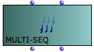
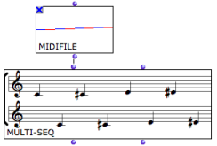
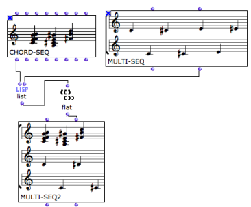
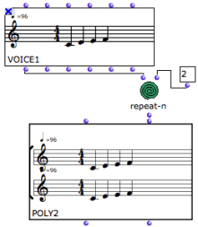

Navigation générale : 

  - [Guide](OM-Documentation.md)
  - [Plan](OM-Documentation_1.md)
  - [Glossaire](OM-Documentation_2.md)

OpenMusic
DocumentationHiérarchie
de section : [OM 6.6 User
Manual](OM-User-Manual.md) \>
[Score
Objects](ScoreObjects.md) \>
[Presentation](Score-Objects-Intro.md)
\> Polyphonic
Objects

Navigation : [page
précédente](RhythmicObjects.md "page précédente(Rhythmic Objects)")
| [page
suivante](RT.md "page suivante(Rhythm Trees)")

# Polyphonic Objects

## The Multi-Seq Object

|                                                                                     |                                                                   |
| ----------------------------------------------------------------------------------- | ----------------------------------------------------------------- |
|  | The multi-seq object allows to "superimpose" several chord-seqs . |

Inputs and Outputs

Multi-seqs have two inputs and outputs.

  - The first input – self – takes chord-seqs or midifiles .The
    second input takes a list of chord-seqs .
  - The first output returns the self of the multi-seq . The
    second output returns a list of chord-seqs .

Applications

<table>
<colgroup>
<col style="width: 50%" />
<col style="width: 50%" />
</colgroup>
<tbody>
<tr class="odd">
<td>

To convert a midifile into a multi-seq  :

<ul>
<li>connect a midifile object's "self" output to the "self" input of a multi-seq ,</li>
<li>evaluate the multi-seq .</li>
</ul>

The midifile is expressed as a standard musical score, which can be accessed and modified via its editor.

You will have to select a midi file when the object is evaluated. Lock the box in order not to have to choose a file again.

</td>
<td>

</td>
</tr>
</tbody>
</table>

Modifying Score Objects

  - [Polyphonic Objects : Poly and Multi-seq
    Editors](Poly-Multi-Editor.md)

To convert a midifile and a chord-seq into a multi-seq :

1.  convert the midifile into a multi-seq ,

2.  connect the second output of the multi-seq , and the "self" output
    or the chord-seq to list .

3.  If the midifile has more than one voice, use flat to get a single
    level list of chord-seqs.

4.  Connect list or flat to the second input of the multi-seq.

Multi-Seq to Midifile

You can possibly convert the resulting multi-seq into a midifile with a
simple connection and evaluation.

## The Poly Object

|                                                                                  |                                                          |
| -------------------------------------------------------------------------------- | -------------------------------------------------------- |
|  | The poly object allows to "superimpose" several voices . |

Inputs and Outputs

The poly object has two inputs and outputs :

  - The first input – self – takes polys or midi files . The
    second input take a list of voices .
  - The first output returns the self of the poly . The second
    output returns a list of voices .

Applications

<table>
<colgroup>
<col style="width: 50%" />
<col style="width: 50%" />
</colgroup>
<tbody>
<tr class="odd">
<td>

To create a poly out of a series of voices  :

<ul>
<li>create a list of voices with a list function, or any other type of relevant function, </li>
<li>connect the list function to the second input of the poly and evaluate the box.</li>
</ul>

</td>
<td>

</td>
</tr>
</tbody>
</table>

About Polys and Multi-Seq Editors

  - [Polyphonic Objects : Poly and Multi-seq
    Editors](Poly-Multi-Editor.md)

Références : 

Plan :

  - [OpenMusic Documentation](OM-Documentation.md)
  - [OM 6.6 User Manual](OM-User-Manual.md)
      - [Introduction](00-Sommaire.md)
      - [System Configuration and
        Installation](Installation.md)
      - [Going Through an OM Session](Goingthrough.md)
      - [The OM Environment](Environment.md)
      - [Visual Programming I](BasicVisualProgramming.md)
      - [Visual Programming
        II](AdvancedVisualProgramming.md)
      - [Basic Tools](BasicObjects.md)
      - [Score Objects](ScoreObjects.md)
          - [Presentation](Score-Objects-Intro.md)
              - [Harmonic Objects](Note-Chord-Chord-seq.md)
              - [Rhythmic Objects](RhythmicObjects.md)
              - Polyphonic
                Objects
          - [Rhythm Trees](RT.md)
          - [Score Players](ScorePlayer.md)
          - [Score Editors](ScoreEditors.md)
          - [Quantification](Quantification.md)
          - [Export / Import](ImportExport.md)
      - [Maquettes](Maquettes.md)
      - [Sheet](Sheet.md)
      - [MIDI](MIDI.md)
      - [Audio](Audio.md)
      - [SDIF](SDIF.md)
      - [Lisp Programming](Lisp.md)
      - [Errors and Problems](errors.md)
  - [OpenMusic QuickStart](QuickStart-Chapters.md)

Navigation : [page
précédente](RhythmicObjects.md "page précédente(Rhythmic Objects)")
| [page
suivante](RT.md "page suivante(Rhythm Trees)")

[A propos...](OM-Documentation_3.md)(c) Ircam - Centre
Pompidou

