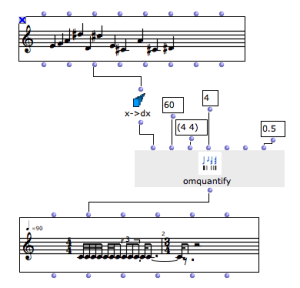

Navigation générale : 

  - [Guide](OM-Documentation.md)
  - [Plan](OM-Documentation_1.md)
  - [Glossaire](OM-Documentation_2.md)

OpenMusic
DocumentationHiérarchie
de section : [OM 6.6 User
Manual](OM-User-Manual.md) \>
[Score
Objects](ScoreObjects.md) \>
Quantification

Navigation : [page
précédente](Editor-Play.md "page précédente(Play Controls)")
| [page
suivante](ImportExport.md "page suivante(Export / Import)")

# Quantification

Quantification is the name of the process allowing to convert absolute
durations (for instance, in milliseconds) into a structured rhythmic
sequence of measures with metrics and pulse subdivisions.

In other word and with OpenMusic objects, this is basically what happens
when converting a **chord-seq**, or a MIDI file oject into a **voice**.

Quantification is not an easy task : it implies preliminary information
and adapted approximations in order to be performed correctly. When
importing MIDI files into a voice, for instance, the tempo and metrics
information can be used to better deduce the rhythm corresponding to the
raw sequence of onsets encoded in the MIDI file.

Quantification Parameters

<table>
<colgroup>
<col style="width: 50%" />
<col style="width: 50%" />
</colgroup>
<tbody>
<tr class="odd">
<td>

In order to guide the quantification processes, some general parameters can be set in th OM Preferences (<code class="textTab_tl">Quantification</code> tab): allowed/forbidden rhythmic subdivisions, tempo, time signatures, etc.

</td>
<td>

</td>
</tr>
</tbody>
</table>

Even though, some notes in the original sequence may be lost during
quantification. In this case, the following message will appear :

Warning: with the given constraints, n notes
are lost while quantizing

In this case, the quantification parameters should probably be changed
in order to better match the rhythmic constraints with the initial
durations of the sequence.

Quantification Box

When specific or precise quantification processes need to be performed,
you will generally need to use the **OMQUANTIFY** box in order to
convert a duration list (typically coming from **chord-seq**s or similar
data) into a rhythmic tree suitable to a **voice** object
initialization.

About Rhytmic Trees

  - [Rhythm Trees](RT.md)

<table>
<colgroup>
<col style="width: 50%" />
<col style="width: 50%" />
</colgroup>
<tbody>
<tr class="odd">
<td>

The main input of <strong>OMQUANTIFY</strong> is a list of durations.

The orther parameters are similar to the quantification preferences parameters, but they will apply only to this particular quantification process.

</td>
<td>

</td>
</tr>
</tbody>
</table>

Duration from a Chord-Seq

The **X-\>DX** function can be used to compute a list of durations
starting from the list of onsets of a chord-seq object.

<table>
<colgroup>
<col style="width: 50%" />
<col style="width: 50%" />
</colgroup>
<tbody>
<tr class="odd">
<td>

Nothe that OMQUANTIFY only processes durations to compute a rhythm tree.

Use the pitch information from the initial chord-seq in order to set the voice's chords slot.

</td>
<td>

</td>
</tr>
</tbody>
</table>

Références : 

Plan :

  - [OpenMusic Documentation](OM-Documentation.md)
  - [OM 6.6 User Manual](OM-User-Manual.md)
      - [Introduction](00-Sommaire.md)
      - [System Configuration and
        Installation](Installation.md)
      - [Going Through an OM Session](Goingthrough.md)
      - [The OM Environment](Environment.md)
      - [Visual Programming I](BasicVisualProgramming.md)
      - [Visual Programming
        II](AdvancedVisualProgramming.md)
      - [Basic Tools](BasicObjects.md)
      - [Score Objects](ScoreObjects.md)
          - [Presentation](Score-Objects-Intro.md)
          - [Rhythm Trees](RT.md)
          - [Score Players](ScorePlayer.md)
          - [Score Editors](ScoreEditors.md)
          - Quantification
          - [Export / Import](ImportExport.md)
      - [Maquettes](Maquettes.md)
      - [Sheet](Sheet.md)
      - [MIDI](MIDI.md)
      - [Audio](Audio.md)
      - [SDIF](SDIF.md)
      - [Lisp Programming](Lisp.md)
      - [Errors and Problems](errors.md)
  - [OpenMusic QuickStart](QuickStart-Chapters.md)

Navigation : [page
précédente](Editor-Play.md "page précédente(Play Controls)")
| [page
suivante](ImportExport.md "page suivante(Export / Import)")

[A propos...](OM-Documentation_3.md)(c) Ircam - Centre
Pompidou

