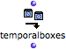
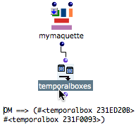

Navigation générale : 

  - [Guide](OM-Documentation.md)
  - [Plan](OM-Documentation_1.md)
  - [Glossaire](OM-Documentation_2.md)

OpenMusic
DocumentationHiérarchie
de section : [OM 6.6 User
Manual](OM-User-Manual.md) \>
[Maquettes](Maquettes.md) \>
[Maquettes in
Patches](Maquettes%20in%20Patches.md) \>
[Reference
Mode](Maquettes%20in%20Patches2.md) \>
Accessing
Boxes

Navigation : [page
précédente](addexamples.md "page précédente(Examples)")
| [page
suivante](REF4.md "page suivante(Removing Boxes)")

# Accessing TemporalBoxes of a Maquette from a Patch

Accessing TemporalBoxes from a patch is especially necessary for
removing them from a maquette, and for manipulating them from outside
the maquette.

## Temporalboxes Function : Use

<table>
<tbody>
<tr class="odd">
<td>

</td>
<td>
The temporalboxes function allows to access and modifiy all the temporal objects contained in a maquette.

To add the temporalboxes function :

<ul>
<li> <code class="keyboard_tl">Cmd</code> click and type "temporalboxes" </li>
<li> select <code class="menuPath_tl">Functions / OMKernel / Maquette / Temporalboxes</code>. </li>
</ul></td>
</tr>
</tbody>
</table>

## Procedure

<table>
<colgroup>
<col style="width: 50%" />
<col style="width: 50%" />
</colgroup>
<tbody>
<tr class="odd">
<td>

<ol>
<li>
Connect the maquette box on "reference" mode to the input of the temporalboxes function.
</li>
<li>
Connect the output of the temporalboxes function to the program. The boxes contained in the maquette can be manipulated from the patch.
</li>
</ol>

</td>
<td>

The temporal objects enclosed in the maquette is returned as a TemporalBoxes list when evaluating the function.

</td>
</tr>
</tbody>
</table>

Références : 

Plan :

  - [OpenMusic Documentation](OM-Documentation.md)
  - [OM 6.6 User Manual](OM-User-Manual.md)
      - [Introduction](00-Sommaire.md)
      - [System Configuration and
        Installation](Installation.md)
      - [Going Through an OM Session](Goingthrough.md)
      - [The OM Environment](Environment.md)
      - [Visual Programming I](BasicVisualProgramming.md)
      - [Visual Programming
        II](AdvancedVisualProgramming.md)
      - [Basic Tools](BasicObjects.md)
      - [Score Objects](ScoreObjects.md)
      - [Maquettes](Maquettes.md)
          - [Creating a Maquette](Maquette.md)
          - [TemporalBoxes](TemporalBoxes.md)
          - [The Maquette Editor](Editor.md)
          - [Maquette
            Programming](Programming%20Maquette.md)
          - [Maquettes in
            Patches](Maquettes%20in%20Patches.md)
              - [Build Mode](Build.md)
              - [Functional
                Mode](Maquettes%20in%20Patches1.md)
              - [Reference
                Mode](Maquettes%20in%20Patches2.md)
                  - [Adding TemporalBoxes](addprocedure.md)
                  - [Examples](addexamples.md)
                  - Accessing
                    Boxes
                  - [Removing Boxes](REF4.md)
                  - [Interaction (1)](REF5.md)
                  - [Interation (2)](Intercation2.md)
      - [Sheet](Sheet.md)
      - [MIDI](MIDI.md)
      - [Audio](Audio.md)
      - [SDIF](SDIF.md)
      - [Lisp Programming](Lisp.md)
      - [Errors and Problems](errors.md)
  - [OpenMusic QuickStart](QuickStart-Chapters.md)

Navigation : [page
précédente](addexamples.md "page précédente(Examples)")
| [page
suivante](REF4.md "page suivante(Removing Boxes)")

[A propos...](OM-Documentation_3.md)(c) Ircam - Centre
Pompidou

