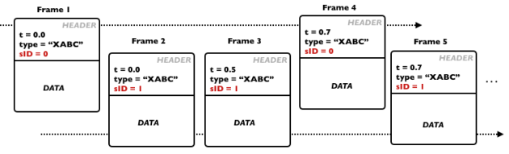
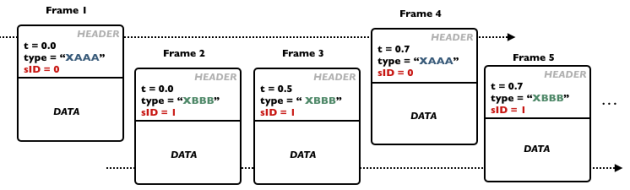
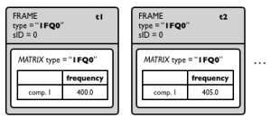
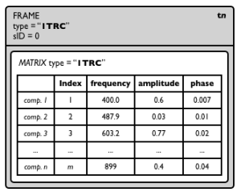

Navigation générale : 

  - [Guide](OM-Documentation.md)
  - [Plan](OM-Documentation_1.md)
  - [Glossaire](OM-Documentation_2.md)

OpenMusic
DocumentationHiérarchie
de section : [OM 6.6 User
Manual](OM-User-Manual.md) \>
[SDIF](SDIF.md) \>
Introduction to
SDIF

Navigation : [page
précédente](SDIF.md "page précédente(SDIF)")
| [page
suivante](SDIFFile.md "page suivante(SDIFFile)")

# Introduction to SDIF

[Sommaire ](#)

1.  [SDIF Frames and Streams](#mgN12)
2.  [SDIF Data/Matrices](#mgNe9)
3.  [SDIF Types](#mgN152)
4.  [Examples of Common Standard SDIF Descriptions](#mgN1d8)

In this section we give a general introduction of the main SDIF concepts
required to understand and make an efficient use of the OM SDIF tools.

## SDIF Frames and Streams

SDIF is a binary format where data are encoded in time-tagged **FRAMES**
.

"Time-tagged" means each frame embeds its own time localization and
there is no global (regular) sample rate for the data flow. Each frame
has a header , where the time-tag as well as other information are
stored, and contain a certain amount of data.

A sequence (stream) of SDIF frames.

The next paragraphs explicit the additional data contained in the SDIF
frame headers.

Frame Type

The frame **TYPE** allows to determine the contents of the frame and the
structure of the data it contains. SDIF types are identified by a
signature of 4 ASCII characters.

Examples of standard SDIF frame types are for instance "1TRC"
(sinusoidal tracks, used for additive sound descriptions), "1MRK"
(markers), "1FQ0" (fudamental frequency), "1ENV" (spectral envelope)
etc.

Stream ID

Each frame also has a **stream** ID ( sID ). It is therefore possible to
store several interleaved frame streams (connected by their common
stream ID and frame type) in a same SDIF file.

**Stream ID and frame type will be crucial information to access and
read the data in SDIF files.**

Below are two examples of interleaved SDIF streams.

  - In the first example frames are divided in 2 streams and of
    identical types. This could be for instance the result of the same
    analysis of different parallel audio tracks.

Note that the frames time-tags are not necessarily synchronous nor
strictly interleaved (they must only be in ascending temporal order).
Reading applications should handle and manage the stream separation
using the frame stream IDs.

  - In the second examples frames are different in the two streams (type
    "XAAA" in stream 0, and type "XBBB" in stream 1). This can be for
    instance the results of several analyses of a same sound extract, or
    even completely unrelated data merged in a same sequence of frames
    and in the SDIF file.

## SDIF Data/Matrices

<table>
<colgroup>
<col style="width: 50%" />
<col style="width: 50%" />
</colgroup>
<tbody>
<tr class="odd">
<td>

Within every SDIF frame, the actual data is stored in bidimensional matrices.

A frame can contain one or several matrices. Each matrix is an array of data preceded (like SDIF frames)by a "matrix header" containing some general information. In particular, each matrix also has a <strong>TYPE</strong> (signature of 4 characters) used to identify the nature of the data it contains.

By conventions, the columns of the SDIF matrices are called <strong>fields </strong> : they correspond to the different parameters of a given description. For instance, sinusoidal tracks matrices (type "1TRC") have 4 fields describing partials : index, frequency, amplitude, phase.

Matrix lines are called <strong>components</strong> . There is a fixed number of fields in a matrix, but there can be any number of components.

As matrices are embedded in time-tagged frames, this description is supposed to be at one particular time. In other words, SDIF matrices contain the value of a given set of parameters for a number of components at the time determined by their containing frame.

</td>
<td>

</td>
</tr>
</tbody>
</table>

## SDIF Types

The SDIF signatures define types for frames and matrices, that is, it
informs about the data contained in these structures.

Concretely, the frame types list the possible of matrix types found in
the frame,a nd the matrix types list the matrix fields' names.

A set of SDIF types exist by default. Others can be declared in the SDIF
files.

An informative list of standard types is provided at
[http://sdif.sourceforge.net/standard/types-main.html
](http:/sdif.sourceforge.net/standard/types-main.md "http://sdif.sourceforge.net/standard/types-main.html (nouvelle fenêtre)")

Frame Types

SDIF Frame type declarations indicate a type signature and a set of
allowed matrix types.

Matrix Types

SDIF Matrix type declarations indicate a type signature and an ordered
list of fields.

Notes about SDIF type signatures

  - By convention, standard SDIF types' first character is a version
    number (most often, "1"), while experimental types start with an
    "X".

  - It can happend (and is correct) that a frame and matrix type have
    the same signature.

Type extension

In addition to type declaration, it is also possible to declare
extensions of existing SDIF types, for instance, in order to add fields
n a given matrix type, or to add matrices in a frame type.

## Examples of Common Standard SDIF Descriptions

Here is a set of common sound descriptions used in musical applications.

Fundamental Frequency

<table>
<colgroup>
<col style="width: 50%" />
<col style="width: 50%" />
</colgroup>
<tbody>
<tr class="odd">
<td>

The fundamental frequency estimation is one of the simplest sound descriptions : it generally has one single field (the frequency) and one single component.

<strong>The fudamental frequency matrix type signature is "1FQ0".</strong>

It ususally has one single field (frequency) : here is what the type declaration looks like :

1FQ0 { frequency }

Sometimes the fundamental frequency description can involve additional parameter. The standard matrix type definition is actually of the form :

1FQ0 { frequency, confidence, score, realamplitude}

<strong>The fudamental frequency frame type signature is also "1FQ0".</strong> 1FQ0 frames only contain one 1FQ0 matrix. The type declaration is therefore of the form :

1FQ0 { 1FQ0 FundamentalFrequencyEstimate}

</td>
<td>

</td>
</tr>
</tbody>
</table>

Partials / Sinusoidal Track

<table>
<colgroup>
<col style="width: 50%" />
<col style="width: 50%" />
</colgroup>
<tbody>
<tr class="odd">
<td>

The partials are described frame by frame in SDIF. In each frame, the parameters are described for each partial, which is identified by a unique index.

<strong>The partials matrix type signature is "1TRC".</strong>

The standard matrix type definition is of the form :

1TRC { index, frequency, amplitude, phase }

An arbitrary number of partials can de stored in every matrix.

<strong>The partials frame type signature is also "1TRC".</strong> 1TRC frames only contain one 1TRC matrix. The type declaration is therefore of the form :

1TRC { 1TRC SinusoidalTracks}

</td>
<td>

</td>
</tr>
</tbody>
</table>

Harmonic Partials

Harmonic partials are stored exactly like partials in frames / matrices
of type "**1HRM**"

Markers

Markers are simple time information. They are generally stored in
**frames of type "1MRK"** with adequate time-tag.

It is often the case, however, that markers embed additional data and
information. In particular, transient detection markers differentiate
begin and end of the transients. In this case, beginning marker frames
contain a matrix of type "1BEG", while end markers contain matrix of
type "1END".

1BEG and 1END matrices contain ID values (matrix 1 x n ).

Chord-Sequence Analysis

<table>
<colgroup>
<col style="width: 50%" />
<col style="width: 50%" />
</colgroup>
<tbody>
<tr class="odd">
<td>

Chord-Sequence analysis or descriptions are not straightforward to embed in SDIF, since they are closer to "symbolic" (MIDI-like) data than signal descriptors. They can however be stored efficiently using markers and 1MRK frames.

Following the model of the SDIF partials, each "note" in such analysis is identified by a unique ID. The marker frames will then contains, at a given time:

<ul>
<li>
1BEG matrices containing the ID of the notes beginning at this moment.
</li>
<li>
1TRC matrices containing the value of the different parameters of the notes begining at this moment
</li>
<li>
1END frames containing the ID of the notes ending at this moment.
</li>
</ul>

Note that a same 1MRK frame does not necessarily contain both 1BEG and 1END matrices.

</td>
<td>

</td>
</tr>
</tbody>
</table>

Références : 

Plan :

  - [OpenMusic Documentation](OM-Documentation.md)
  - [OM 6.6 User Manual](OM-User-Manual.md)
      - [Introduction](00-Sommaire.md)
      - [System Configuration and
        Installation](Installation.md)
      - [Going Through an OM Session](Goingthrough.md)
      - [The OM Environment](Environment.md)
      - [Visual Programming I](BasicVisualProgramming.md)
      - [Visual Programming
        II](AdvancedVisualProgramming.md)
      - [Basic Tools](BasicObjects.md)
      - [Score Objects](ScoreObjects.md)
      - [Maquettes](Maquettes.md)
      - [Sheet](Sheet.md)
      - [MIDI](MIDI.md)
      - [Audio](Audio.md)
      - [SDIF](SDIF.md)
          - Introduction to
            SDIF
          - [SDIFFile](SDIFFile.md)
          - [Accessing SDIF Data](SDIF-Read.md)
          - [SDIF Classes](SDIF-Classes.md)
          - [Writing SDIF Files](SDIF-Write.md)
      - [Lisp Programming](Lisp.md)
      - [Errors and Problems](errors.md)
  - [OpenMusic QuickStart](QuickStart-Chapters.md)

Navigation : [page
précédente](SDIF.md "page précédente(SDIF)")
| [page
suivante](SDIFFile.md "page suivante(SDIFFile)")

[A propos...](OM-Documentation_3.md)(c) Ircam - Centre
Pompidou

