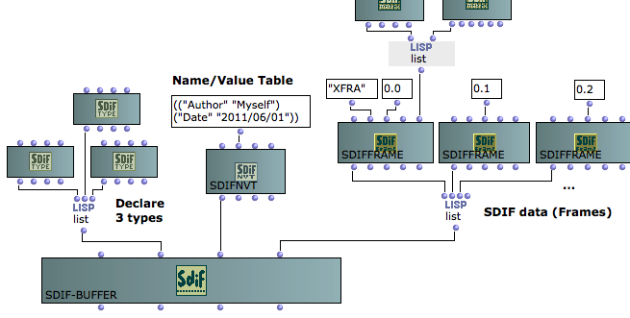
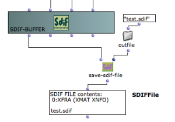
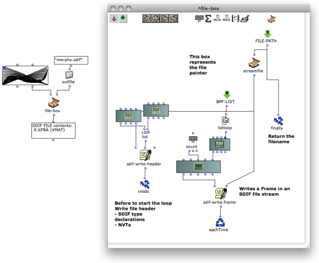
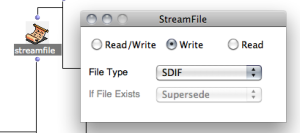

Navigation générale : 

  - [Guide](OM-Documentation.md)
  - [Plan](OM-Documentation_1.md)
  - [Glossaire](OM-Documentation_2.md)

OpenMusic
DocumentationHiérarchie
de section : [OM 6.6 User
Manual](OM-User-Manual.md) \>
[SDIF](SDIF.md) \>
Writing SDIF
Files

Navigation : [page
précédente](SDIF-Classes.md "page précédente(SDIF Classes)")
| [page
suivante](Lisp.md "page suivante(Lisp Programming)")

# Writing SDIF Files

## SDIF-Buffer

The class **SDIF-BUFFER** allows to gather SDIF objects and makes the
connection with "real" SDIF files.

An SDIF-Buffer contains :

  - A list of SDIF Frames or SDIF Streams
  - A list of SDIFTypes (type declarations)
  - A list of Name/Value tables

More about the SDIF classes (SDIFFrame, SDIFType,
SDIFNVT...)

  - [SDIF Classes](SDIF-Classes.md)

<table>
<colgroup>
<col style="width: 50%" />
<col style="width: 50%" />
</colgroup>
<tbody>
<tr class="odd">
<td>

The SDIF-BUFFER and its contents can then be saved in a file using SAVE-SDIF-FILE.

</td>
<td>

</td>
</tr>
</tbody>
</table>

## Iterative SDIF file Writing using the File-Box

SDIF data can also be written in a file using the File-Box tool.

This alternative avoids storing large sets of data in your OM patches
and write generated SDIF data on-the-fly during an iterative process.

How to use the File-Box

  - [File-Box : Iterative File Input/Output
    Processes](File-Box.md)

SDIF Write Tools in the File-Box

<table>
<colgroup>
<col style="width: 50%" />
<col style="width: 50%" />
</colgroup>
<tbody>
<tr class="odd">
<td>

In order to write data in an SDIF file, the STREAMFILE pointer must be set to "SDIF" first.

</td>
<td>

</td>
</tr>
</tbody>
</table>

The process must then start with a call to **SDIF-WRITE-HEADER**
connected to this pointer (see picture above). SDIF-WRITE-HEADER will
write type declarations and name/value tables in the file header, but
also some other general data, so it must be called **even if there is no
type or NVT to write**.

Use **SDIF-WRITE-FRAME** in the rest of your program in order to write
the sequence of SDIF frames in the file.

Références : 

Plan :

  - [OpenMusic Documentation](OM-Documentation.md)
  - [OM 6.6 User Manual](OM-User-Manual.md)
      - [Introduction](00-Sommaire.md)
      - [System Configuration and
        Installation](Installation.md)
      - [Going Through an OM Session](Goingthrough.md)
      - [The OM Environment](Environment.md)
      - [Visual Programming I](BasicVisualProgramming.md)
      - [Visual Programming
        II](AdvancedVisualProgramming.md)
      - [Basic Tools](BasicObjects.md)
      - [Score Objects](ScoreObjects.md)
      - [Maquettes](Maquettes.md)
      - [Sheet](Sheet.md)
      - [MIDI](MIDI.md)
      - [Audio](Audio.md)
      - [SDIF](SDIF.md)
          - [Introduction to SDIF](SDIF-Intro.md)
          - [SDIFFile](SDIFFile.md)
          - [Accessing SDIF Data](SDIF-Read.md)
          - [SDIF Classes](SDIF-Classes.md)
          - Writing SDIF
            Files
      - [Lisp Programming](Lisp.md)
      - [Errors and Problems](errors.md)
  - [OpenMusic QuickStart](QuickStart-Chapters.md)

Navigation : [page
précédente](SDIF-Classes.md "page précédente(SDIF Classes)")
| [page
suivante](Lisp.md "page suivante(Lisp Programming)")

[A propos...](OM-Documentation_3.md)(c) Ircam - Centre
Pompidou

