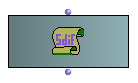
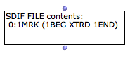
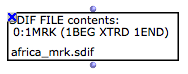
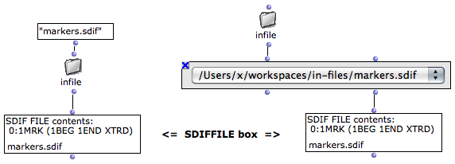
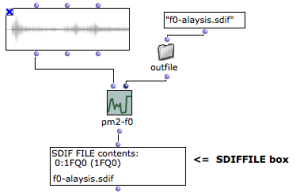
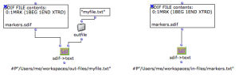
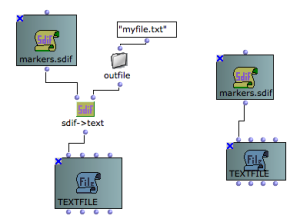
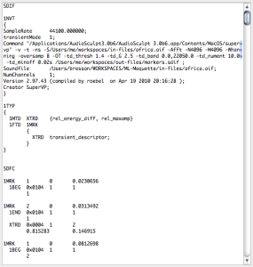
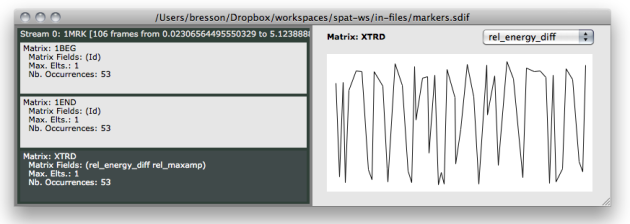

Navigation générale : 

  - [Guide](OM-Documentation.md)
  - [Plan](OM-Documentation_1.md)
  - [Glossaire](OM-Documentation_2.md)

OpenMusic
DocumentationHiérarchie
de section : [OM 6.6 User
Manual](OM-User-Manual.md) \>
[SDIF](SDIF.md) \>
SDIFFile

Navigation : [page
précédente](SDIF-Intro.md "page précédente(Introduction to SDIF)")
| [page
suivante](SDIF-Read.md "page suivante(Accessing SDIF Data)")

# SDIF Files in OM : The SDIFFile Object

SDIF files are handled in OM via the **SDIFFILE** object. SDIFFILE boxes
(when correctly initialized) are attached to a file on the computer hard
disk. Therefore the actual data is not intern in the OM patch but always
remains in the external file.

<table>
<colgroup>
<col style="width: 50%" />
<col style="width: 50%" />
</colgroup>
<tbody>
<tr class="odd">
<td>

SDIFFILE has one single input/output used to initialize the box or access the contents of the attached SDIF file.

</td>
<td>

</td>
</tr>
</tbody>
</table>

## SDIFFile Initialization

Default Initialization

If nothing is connected to the SDIFFILE box input, when it is evaluated,
a file chooser dialog opens and allows to choose a file to load.

<table>
<colgroup>
<col style="width: 50%" />
<col style="width: 50%" />
</colgroup>
<tbody>
<tr class="odd">
<td>

When initialized, the box miniview (press <code class="keyboard_tl">m</code>) displays some general information about the contents of the SDIF file. Each line is a stream ID followed by a frame type signature and a list of contained matrix type signatures.

</td>
<td>

</td>
</tr>
</tbody>
</table>

About the Structure of an SDIF File (Streams, Frames,
Matrices...)

  - [Introduction to SDIF](SDIF-Intro.md)

File Name

When the name of the box is visible (press `n`) the name of the file is
displayed and updated at initializing the box.

<table>
<colgroup>
<col style="width: 50%" />
<col style="width: 50%" />
</colgroup>
<tbody>
<tr class="odd">
<td>

After the SDIF file is loaded, you may want to <a href="LockMode.md">lock the box</a> (press <code class="keyboard_tl">b</code>) in order to avoid reinitalizing it at next evaluations.

</td>
<td>

</td>
</tr>
</tbody>
</table>

Pathname Initialization

The SDIFFILE box is more generally initialized with a file pathname,
which can be connected to its input.

This pathname can be typed textually or come from another box or
function.

About Pathnames in OM

  - [Creating and Using Pathnames](Pathnames.md)

Sound Analysis Results

<table>
<colgroup>
<col style="width: 50%" />
<col style="width: 50%" />
</colgroup>
<tbody>
<tr class="odd">
<td>

Most of the sound analysis tools available in OM (generally part of external libraries such as OM-SuperVP or OM-pm2) write analysis results in SDIF files and just return the written file pathname.

These return values are therefore suitable for connection to the SDFFILE box.

</td>
<td>

Fundamental frequency analysis with pm2-f0 from the OM-pm2 library. The result of analysis is a created SDIF file pathname, connected to the SDIFFILE box.

</td>
</tr>
</tbody>
</table>

## File Contents

Like MIDI or AIFF, SDIF is a binary data format: the contents of an SDIF
file can not be read or edited as a simple text but requires specific
tools and conversions. [A number of different tools are available
in OM for this purpose](SDIF-Read.md), which will be presented in
these SDIF manual pages.

It is however possible to convert an SDIF file to text in order to check
the full exact contents of a file.

<table>
<colgroup>
<col style="width: 50%" />
<col style="width: 50%" />
</colgroup>
<tbody>
<tr class="odd">
<td>

<ul>
<li>
The SDIF-&gt;TEXT box allows to write a text file from an input SDIFFIle. If no pathname is given for the text file, the created files will have the same name and location as the original SDIF file, with the "txt" extension.
</li>
</ul>

</td>
<td>

</td>
</tr>
</tbody>
</table>

<table>
<colgroup>
<col style="width: 50%" />
<col style="width: 50%" />
</colgroup>
<tbody>
<tr class="odd">
<td>

<ul>
<li>
The output of SDIF-&gt;TEXT is the pathname of the text file created. This pathname can therefore also be used to initialize a <a href="textfile.md">TEXTFILE</a> object and visualize the text conversion in OM.
</li>
<li>
For convenience, it is also possible to directly connect the output of SDIFFILE to the first input of <a href="textfile.md">TEXTFILE</a> in order to convert the SDIF data to text and initialize the TEXTFILE in one single step. The file created on the disk will have the same name and location as the original SDIF file, with the "txt" extension.
</li>
</ul>

</td>
<td>

</td>
</tr>
</tbody>
</table>

<table>
<colgroup>
<col style="width: 50%" />
<col style="width: 50%" />
</colgroup>
<tbody>
<tr class="odd">
<td>

</td>
<td>

Here is an example of the text conversion of an SDIF file. We can already observe a number of information:

<ul>
<li>
The <strong>1NVT</strong> block ( name-value tables ) contains some global textual information about the file contents
</li>
<li>
The <strong>1TYP</strong> block contains some type declarations
</li>
<li>
The (main) <strong>SDFC</strong> part contains a succession of SDIF frames. All frames are listed (each described by its type signature, number of matrices inside, stream ID, time tag) and followed by a description of the different matrices (type signature, data size, number of components - rows, number of fields - columns) and their numerical data (matrix of numbers).
</li>
</ul>

</td>
</tr>
</tbody>
</table>

The SDIF Format

  - [Introduction to SDIF](SDIF-Intro.md)

Reading SDIF File Data in OM

  - [Accessing SDIF Data](SDIF-Read.md)

## SDIFFile Editor

Once initialize and attached to a file , double click on the SDIFFILE
box to open the SDIFFile editor.

The SDIFFile editor is divided in two main areas :

  - **On the left-part**, the different streams in the SDIF file are
    listed in separate blocks. Each block in turns contains a number of
    sub-blocks corresponding to the different SDIF matrix types found in
    this stream. Total number of frames, as well as beginning and end
    time are given for the different streams. For each matrix type, the
    different fields are given,as well as the maximum number of elements
    found in such matrix and its number of occurences in the stream.

Selecting a matrix block allows to visualize details of its contents on
the right-part of the editor.

  - **On the right part**, some data from the selected "matrix stream"
    is displayed. A specific field must be selected in the top-right
    menu. For this field, the evolution (in time) of a number of
    components is plotted as a set of curves. (When there is no
    evolution -- that is, only one matrix of this type has been found in
    the frame stream -- the single numerical values are displayed
    insteand of a curve).

More Information about the Structure of an SDIF File

  - [Introduction to SDIF](SDIF-Intro.md)

The SDIFFile editor allows to inspect and visualize the contents of the
SDIF file, but does not allow any modification or data edition.

An alternative editor for SDIF files : SDIF-Edit

SDIF-Edit is a program allowing to visualize and edit SDIF files in 3D.

It was used as the default editor for SDIFFile boxes in former versions
of OM (\< 6.4)

In OM 6.4 you can use SDIF-Edit instead of the default SDIF Editor
installing a dedicated external library.

All information and downloads for SDIF-Edit available here :
[http://repmus.ircam.fr/sdifedit](http://repmus.ircam.fr/sdifedit "http://repmus.ircam.fr/sdifedit (nouvelle fenêtre)")

Références : 

Plan :

  - [OpenMusic Documentation](OM-Documentation.md)
  - [OM 6.6 User Manual](OM-User-Manual.md)
      - [Introduction](00-Sommaire.md)
      - [System Configuration and
        Installation](Installation.md)
      - [Going Through an OM Session](Goingthrough.md)
      - [The OM Environment](Environment.md)
      - [Visual Programming I](BasicVisualProgramming.md)
      - [Visual Programming
        II](AdvancedVisualProgramming.md)
      - [Basic Tools](BasicObjects.md)
      - [Score Objects](ScoreObjects.md)
      - [Maquettes](Maquettes.md)
      - [Sheet](Sheet.md)
      - [MIDI](MIDI.md)
      - [Audio](Audio.md)
      - [SDIF](SDIF.md)
          - [Introduction to SDIF](SDIF-Intro.md)
          - SDIFFile
          - [Accessing SDIF Data](SDIF-Read.md)
          - [SDIF Classes](SDIF-Classes.md)
          - [Writing SDIF Files](SDIF-Write.md)
      - [Lisp Programming](Lisp.md)
      - [Errors and Problems](errors.md)
  - [OpenMusic QuickStart](QuickStart-Chapters.md)

Navigation : [page
précédente](SDIF-Intro.md "page précédente(Introduction to SDIF)")
| [page
suivante](SDIF-Read.md "page suivante(Accessing SDIF Data)")

[A propos...](OM-Documentation_3.md)(c) Ircam - Centre
Pompidou

