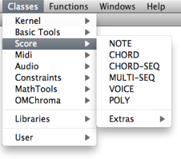
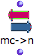

Navigation générale : 

  - [Guide](OM-Documentation.md)
  - [Plan](OM-Documentation_1.md)
  - [Glossaire](OM-Documentation_2.md)

OpenMusic
DocumentationHiérarchie
de section : [OM 6.6 User
Manual](OM-User-Manual.md) \>
[Score
Objects](ScoreObjects.md) \>
Presentation

Navigation : [page
précédente](ScoreObjects.md "page précédente(Score Objects)")
| [page
suivante](Note-Chord-Chord-seq.md "page suivante(Harmonic Objects)")

# Score Objects Presentation

[Sommaire ](#)

1.  [Types : "Harmonic", "Rhythmic" and "Polyphonic" Objects.](#zdN51)
2.  [Time Representation](#zdNe6)
3.  [Pitches](#zdN1d7)
4.  [General Score Modules](#zdN314)

<table>
<colgroup>
<col style="width: 50%" />
<col style="width: 50%" />
</colgroup>
<tbody>
<tr class="odd">
<td>

</td>
<td>

Score classes enclose the musical objects that compose a score : notes , chords , chord-seqs , voices , polys . Out of convenience, we have gathered these objects in three categories : "harmonic", "rhythmic" and "polyphonic" objects.

They can be accessed via the <code class="menuPath_tl">Classes / Score</code> menu.

</td>
</tr>
</tbody>
</table>

## Types : "Harmonic", "Rhythmic" and "Polyphonic" Objects.

1.  **Harmonic objects** include notes , chords and chord-seqs .

2.  **Rhythmic objects** include voices (internally made of measures
    and  groups).

3.  **Polyphonic objects** include polys and multi-seqs . These are
    "superimpositions" of objects :
    
      -  voices on one hand, 
      -  chord-seqs on the other hand.

## Time Representation

These objects can be classified into two temporal categories :

  -  **Pulsed, or rhythmic representations** are based on a
    traditional **rhythmic expression** of events in time, via
    rhythm
    trees[\[1\]](#kFootBsktc3051).
    Voices and polys are pulsed representations.
  -  **Linear representations** are based on the **absolute
    duration** of events – in milliseconds. Chord-seqs and multi-seqs
    are linear representations.
  -  Notes and chords are atomic objects and correspond to both
    temporal categories.

Expressing Rhythms

  - [Rhythm Trees](RT.md)

## Pitches

Pitches in OM are usually represented in midicents.

A midicent is a cent of one MIDI unit, that is, of a half-tone.

MIDI pitch units

In MIDI, the middle C is represented by the value 60, then 61=C\#, 62=D,
63=D\#, etc.

In midicent, therefore, C=6000, C\#=6100, ...

Midicents allow to represent microintervals, which standard MIDI values
can't do : 6050 = C+1/4 tone, 6020=C+ 1/10th tone, etc.

How to Play MicroIntervals

  - [Playing Microintervals with MIDI](Microintervals.md)

Manipulating Pitches in OM : Basic Tools

<table>
<colgroup>
<col style="width: 50%" />
<col style="width: 50%" />
</colgroup>
<tbody>
<tr class="odd">
<td>

</td>
<td>

A set of functions and conversion modules allows to manipulate midicents and pitches in general. They can be accessed via the <code class="menuPath_tl">Functions / Score /</code>menu.

</td>
</tr>
</tbody>
</table>

<table>
<tbody>
<tr class="odd">
<td>

</td>
<td>
The <strong>frequency-to-midicents</strong> function converts frequencies (or lists of frequencies) to midicents.
</td>
</tr>
<tr class="even">
<td>

</td>
<td>
The <strong>midicents-to-frequencies</strong> function converts midicents to frequencies.

Its input takes atoms or lists.
</td>
</tr>
<tr class="odd">
<td>

</td>
<td>
The <strong>name-to-midicents</strong> function converts a note name (like "C3") or a list of note names, to midicent value(s).
</td>
</tr>
<tr class="even">
<td>

</td>
<td>
The <strong>midicents-to-name</strong> function converts a midicents value (or a list of values) to note name(s).
</td>
</tr>
<tr class="odd">
<td>

</td>
<td>
The <strong>approximate-midicents</strong> function approximates a midicents value to the closest tempered division of the octave (for isntance 4 = quarter tones).
</td>
</tr>
</tbody>
</table>

## General Score Modules

<table>
<colgroup>
<col style="width: 50%" />
<col style="width: 50%" />
</colgroup>
<tbody>
<tr class="odd">
<td>

A set of score objects manipulation modules are avalable in the Functions<code class="menuPath_tl"> / Score</code> menu

</td>
<td>

</td>
</tr>
</tbody>
</table>

Références : 

1.  
    
    

    
    

    
    Rhythm Tree
    
    

    
    

    
    

    
    

    
    A rhythm tree expresses a rhythmic structure as a list.
    
    This list is made of :
    
      - a duration, or number of measures,
    
      - a list of measures.
    
    Each measure is made of
    
      - a time signature
    
      - a list or proportions, or rhythmic values.
    
    For instance : (1 (((4 4) (1 1 2))) is a rhythm of one measure,
    signature 4/4, with two quarter and one half note (proportions = 1/4
    1/4 2/4 = 1/4 1/4 1/2).
    
    The term of "tree" refers to a recusrive structure: each item in the
    proportions list can in turn be expressed as a duration with a list
    of subdivisions.
    
    For instance the second beat in our measure could be subdivided as
    follows : ((4 4) (1 (1 (2 3)) 2)).
    
    

    
    

    
    

    
    

Plan :

  - [OpenMusic Documentation](OM-Documentation.md)
  - [OM 6.6 User Manual](OM-User-Manual.md)
      - [Introduction](00-Sommaire.md)
      - [System Configuration and
        Installation](Installation.md)
      - [Going Through an OM Session](Goingthrough.md)
      - [The OM Environment](Environment.md)
      - [Visual Programming I](BasicVisualProgramming.md)
      - [Visual Programming
        II](AdvancedVisualProgramming.md)
      - [Basic Tools](BasicObjects.md)
      - [Score Objects](ScoreObjects.md)
          - Presentation
              - [Harmonic Objects](Note-Chord-Chord-seq.md)
              - [Rhythmic Objects](RhythmicObjects.md)
              - [Polyphonic Objects](Polyphonic.md)
          - [Rhythm Trees](RT.md)
          - [Score Players](ScorePlayer.md)
          - [Score Editors](ScoreEditors.md)
          - [Quantification](Quantification.md)
          - [Export / Import](ImportExport.md)
      - [Maquettes](Maquettes.md)
      - [Sheet](Sheet.md)
      - [MIDI](MIDI.md)
      - [Audio](Audio.md)
      - [SDIF](SDIF.md)
      - [Lisp Programming](Lisp.md)
      - [Errors and Problems](errors.md)
  - [OpenMusic QuickStart](QuickStart-Chapters.md)

Navigation : [page
précédente](ScoreObjects.md "page précédente(Score Objects)")
| [page
suivante](Note-Chord-Chord-seq.md "page suivante(Harmonic Objects)")

[A propos...](OM-Documentation_3.md)(c) Ircam - Centre
Pompidou

