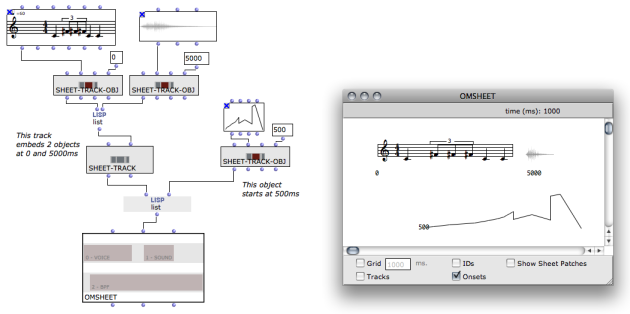

Navigation générale : 

  - [Guide](OM-Documentation.md)
  - [Plan](OM-Documentation_1.md)
  - [Glossaire](OM-Documentation_2.md)

OpenMusic
DocumentationHiérarchie
de section : [OM 6.6 User
Manual](OM-User-Manual.md) \>
[Sheet](Sheet.md) \>
Sheet Box

Navigation : [page
précédente](Sheet-Editor.md "page précédente(Sheet Editor)")
| [page
suivante](Sheet-Patch.md "page suivante(Sheet Patches)")

# Building Sheets in Visual Programs

As other musical objects, a sheet can be simply created in an OM patch.
This can be done at several levels of precision and complexity.

Remainder : objects allowed in the OMSheet

You can insert in a sheet most of the standard OM musical objects :

  - CHORD-SEQ
  - VOICE
  - SOUND
  - BPF / MIDICONTROL
  - MAQUETTE

## Connecting Objects

Objects are to be connected to the input of the OMSheet in order to be
included in it.

expects to receive a list, each element corresponding to one new sheet
track.

Empty Tracks

In the example above, note that the NIL element in the input list
produced an empty track in the OMSheet object created.

Polyphonic Objects

If you try to create a track from a polyphonic object (**multi-seq** or
**poly**), the sheet will automatically split it at initialization and
create a new track with each voice of the object.

Compound Tracks

Several musical objects can coexist (generally, sequencially) on a same
track. To create several objects on a same track, just connect a list of
objects instead of a single object to the first-level input list :

Objects Onsets

In compound tracks, objects are automatically positioned one after the
other (an object starts right at the end of the previous one in the
list). See next section for more advanced control on the position of the
objects.

Maquettes

Maquettes can be embedded in OMSheets as other musical objects. Just use
the maquette box in the "reference" evaluation mode and connect it as
any other object box.

"Reference" Evaluation Mode

  - [Reference Mode](RefMode.md)

Note that the size of the maquette boxes may be distorted due to the
non-linear graphical representation of the score in the editor.

Maquette Result

If the maquette has a "synthesis function", the result will appear along
with the boxes in the maquette representation.

Maquette Computation

  - [An Alternate Evaluation Tool : the Synthesis
    Patch](Synthpatchprog.md)

## Controlling the Structure

For a more accurate control of the sheet structure (and in particular of
the temporal structure), the internal components of the sheet can be
created and assembled directly in the OM patch. The classes
**SHEET-TRACK** and **SHEET-TRACK-OBJ** can be used for this purpose.

Build the tracks and connect them instead of simple objects :

  - **SHEET-TRACK** is just initialized with a list of
    **SHEET-TRACK-OBJs**.

  - **SHEET-TRACK-OBJ** is initialized with an object, a start time (or
    "onset") and an ID number (optional).

## Sheet Patches

The other input of the OMSheet box () allows you to programmatically set
the patches used internally in the sheet.

Programming Inside the Sheet

  - [Sheet Patches](Sheet-Patch.md)

<table>
<colgroup>
<col style="width: 50%" />
<col style="width: 50%" />
</colgroup>
<tbody>
<tr class="odd">
<td>

Just connect a list of patch boxes in "reference" mode.

</td>
<td>

</td>
</tr>
</tbody>
</table>

Patches in "Reference" Mode ?

  - [Reference Mode](RefMode.md)

Références : 

Plan :

  - [OpenMusic Documentation](OM-Documentation.md)
  - [OM 6.6 User Manual](OM-User-Manual.md)
      - [Introduction](00-Sommaire.md)
      - [System Configuration and
        Installation](Installation.md)
      - [Going Through an OM Session](Goingthrough.md)
      - [The OM Environment](Environment.md)
      - [Visual Programming I](BasicVisualProgramming.md)
      - [Visual Programming
        II](AdvancedVisualProgramming.md)
      - [Basic Tools](BasicObjects.md)
      - [Score Objects](ScoreObjects.md)
      - [Maquettes](Maquettes.md)
      - [Sheet](Sheet.md)
          - [Sheet Editor](Sheet-Editor.md)
          - Sheet
            Box
          - [Sheet Patches](Sheet-Patch.md)
      - [MIDI](MIDI.md)
      - [Audio](Audio.md)
      - [SDIF](SDIF.md)
      - [Lisp Programming](Lisp.md)
      - [Errors and Problems](errors.md)
  - [OpenMusic QuickStart](QuickStart-Chapters.md)

Navigation : [page
précédente](Sheet-Editor.md "page précédente(Sheet Editor)")
| [page
suivante](Sheet-Patch.md "page suivante(Sheet Patches)")

[A propos...](OM-Documentation_3.md)(c) Ircam - Centre
Pompidou

