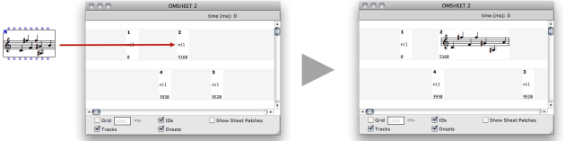

Navigation générale : 

  - [Guide](OM-Documentation.md)
  - [Plan](OM-Documentation_1.md)
  - [Glossaire](OM-Documentation_2.md)

OpenMusic
DocumentationHiérarchie
de section : [OM 6.6 User
Manual](OM-User-Manual.md) \>
[Sheet](Sheet.md) \>
Sheet Editor

Navigation : [page
précédente](Sheet.md "page précédente(Sheet)")
| [page
suivante](Sheet-Box.md "page suivante(Sheet Box)")

# Sheet Editor

[Sommaire ](#)

1.  [Creating Sheet Contents](#vfN6f)
2.  [Display](#vfN1e5)
3.  [Time Positions and Display](#vfN2f1)
4.  [Editing Objects](#vfN355)
5.  [Playback](#vfN3ca)

<table>
<colgroup>
<col style="width: 50%" />
<col style="width: 50%" />
</colgroup>
<tbody>
<tr class="odd">
<td>

A new OMSheet editor is initially a blank page : there is nothing inside.

A first step is therefore to add tracks and objects in this page. This can be done beforehand at building the Sheet object in the patch, or directly in the editor.

</td>
<td>

</td>
</tr>
</tbody>
</table>

Building the Sheet Structure in a Patch

  - [Building Sheets in Visual Programs](Sheet-Box.md)

The `Show Sheet Patches` box allows to display ofr hide the patches,
that is, the "algorithmic" part of the sheet. We will not consider it in
this section and focus on the "score" part only.

About The "Algorithmic" Part

  - [Sheet Patches](Sheet-Patch.md)

## Creating Sheet Contents

Adding/Removing Tracks

<table>
<colgroup>
<col style="width: 50%" />
<col style="width: 50%" />
</colgroup>
<tbody>
<tr class="odd">
<td>

New tracks can be added in the sheet using the <code class="menuPath_tl">File / New Track</code> menu or corresponding <code class="keyboard_tl">CMD</code> + <code class="keyboard_tl">N</code> keyboard shortcut.

Select a track and use the delete key ( <code class="keyboard_tl">&lt;=</code> ) to remove it.

</td>
<td>

</td>
</tr>
</tbody>
</table>

Adding/Removing Objects

<table>
<colgroup>
<col style="width: 50%" />
<col style="width: 50%" />
</colgroup>
<tbody>
<tr class="odd">
<td>

<code class="keyboard_tl">CMD</code> + Click somewhere in a sheet track to create a new object at this position.

You can also use the <code class="menuPath_tl">File / New Object</code> menu or corresponding <code class="keyboard_tl">CMD</code> + <code class="keyboard_tl">SHIFT</code> + <code class="keyboard_tl">N</code> keyboard shortcut to create a new object at the end of the selected track (if any).

Select an object and use the delete key ( <code class="keyboard_tl">&lt;=</code> ) to remove it.

</td>
<td>

</td>
</tr>
</tbody>
</table>

New Sheet Objects

Note that new sheet objects are "empty". Their value is NIL.

Objects ID

Note that every object is automatically affected a unique ID number,
visible if the box `IDs` is checked on.

These IDs are mainly used to identify the objects in the "programmatic"
part of the Sheet creation.

Programming Sheets

  - [Sheet Patches](Sheet-Patch.md)

Setting Contents in Sheet Objects

Here again, there exist several ways of setting the actual contents of a
sheet object.

1.  [At creating the sheet object in a patch](Sheet-Box.md)

2.  [Using the sheet internal patches](Sheet-Patch.md)

3.  By dragging and dropping an existing object (from a patch or from
    the sheet itself) on a sheet object box (see below).

Dragging Objects in The Sheet

It is also possibe to drag the value from one object in the sheet to
another one :

The contents of an existing object can be replaced with a value of
another type.

Deleting Objects Contents

Select an object and use the `SHIFT` + delete key ( `<=` ) to remove its
contents (reset the value to NIL).

Use `i` to reset the box initial size.

## Display

Several options allow to modify the general display of the sheet tracks.
These options do not modify its actual ("musial") contents.

Move / Switch / Resize Tracks

Use :

  - Up and Down arrow keys to change the size of selected
    track(s)
  - `SHIFT` + Up and Down arrow keys to change the position or
    spacing of selected track(s)
  - `ALT` + Up and Down arrow keys switch up/down the selected
    track(s)

Sow / Hide tracks

<table>
<colgroup>
<col style="width: 50%" />
<col style="width: 50%" />
</colgroup>
<tbody>
<tr class="odd">
<td>

The <code class="textCheckBox_tl">Tracks</code> box allow to choose to display or not the tracks in the background.

</td>
<td>

Hiding tracks in the OMSheet editor.

</td>
</tr>
</tbody>
</table>

Object Info

<table>
<colgroup>
<col style="width: 50%" />
<col style="width: 50%" />
</colgroup>
<tbody>
<tr class="odd">
<td>

The <code class="textCheckBox_tl">IDs</code> and <code class="textCheckBox_tl">Onsets</code> boxes allow to choose to display or hide the onset (ms) and the object ID on the individual objects.

</td>
<td>

</td>
</tr>
</tbody>
</table>

Score Attributes

<table>
<colgroup>
<col style="width: 50%" />
<col style="width: 50%" />
</colgroup>
<tbody>
<tr class="odd">
<td>

Score objects appearance can be modified in the Sheet editor :

<ul>
<li>
Select the object and use the Up and Down arrow keys to move the score vertically.
</li>
<li>
Right / <code class="keyboard_tl">CTRL</code> click on the object to open the contextual menu and change the score font size and staff.
</li>
</ul>

</td>
<td>

</td>
</tr>
</tbody>
</table>

## Time Positions and Display

All the objects and internal events in the sheet are precisely
positioned in the time axis according to non-linear notation or other
graphical constraints.

The `Grid` box and value field allow to display and set a regular
temporal grid on the score : you can see that this regular temporal grid
rarely draws a regular pattern, and changes depending on the objects in
the score and their relative positions.

The spacing of the grid units (here, of 1000ms = 1s) is optimized
depending on the graphical constraints of the objects in the score.

Moving Objects

Uset the `<=` and `=>` arrow keys to move the objects in the time axis
(and add `SHIFT` key to move them faster).

Aligning to the Grid

By pressing `a`, the object aligns its onset time to the current grid
unit.

## Editing Objects

<table>
<colgroup>
<col style="width: 50%" />
<col style="width: 50%" />
</colgroup>
<tbody>
<tr class="odd">
<td>

Double click on a Sheet object to edit its contents with the corresponding editor.

</td>
<td>

</td>
</tr>
</tbody>
</table>

Some Sheet Objects Editors...

  - [Score Editors](ScoreEditors.md)
  - [BPFs and BPCs Editors](BPFEditors.md)
  - [The Sound Editor](SoundEditor.md)
  - [The Maquette Editor](Editor.md)

## Playback

<table>
<colgroup>
<col style="width: 50%" />
<col style="width: 50%" />
</colgroup>
<tbody>
<tr class="odd">
<td>

Use the standard score playback controls to play the sheet or some parts of it.

If an interval or a set of specific objects are selected at launching the player, only these parts of the score are played.

</td>
<td>

</td>
</tr>
</tbody>
</table>

Score Playback Controls

  - [Play Controls](Editor-Play.md)

Références : 

Plan :

  - [OpenMusic Documentation](OM-Documentation.md)
  - [OM 6.6 User Manual](OM-User-Manual.md)
      - [Introduction](00-Sommaire.md)
      - [System Configuration and
        Installation](Installation.md)
      - [Going Through an OM Session](Goingthrough.md)
      - [The OM Environment](Environment.md)
      - [Visual Programming I](BasicVisualProgramming.md)
      - [Visual Programming
        II](AdvancedVisualProgramming.md)
      - [Basic Tools](BasicObjects.md)
      - [Score Objects](ScoreObjects.md)
      - [Maquettes](Maquettes.md)
      - [Sheet](Sheet.md)
          - Sheet
            Editor
          - [Sheet Box](Sheet-Box.md)
          - [Sheet Patches](Sheet-Patch.md)
      - [MIDI](MIDI.md)
      - [Audio](Audio.md)
      - [SDIF](SDIF.md)
      - [Lisp Programming](Lisp.md)
      - [Errors and Problems](errors.md)
  - [OpenMusic QuickStart](QuickStart-Chapters.md)

Navigation : [page
précédente](Sheet.md "page précédente(Sheet)")
| [page
suivante](Sheet-Box.md "page suivante(Sheet Box)")

[A propos...](OM-Documentation_3.md)(c) Ircam - Centre
Pompidou

