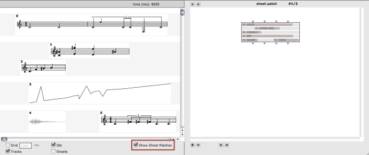

Navigation générale : 

  - [Guide](OM-Documentation.md)
  - [Plan](OM-Documentation_1.md)
  - [Glossaire](OM-Documentation_2.md)

OpenMusic
DocumentationHiérarchie
de section : [OM 6.6 User
Manual](OM-User-Manual.md) \>
[Sheet](Sheet.md) \>
Sheet Patches

Navigation : [page
précédente](Sheet-Box.md "page précédente(Sheet Box)")
| [page suivante](MIDI.md "page suivante(MIDI)")

# Sheet Patches

In addition to their musical contents, OMSheets embed some programmatic
aspects materialized as a list of internal patches.

To make these patches visible, use the `Show Sheet Patches` box in the
sheet editor.

## Basic Operations on the Sheet Patches

A number of buttons are visible around the patch editor part of the
window.

Tooltips

<table>
<colgroup>
<col style="width: 50%" />
<col style="width: 50%" />
</colgroup>
<tbody>
<tr class="odd">
<td>

Used <code class="keyboard_tl">CMD</code> to show the "tooltip" help of the different buttons

</td>
<td>

</td>
</tr>
</tbody>
</table>

Creating/Removing Sheet Patches

Sheet patches can be attached to a given sheet object at initialisation,
or using the `+` / `-` buttons in the editor. There can be any number of
patches attached to a sheet.

The

arrow buttons at the top allow to navigate between the different patches
attached to a sheet.

The

arrow buttons at the bottom allow to change the order of the patches
attached to a sheet by moving the current one up or down in the list.

Adding Patches using the OMSheet Box

  - [Building Sheets in Visual Programs](Sheet-Box.md)

## Sheet Access

The sheet patches are like standard patches, except that they can
contain a special kind of box called **SHEET-ACCESS** (one is created by
defalut when adding a new patch with the `+` button in the sheet-patch
window).

This box is meant to represent and allow to read or modify the contents
of the objects in the sheet containing the patch.

The SHEET-ACCESS box has 4 inputs/outputs

  - The usual input corresponds to the sheet containing the patch.

  - The input allows to target a specific object in the sheet using its
    ID number. When the **sheet-access** box is evaluated, the
    corresponding rectangle is highlighted in it :

  - and allow to read and/or modify repectively the corresponding object
    in the sheet (a SHEET-TRACK-OBJ instance including the value and
    temporal location) or its contents (the value only, that is, the
    musical object it contains).

Sheet Accesses

The Sheet patches can contain as many sheet access boxes as needed.

Note that the contents of the sheet access itself may change depending
on the evaluation performed on it, so the order of evaluations may
matter at the time of programming advanced relations between the
objects.

Example of Sheet programming Using Sheet-Access (1)

In this example, the Chord-seq (ID=1) is determined from the data coming
from object ID=0 (a BPF)

Example of Sheet programming Using Sheet-Access (2)

In this exemple, the object on track 2 (object ID=1) is determined using
a **sheet-track-obj** in order to set its onset at the position of
measure 1 in object 0 (this first voice).

The contents of object 1 is the reverse rhythm of voice 0.

Références : 

Plan :

  - [OpenMusic Documentation](OM-Documentation.md)
  - [OM 6.6 User Manual](OM-User-Manual.md)
      - [Introduction](00-Sommaire.md)
      - [System Configuration and
        Installation](Installation.md)
      - [Going Through an OM Session](Goingthrough.md)
      - [The OM Environment](Environment.md)
      - [Visual Programming I](BasicVisualProgramming.md)
      - [Visual Programming
        II](AdvancedVisualProgramming.md)
      - [Basic Tools](BasicObjects.md)
      - [Score Objects](ScoreObjects.md)
      - [Maquettes](Maquettes.md)
      - [Sheet](Sheet.md)
          - [Sheet Editor](Sheet-Editor.md)
          - [Sheet Box](Sheet-Box.md)
          - Sheet
            Patches
      - [MIDI](MIDI.md)
      - [Audio](Audio.md)
      - [SDIF](SDIF.md)
      - [Lisp Programming](Lisp.md)
      - [Errors and Problems](errors.md)
  - [OpenMusic QuickStart](QuickStart-Chapters.md)

Navigation : [page
précédente](Sheet-Box.md "page précédente(Sheet Box)")
| [page suivante](MIDI.md "page suivante(MIDI)")

[A propos...](OM-Documentation_3.md)(c) Ircam - Centre
Pompidou

