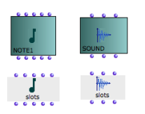
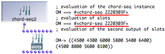

Navigation générale : 

  - [Guide](OM-Documentation.md)
  - [Plan](OM-Documentation_1.md)
  - [Glossaire](OM-Documentation_2.md)

OpenMusic
DocumentationHiérarchie
de section : [OM 6.6 User
Manual](OM-User-Manual.md) \>
[Visual Programming
II](AdvancedVisualProgramming.md) \>
[Instances](Instances.md) \>
Slots

Navigation : [page
précédente](GlobalVariables.md "page précédente(Global Variables)")
| [page
suivante](Store.md "page suivante(The Store Object)")

# Reading and Modifying Instances : Slots

The slots box can read or modify the slots values – "fields" or
parameters – of an instance or global variable.

About Instance Boxes and Global Variables

  - [Instance Boxes](InstanceBoxes.md)
  - [Global Variables](GlobalVariables.md)

## Properties

Creating a Slots Box

**** To create a slots box :

1.  `Cmd` click in a patch editor and type a class name, as for any
    other box

2.  keep `SHIFT` pressed when validating.

You can also

1.  create a factory box

2.  select it and press `Alt`

3.  drag the box with `SHIFT` key pressed.

Morphology

<table>
<colgroup>
<col style="width: 50%" />
<col style="width: 50%" />
</colgroup>
<tbody>
<tr class="odd">
<td>

</td>
<td>

The structure and morphology of a slots box is similar to those of its corresponding factory box. The slots box also has a "self", and a number of parametric slots.

</td>
</tr>
</tbody>
</table>

<table>
<colgroup>
<col style="width: 50%" />
<col style="width: 50%" />
</colgroup>
<tbody>
<tr class="odd">
<td>

For instance, the slots box created out of a chord instance has the same inputs and outputs : self , lmidic for midicents, lvel for velocities, loffset for notes offsets , ldur for durations, lchan for midi channels. It also has the same icon.

</td>
<td>

</td>
</tr>
</tbody>
</table>

Behaviour

When the slots box is evaluated :

  - The outputs of slots return the values of an instance's
    corresponding slots. 
  - The inputs of slots can take values which are assigned tothe
    corresponding slots of the object.

## Using the Slots Box to Modify an Instance

Using "slots" allows to read and modify the parameters of an object
without creating new instances out of new factory boxes :

Constraint

The **"self"** **input** of slots must be connected to the **"self"
output** of an object, in order to set the object whose slots are to be
read and/or modified.

Reading Values

To read the value(s) of an instance's slot :

1.  connect the instance to the "self" input of slots,

2.  evaluate the corresponding output of slots.

Modifying the Values of an Object

To modify the value(s) of an instance's slot :

1.  connect the instance to the "self" input of slots,

2.  enter new values in the relevant input of slots,

3.  evaluate slots

Note that the reference of the object hasn't changed, despite the fact
the object's content has changed.

Applying Slots to Factory Boxes

<table>
<colgroup>
<col style="width: 50%" />
<col style="width: 50%" />
</colgroup>
<tbody>
<tr class="odd">
<td>

The same procedures can apply to factory boxes.

<ol>
<li>
Before evaluating, you may need to lock the factory box before evaluating slots : otherwise, it will be reset to its default values.
</li>
<li>
After evaluating, you may need to select the factory box and press <code class="keyboard_tl">m</code> to refresh the miniview.
</li>
</ol>

</td>
<td>

</td>
</tr>
</tbody>
</table>

## Modifying an Object in an Abstraction

With a slots box, an instance can be passed through the inputs of an
abstraction and mainpulated without resorting to a new factory boxes,
which would generate copies of the instance. This is sometimes necessary
:

  - for optimization purposes

  - to ensure keeping the original instance one operates upon.

<table>
<colgroup>
<col style="width: 50%" />
<col style="width: 50%" />
</colgroup>
<tbody>
<tr class="odd">
<td>

</td>
<td>

To read or modify the parametric values of an instance from <strong>inside an abstraction</strong> :

<table>
<tbody>
<tr class="odd">
<td>
1.
</td>
<td>
add an input and an output to the abstraction
</td>
</tr>
<tr class="even">
<td>
2.
</td>
<td>
connect the self output of the instance to the sub patch input
</td>
</tr>
<tr class="odd">
<td>
3.
</td>
<td>
connect the sub patch output to the self intput of an equivalent instance.
</td>
</tr>
</tbody>
</table>

</td>
</tr>
</tbody>
</table>

1 - Using Instance Values in a Sub-Patch to Create a New
Object

1.  In the sub patch editor, add a chord box and create a corresponding
    slots box.
    
    Add the items required to modify the values of the chord, and
    connect them to the .
    
    Connect these items to slots, and to the factory box.
    
    Connect the remaining inputs of the factory box to the corresponding
    outputs of slots box.

2.  Connect the **input** of the sub patch to the **"self" input of
    slots**
    
    Connect the **output** of the sub patch to the "self" output of the
    factory box.
    
    Evaluate the factory box outside the patch.

The input instance values are read and used for generating a new object.

2 - Modifying an Instance in a Sub-Patch

The input values of the instance are read and modified by the second
slots box. Chord \#2 is also modified, since chord \#1 has been
modified.

When the initial instance coming from a factory box is modified, you may
need to refresh the box minivie in order to visualize the changes.

Références : 

Plan :

  - [OpenMusic Documentation](OM-Documentation.md)
  - [OM 6.6 User Manual](OM-User-Manual.md)
      - [Introduction](00-Sommaire.md)
      - [System Configuration and
        Installation](Installation.md)
      - [Going Through an OM Session](Goingthrough.md)
      - [The OM Environment](Environment.md)
      - [Visual Programming I](BasicVisualProgramming.md)
      - [Visual Programming
        II](AdvancedVisualProgramming.md)
          - [Abstraction](Abstraction.md)
          - [Evaluation Modes](EvalModes.md)
          - [Higher-Order Functions](HighOrder.md)
          - [Control Structures](Control.md)
          - [Iterations: OMLoop](OMLoop.md)
          - [Instances](Instances.md)
              - [Instance Boxes](InstanceBoxes.md)
              - [Global Variables](GlobalVariables.md)
              - Slots
              - [The Store Object](Store.md)
          - [Interface Boxes](InterfaceBoxes.md)
          - [Files](Files.md)
      - [Basic Tools](BasicObjects.md)
      - [Score Objects](ScoreObjects.md)
      - [Maquettes](Maquettes.md)
      - [Sheet](Sheet.md)
      - [MIDI](MIDI.md)
      - [Audio](Audio.md)
      - [SDIF](SDIF.md)
      - [Lisp Programming](Lisp.md)
      - [Errors and Problems](errors.md)
  - [OpenMusic QuickStart](QuickStart-Chapters.md)

Navigation : [page
précédente](GlobalVariables.md "page précédente(Global Variables)")
| [page
suivante](Store.md "page suivante(The Store Object)")

[A propos...](OM-Documentation_3.md)(c) Ircam - Centre
Pompidou

