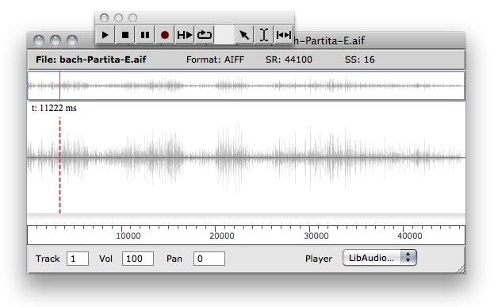

Navigation générale : 

  - [Guide](OM-Documentation.md)
  - [Plan](OM-Documentation_1.md)
  - [Glossaire](OM-Documentation_2.md)

OpenMusic
DocumentationHiérarchie
de section : [OM 6.6 User
Manual](OM-User-Manual.md) \>
[Audio](Audio.md) \>
Sound Editor

Navigation : [page
précédente](Sound.md "page précédente(Sound Object)")
| [page
suivante](AudioPlayer.md "page suivante(Audio Player)")

# The Sound Editor

Double click on an initialized sound box to open its sound editor.

The sound editor displays the sund wave form as well as a number of
additional information : file name, format, sample rate (SR), sample
size.

## Navigation and Playback

Use the palette button or the `space` key to play/stop the sound file.

Playing Parameters

Some playback parameter are accessible at the bottom part of the
editor : volume controller, L/R panning, and audio track.

It is also possible, when several players are available, to chosse among
them the one to use for playing the sound (`Player` menu).

More About Audio Tracks and the Audio Player

  - [The Audio Player](AudioPlayer.md)

Navigation

<table>
<colgroup>
<col style="width: 50%" />
<col style="width: 50%" />
</colgroup>
<tbody>
<tr class="odd">
<td>

Use the ruler at the bottom of the waveform display to zoom in/out, and the scrollbar to navigate in the sound.

The button resets the orginal scale.

</td>
<td>

</td>
</tr>
</tbody>
</table>

The red vertical line is a cursor indicating the starting point for the
playback of the sound.

Click anywhere on the main panel to set the cursor start position.

Regions

<table>
<colgroup>
<col style="width: 50%" />
<col style="width: 50%" />
</colgroup>
<tbody>
<tr class="odd">
<td>

You can select a specific region in the sound using the  tool of the palette.

When a region is selected, the space play command will trigger playback of this region only.

To play a region from the palette, use the  button.

</td>
<td>

</td>
</tr>
</tbody>
</table>

You can drag a selected region from the sound editor to a patch window
in order to create a new sound box with the selected part of the sound.

## Markers

The sound markers are also visible in the sound editor, and can be
added, moved or deleted from this window.

<table>
<colgroup>
<col style="width: 50%" />
<col style="width: 50%" />
</colgroup>
<tbody>
<tr class="odd">
<td>

<ul>
<li>To add a marker, <code class="keyboard_tl">CMD</code> + click on the sound panel ;</li>
<li>To select a maker or a set of markers, jus clic and drag as usual ;</li>
<li>To delete selected markers, press <code class="keyboard_tl">&lt;- </code> ;</li>
<li>To move markers, drag them with the move or double click and edit the time value.</li>
</ul>

</td>
<td>

</td>
</tr>
</tbody>
</table>

Region from markers

<table>
<colgroup>
<col style="width: 50%" />
<col style="width: 50%" />
</colgroup>
<tbody>
<tr class="odd">
<td>

Double click in a region between two markers to select it.

This region can then be played or used to create a new sound extract (see above).

</td>
<td>

</td>
</tr>
</tbody>
</table>

Warning

Too small regions (under a 200ms) may not be played or extracted
correctly.

Références : 

Plan :

  - [OpenMusic Documentation](OM-Documentation.md)
  - [OM 6.6 User Manual](OM-User-Manual.md)
      - [Introduction](00-Sommaire.md)
      - [System Configuration and
        Installation](Installation.md)
      - [Going Through an OM Session](Goingthrough.md)
      - [The OM Environment](Environment.md)
      - [Visual Programming I](BasicVisualProgramming.md)
      - [Visual Programming
        II](AdvancedVisualProgramming.md)
      - [Basic Tools](BasicObjects.md)
      - [Score Objects](ScoreObjects.md)
      - [Maquettes](Maquettes.md)
      - [Sheet](Sheet.md)
      - [MIDI](MIDI.md)
      - [Audio](Audio.md)
          - [Sound Object](Sound.md)
          - Sound
            Editor
          - [Audio Player](AudioPlayer.md)
          - [Sound Tools](SoundTools.md)
          - [Sound Processing](SoundProcessing.md)
          - [Recording](SoundRecording.md)
          - [External Libraries](Externals.md)
          - [Audio Preferences](SoundPreferences.md)
      - [SDIF](SDIF.md)
      - [Lisp Programming](Lisp.md)
      - [Errors and Problems](errors.md)
  - [OpenMusic QuickStart](QuickStart-Chapters.md)

Navigation : [page
précédente](Sound.md "page précédente(Sound Object)")
| [page
suivante](AudioPlayer.md "page suivante(Audio Player)")

[A propos...](OM-Documentation_3.md)(c) Ircam - Centre
Pompidou

