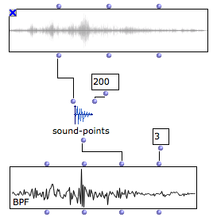

Navigation générale : 

  - [Guide](OM-Documentation.md)
  - [Plan](OM-Documentation_1.md)
  - [Glossaire](OM-Documentation_2.md)

OpenMusic
DocumentationHiérarchie
de section : [OM 6.6 User
Manual](OM-User-Manual.md) \>
[Audio](Audio.md) \>
Sound Tools

Navigation : [page
précédente](AudioPlayer.md "page précédente(Audio Player)")
| [page
suivante](SoundProcessing.md "page suivante(Sound Processing)")

# Sound Tools

A few utility functions related to sound objects are accessible in the
`Audio/Tools` menu.

  - **SOUND-DUR** : returns the duration of a sound in seconds

  - **SOUND-DUR-MS** : duration in milliseconds

  - **SEC-\>SAMPLES** : converts a duration into a number of samples
    (depending on the sample rate)

  - **etc.**

SOUND-POINTS

<table>
<colgroup>
<col style="width: 50%" />
<col style="width: 50%" />
</colgroup>
<tbody>
<tr class="odd">
<td>

The SOUND-POINTS function allows to downsample the sound waveofrm and extract a number of points out of it.

</td>
<td>

SOUND-POINTS : downsampling a sound waveform. The sample values are displayed in a BPF (note that the number of decimals in the BPF has to be increased due to the range and precision of the sample values).

</td>
</tr>
</tbody>
</table>

Références : 

Plan :

  - [OpenMusic Documentation](OM-Documentation.md)
  - [OM 6.6 User Manual](OM-User-Manual.md)
      - [Introduction](00-Sommaire.md)
      - [System Configuration and
        Installation](Installation.md)
      - [Going Through an OM Session](Goingthrough.md)
      - [The OM Environment](Environment.md)
      - [Visual Programming I](BasicVisualProgramming.md)
      - [Visual Programming
        II](AdvancedVisualProgramming.md)
      - [Basic Tools](BasicObjects.md)
      - [Score Objects](ScoreObjects.md)
      - [Maquettes](Maquettes.md)
      - [Sheet](Sheet.md)
      - [MIDI](MIDI.md)
      - [Audio](Audio.md)
          - [Sound Object](Sound.md)
          - [Sound Editor](SoundEditor.md)
          - [Audio Player](AudioPlayer.md)
          - Sound
            Tools
          - [Sound Processing](SoundProcessing.md)
          - [Recording](SoundRecording.md)
          - [External Libraries](Externals.md)
          - [Audio Preferences](SoundPreferences.md)
      - [SDIF](SDIF.md)
      - [Lisp Programming](Lisp.md)
      - [Errors and Problems](errors.md)
  - [OpenMusic QuickStart](QuickStart-Chapters.md)

Navigation : [page
précédente](AudioPlayer.md "page précédente(Audio Player)")
| [page
suivante](SoundProcessing.md "page suivante(Sound Processing)")

[A propos...](OM-Documentation_3.md)(c) Ircam - Centre
Pompidou

