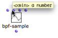
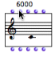
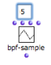
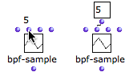

Navigation générale : 

  - [Guide](OM-Documentation.md)
  - [Plan](OM-Documentation_1.md)
  - [Glossaire](OM-Documentation_2.md)

OpenMusic
DocumentationHiérarchie
de section : [OM 6.6 User
Manual](OM-User-Manual.md) \>
[Visual Programming
I](BasicVisualProgramming.md) \>
[Box Inputs](BoxInputs.md) \>
Standard
Inputs

Navigation : [page
précédente](BoxInputs.md "page précédente(Box Inputs)")
| [page
suivante](AdditionalInputs.md "page suivante(Additional Inputs)")

# Standard Inputs

## Information and Default Values

Getting Information : Tooltips

<table>
<colgroup>
<col style="width: 50%" />
<col style="width: 50%" />
</colgroup>
<tbody>
<tr class="odd">
<td>

</td>
<td>

To display information about an inlet, keep <code class="keyboard_tl">Cmd</code> pressed while hovering the mouse over the inlet. A tooltip appears and displays 

<ul>
<li> a parameter name,</li>
<li>a short documentation about this parameter.</li>
</ul>

</td>
</tr>
</tbody>
</table>

Default Values

<table>
<colgroup>
<col style="width: 50%" />
<col style="width: 50%" />
</colgroup>
<tbody>
<tr class="odd">
<td>

All box inputs have default values that are used by the box if no values have been specified by the user, or if the box is not connected to anything.

To visualize the default value of an inlet, hover the mouse over it. If it is connected to any kind of component – such as a value or a box – this default value will be ignored.

</td>
<td>

The default pitch of a note is 6000 midicents, that is, a C4.

</td>
</tr>
</tbody>
</table>

Getting Information about Inputs

  - [Documentation and Info](DocAndInfo.md)

## Entering Values

<table>
<colgroup>
<col style="width: 50%" />
<col style="width: 50%" />
</colgroup>
<tbody>
<tr class="odd">
<td>

To enter a value in an inlet :

<ol>
<li>
click on it
</li>
<li>
type a value in the text field
</li>
<li>
validate.
</li>
</ol>

The value remains hidden unless you hover the mouse over the inlet.

</td>
<td>

</td>
</tr>
</tbody>
</table>

<table>
<colgroup>
<col style="width: 50%" />
<col style="width: 50%" />
</colgroup>
<tbody>
<tr class="odd">
<td>

<code class="keyboard_tl">SHIFT</code> click on the inlet to display the input value in a connected data box that will remain visible.

</td>
<td>

</td>
</tr>
</tbody>
</table>

Saving Values

**Always validate** after entering a value in an inlet :

  -  **** click in the window 
  - press `Enter`.

This is very important since default values can remain hidden.

Input Menu

When the number of possible values is very limited for an argument, some
functions display a pop up menu where the user can pick the desired
value.

To chose a menu item, click on the input, and click again in the pop up
menu.

The list-filter function has three arguments : the numberp predicate, a
list and an action (pass or reject). Here, it passes numbers only (pass
+ numberp) and returns (2).

Références : 

Plan :

  - [OpenMusic Documentation](OM-Documentation.md)
  - [OM 6.6 User Manual](OM-User-Manual.md)
      - [Introduction](00-Sommaire.md)
      - [System Configuration and
        Installation](Installation.md)
      - [Going Through an OM Session](Goingthrough.md)
      - [The OM Environment](Environment.md)
      - [Visual Programming I](BasicVisualProgramming.md)
          - [Patch Introduction](ProgrammingIntro.md)
          - [Adding Boxes Into a Patch](AddingBoxes.md)
          - [Elementary Manipulations](ElementaryManips.md)
          - [Boxes](Boxes.md)
          - [Box Inputs](BoxInputs.md)
              - Standard
                Inputs
              - [Additional Inputs](AdditionalInputs.md)
          - [Connections](Connections.md)
          - [Evaluation](Evaluation.md)
          - [Documentation and Info](DocAndInfo.md)
          - [Comments](Comments.md)
          - [Pictures](Pictures.md)
          - [Saving / Reloading a Patch](SavingPatch.md)
          - [Dead Boxes](DeadBox.md)
      - [Visual Programming
        II](AdvancedVisualProgramming.md)
      - [Basic Tools](BasicObjects.md)
      - [Score Objects](ScoreObjects.md)
      - [Maquettes](Maquettes.md)
      - [Sheet](Sheet.md)
      - [MIDI](MIDI.md)
      - [Audio](Audio.md)
      - [SDIF](SDIF.md)
      - [Lisp Programming](Lisp.md)
      - [Errors and Problems](errors.md)
  - [OpenMusic QuickStart](QuickStart-Chapters.md)

Navigation : [page
précédente](BoxInputs.md "page précédente(Box Inputs)")
| [page
suivante](AdditionalInputs.md "page suivante(Additional Inputs)")

[A propos...](OM-Documentation_3.md)(c) Ircam - Centre
Pompidou

