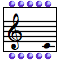
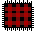
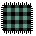
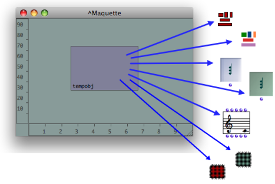

Navigation générale : 

  - [Guide](OM-Documentation.md)
  - [Plan](OM-Documentation_1.md)
  - [Glossaire](OM-Documentation_2.md)

OpenMusic
DocumentationHiérarchie
de section : [OM 6.6 User
Manual](OM-User-Manual.md) \>
[Maquettes](Maquettes.md) \>
TemporalBoxes

Navigation : [page
précédente](Maquette.md "page précédente(Creating a Maquette)")
| [page
suivante](AddingTempbox.md "page suivante(Adding TemporalBoxes)")

# TemporalBoxes

The boxes used within maquettes are called **TemporalBoxes** .

## References

A TemporalBox can refer to several types of items :

<table>
<tbody>
<tr class="odd">
<td><ul>
<li>
an instance :
</li>
</ul></td>
<td>
  
</td>
<td><ul>
<li>
a patch :
</li>
</ul></td>
<td>
 
</td>
<td><ul>
<li>
a maquette :
</li>
</ul></td>
<td>
 
</td>
</tr>
</tbody>
</table>

## Uses

Using TemporalBoxes as Programs

TemporalBoxes can be used in a maquette for manipulating data, like mere
programs. In this case, data is returned to and from TemporalBoxes
**through standard inputs and outputs** .

The program of the TemporalBox can implement its relation to the
maquette's context via a **temporal input** .

Using TemporalBoxes as Musical Objects

TemporalBoxes can also be used in a maquette for producing a musical
value, like musical objects, which are **played** in the maquette. This
musical value is expressed by a **temporal output** .

Références : 

Plan :

  - [OpenMusic Documentation](OM-Documentation.md)
  - [OM 6.6 User Manual](OM-User-Manual.md)
      - [Introduction](00-Sommaire.md)
      - [System Configuration and
        Installation](Installation.md)
      - [Going Through an OM Session](Goingthrough.md)
      - [The OM Environment](Environment.md)
      - [Visual Programming I](BasicVisualProgramming.md)
      - [Visual Programming
        II](AdvancedVisualProgramming.md)
      - [Basic Tools](BasicObjects.md)
      - [Score Objects](ScoreObjects.md)
      - [Maquettes](Maquettes.md)
          - [Creating a Maquette](Maquette.md)
          - TemporalBoxes
              - [Adding TemporalBoxes](AddingTempbox.md)
              - [Elementary Manipulations](elementary.md)
              - [Temporalboxes Appearance](Appearance.md)
              - [TemporalBoxes Value](TempValues.md)
          - [The Maquette Editor](Editor.md)
          - [Maquette
            Programming](Programming%20Maquette.md)
          - [Maquettes in
            Patches](Maquettes%20in%20Patches.md)
      - [Sheet](Sheet.md)
      - [MIDI](MIDI.md)
      - [Audio](Audio.md)
      - [SDIF](SDIF.md)
      - [Lisp Programming](Lisp.md)
      - [Errors and Problems](errors.md)
  - [OpenMusic QuickStart](QuickStart-Chapters.md)

Navigation : [page
précédente](Maquette.md "page précédente(Creating a Maquette)")
| [page
suivante](AddingTempbox.md "page suivante(Adding TemporalBoxes)")

[A propos...](OM-Documentation_3.md)(c) Ircam - Centre
Pompidou

