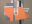

Navigation générale : 

  - [Guide](OM-Documentation.md)
  - [Plan](OM-Documentation_1.md)
  - [Glossaire](OM-Documentation_2.md)

OpenMusic
DocumentationHiérarchie
de section : [OM 6.6 User
Manual](OM-User-Manual.md) \>
[Maquettes](Maquettes.md) \>
[Maquettes in
Patches](Maquettes%20in%20Patches.md) \>
[Reference
Mode](Maquettes%20in%20Patches2.md) \>
Examples

Navigation : [page
précédente](addprocedure.md "page précédente(Adding TemporalBoxes)")
| [page
suivante](REF3.md "page suivante(Accessing Boxes)")

# Adding TemporalBoxes : Examples

## Adding a List of TemporalBoxes in a Maquette

Program

<table>
<colgroup>
<col style="width: 50%" />
<col style="width: 50%" />
</colgroup>
<tbody>
<tr class="odd">
<td>

</td>
<td>

<ul>
<li> List returns a list of TemporalBoxes that are added in the maquette. </li>
<li>The Temporalbox instances have temporal and graphic parameters. </li>
<li>The "self" outputs of the instances are connected to list. </li>
<li>The resulting list is returned to addbox2maquette. </li>
</ul>

When addbox2maquette is evaluated, both TemporalBoxes are added in the maquette.

</td>
</tr>
</tbody>
</table>

Maquette and Evaluations

The corresponding temporal objects are represented by gray boxes

, which show a small OM icon if the `show box icon` option is selected
in the maquette preferences.

The maquette, after the first evaluation of addbox2maquette.

This maquette already contained three temporal objects. Addbox2maquette
has been evaluated twice, without modifying the TemporalBoxes parameters
: objects are superimposed. Everytime the function is evaluated, the
TemporalBoxes are added in the maquette. No TemporalBox is deleted from
the maquette.

After the second evaluation of the function.

## Specifying Colour

The colour of a TemporalBox is specified with R-G-B values and the
om-make-color function.

Systematizing Colour According to Posy and Offset

  - [TemporalBoxes Interaction : Examples (1)](REF5.md)

## Specifying TemporalBoxes Number and Position with a PBF

Program

<table>
<colgroup>
<col style="width: 50%" />
<col style="width: 50%" />
</colgroup>
<tbody>
<tr class="odd">
<td>

</td>
<td>

This patch allows to place <strong>several</strong> TemporalBoxes in a maquette. It has a BPF, an OMLoop box, and the addbox2maquette function.

<ul>
<li> The BPF is a series of points whose graphic position is transposed in the maquette. A series of point in the curve is selected. The x-points and y-points are converted into temporal and graphical data.</li>
<li>The OMLoop iterates the operation. </li>
</ul>

</td>
</tr>
</tbody>
</table>

OMLoop

<table>
<colgroup>
<col style="width: 50%" />
<col style="width: 50%" />
</colgroup>
<tbody>
<tr class="odd">
<td>

</td>
<td>

The "self" of the BPF is returned to the input of the OMLoop : the x and y-points of each point are enumerated via the slots of a BPF and two listloops.

<ul>
<li> Xs are returned to the "offset" input of the TemporalBox instance. </li>
<li> Ys are returned to the "posy" input.</li>
<li>A duration has also been assigned to the temporalbox instance.</li>
</ul>
<ol>
<li>
At each step of the loop, collect stores the information returned by the temporalbox instance.
</li>
<li>
Finally returns the whole of the results addbox2maquette at the end of the iteration.
</li>
</ol>

</td>
</tr>
</tbody>
</table>

Resulting Maquette

The BPF is expressed by the position of the TemporalBoxes.

Références : 

Plan :

  - [OpenMusic Documentation](OM-Documentation.md)
  - [OM 6.6 User Manual](OM-User-Manual.md)
      - [Introduction](00-Sommaire.md)
      - [System Configuration and
        Installation](Installation.md)
      - [Going Through an OM Session](Goingthrough.md)
      - [The OM Environment](Environment.md)
      - [Visual Programming I](BasicVisualProgramming.md)
      - [Visual Programming
        II](AdvancedVisualProgramming.md)
      - [Basic Tools](BasicObjects.md)
      - [Score Objects](ScoreObjects.md)
      - [Maquettes](Maquettes.md)
          - [Creating a Maquette](Maquette.md)
          - [TemporalBoxes](TemporalBoxes.md)
          - [The Maquette Editor](Editor.md)
          - [Maquette
            Programming](Programming%20Maquette.md)
          - [Maquettes in
            Patches](Maquettes%20in%20Patches.md)
              - [Build Mode](Build.md)
              - [Functional
                Mode](Maquettes%20in%20Patches1.md)
              - [Reference
                Mode](Maquettes%20in%20Patches2.md)
                  - [Adding TemporalBoxes](addprocedure.md)
                  - Examples
                  - [Accessing Boxes](REF3.md)
                  - [Removing Boxes](REF4.md)
                  - [Interaction (1)](REF5.md)
                  - [Interation (2)](Intercation2.md)
      - [Sheet](Sheet.md)
      - [MIDI](MIDI.md)
      - [Audio](Audio.md)
      - [SDIF](SDIF.md)
      - [Lisp Programming](Lisp.md)
      - [Errors and Problems](errors.md)
  - [OpenMusic QuickStart](QuickStart-Chapters.md)

Navigation : [page
précédente](addprocedure.md "page précédente(Adding TemporalBoxes)")
| [page
suivante](REF3.md "page suivante(Accessing Boxes)")

[A propos...](OM-Documentation_3.md)(c) Ircam - Centre
Pompidou

