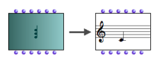

# Visualization

## Visualizing Objects : the Miniview

The current value of a factory box - its last computed value, or its default
value if the box has just been added - is displayed instead of the initial
icon.

To show or hide a miniview, press `m` .

|

A "chord" box in normal and "miniview" modes.  
  
---|---  
  
Adjustments

To move the content of a miniview up or down : press `Alt`\+ `↑` or `↓` .

Default Miniview

The object refers to a simple class with three slots : slot1, slot2 and slot3.

|

Some classes don't have a specific miniview. A default miniview then shows the
different slot - input - names and current values.  
  
---|---  
  
About Slots

  * [Instantiating Objects](2-Instanciation)

## Displaying and Editing the Name of a Factory Box

|

In theory, the name of a factory box isn't displayed with its icon.

To displayed or hide the name of a box, press  `n`.

A default name appears in the lower left corner of the box icon. This name is
that of the corresponding class of the box.  
  
---|---  
  
To edit this name :

  1. open the `Info` window 

    * select `File / Get Info`
    * press `Cmd` +` i`
  2. edit the name in the **" Name"** frame.

|

  
  
---|---  
  
References :

Plan :

  * [OpenMusic Documentation](OM-Documentation)
  * [OM 6.6 User Manual](OM-User-Manual)
    * [Introduction](00-Sommaire)
    * [System Configuration and Installation](Installation)
    * [Going Through an OM Session](Goingthrough)
    * [The OM Environment](Environment)
    * [Visual Programming I](BasicVisualProgramming)
      * [Patch Introduction](ProgrammingIntro)
      * [Adding Boxes Into a Patch](AddingBoxes)
      * [Elementary Manipulations](ElementaryManips)
      * [Boxes](Boxes)
        * [Boxes Features](GraphicFeatures)
        * [Data Boxes](DataBox)
        * [Function Boxes](FunctionBoxes)
        * [Objects - Factory Boxes](FactoryBoxes)
          * Visualization
          * [Instantiating Objects](2-Instanciation)
          * [Playback and Players](1-Play)
          * [Editors](3-Editors)
          * [Import/Export](4-ImportExport)
        * [Abstraction Boxes](AbsBoxesIntro)
        * [Other Boxes](OtherBoxes)
      * [Box Inputs](BoxInputs)
      * [Connections](Connections)
      * [Evaluation](Evaluation)
      * [Documentation and Info](DocAndInfo)
      * [Comments](Comments)
      * [Pictures](Pictures)
      * [Saving / Reloading a Patch](SavingPatch)
      * [Dead Boxes](DeadBox)
    * [Visual Programming II](AdvancedVisualProgramming)
    * [Basic Tools](BasicObjects)
    * [Score Objects](ScoreObjects)
    * [Maquettes](Maquettes)
    * [Sheet](Sheet)
    * [MIDI](MIDI)
    * [Audio](Audio)
    * [SDIF](SDIF)
    * [Lisp Programming](Lisp)
    * [Errors and Problems](errors)
  * [OpenMusic QuickStart](QuickStart-Chapters)

Navigation : [page precedente](FactoryBoxes "page précédente\(Objects –
Factory Boxes\)") | [page suivante](2-Instanciation "page
suivante\(Instantiating Objects\)")

