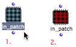
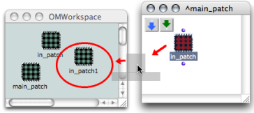
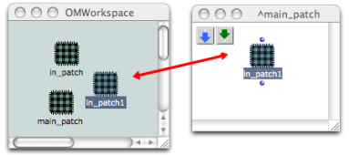

ci a ete desactive. Certaines fonctionnalites de ce guide sont restreintes.

# Conversions

## Converting an Abstraction into an Internal Abstraction

Procedure

|

To convert a patch into an internal patch, select the patch box and press `a`.  
  
---|---  
  
Note

The **copy** of the blue patch that is created is fully autonomous from the
master.

## Converting an Internal Abstraction into a "Basic" Abstraction

Procedure

Converting a red patch into a blue patch amounts to assigning it a reference
in the workspace.

To copy and convert an internal patch into a  **global** - blue - patch, drag
and drop the red patch in the workspace.

Modifications : Effects

Once the conversion is done, the abstraction as well as its reference will be
equally affected by possible modifications.

References :

Plan :

  * [OpenMusic Documentation](OM-Documentation)
  * [OM 6.6 User Manual](OM-User-Manual)
    * [Introduction](00-Sommaire)
    * [System Configuration and Installation](Installation)
    * [Going Through an OM Session](Goingthrough)
    * [The OM Environment](Environment)
    * [Visual Programming I](BasicVisualProgramming)
    * [Visual Programming II](AdvancedVisualProgramming)
      * [Abstraction](Abstraction)
        * [Abstraction Boxes](AbsBoxes)
          * [Standard Abstraction](BlueAbstraction)
          * [Internal Abstractions](RedAbstraction)
          * Conversions
        * [Application](AbsApplication)
        * [Recursive Patches](Recursion)
      * [Evaluation Modes](EvalModes)
      * [Higher-Order Functions](HighOrder)
      * [Control Structures](Control)
      * [Iterations: OMLoop](OMLoop)
      * [Instances](Instances)
      * [Interface Boxes](InterfaceBoxes)
      * [Files](Files)
    * [Basic Tools](BasicObjects)
    * [Score Objects](ScoreObjects)
    * [Maquettes](Maquettes)
    * [Sheet](Sheet)
    * [MIDI](MIDI)
    * [Audio](Audio)
    * [SDIF](SDIF)
    * [Lisp Programming](Lisp)
    * [Errors and Problems](errors)
  * [OpenMusic QuickStart](QuickStart-Chapters)

Navigation : [page precedente](RedAbstraction "page précédente\(Internal
Abstractions\)") | [page suivante](AbsApplication "page
suivante\(Application\)")

