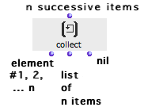
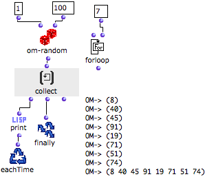

# Collect : Collecting Values

** Collect ** is the most basic collector of the
OMLoop module. It collects the values returned to its input in a list.

## Inputs and Outputs

|

Collect has one default input and three outputs :

  * "what" : collects successive values coming from other boxes

  * first output : appends each new value returned to its input, and returns this new element as a list

  * second output : returns the list of the collected elements

  * third output : resets the collected list to "nil", and returns an empty list.

  
  
---|---  
  
## Example : Building a Random List of Numbers

We want to make a list with seven random numbers between 1 and 100.

  1. Forloop defines a **number of loops** . The iteration will stop after seven loops. 

  2. Om-random calculates a random number, which is printed at each loop by EachTime and print.

  3. At each step, the successive elements are collected by collect.

  4. After seven loops, the iteration is stopped by forloop.

  5. When the iteration stops, Finally returns the list of the numbers collected by collect.

|

  
  
---|---  
  
References :

Plan :

  * [OpenMusic Documentation](OM-Documentation)
  * [OM 6.6 User Manual](OM-User-Manual)
    * [Introduction](00-Sommaire)
    * [System Configuration and Installation](Installation)
    * [Going Through an OM Session](Goingthrough)
    * [The OM Environment](Environment)
    * [Visual Programming I](BasicVisualProgramming)
    * [Visual Programming II](AdvancedVisualProgramming)
      * [Abstraction](Abstraction)
      * [Evaluation Modes](EvalModes)
      * [Higher-Order Functions](HighOrder)
      * [Control Structures](Control)
      * [Iterations: OMLoop](OMLoop)
        * [Iteration](LoopIntro)
        * [General Features](LoopGeneral)
        * [Evaluators](LoopEvaluators)
        * [Iterators](LoopIterators)
        * [Accumulators](LoopAccumulators)
          * Collect
          * [Sum](Sum)
          * [Min / Max](MinMax)
          * [Count](Count)
          * [Acum](Acum)
        * [Example : A Random Series](LoopExample)
      * [Instances](Instances)
      * [Interface Boxes](InterfaceBoxes)
      * [Files](Files)
    * [Basic Tools](BasicObjects)
    * [Score Objects](ScoreObjects)
    * [Maquettes](Maquettes)
    * [Sheet](Sheet)
    * [MIDI](MIDI)
    * [Audio](Audio)
    * [SDIF](SDIF)
    * [Lisp Programming](Lisp)
    * [Errors and Problems](errors)
  * [OpenMusic QuickStart](QuickStart-Chapters)

Navigation : [page precedente](LoopAccumulators "page
précédente\(Accumulators\)") | [page suivante](Sum "page
suivante\(Sum\)")

