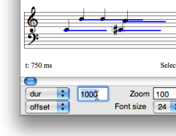
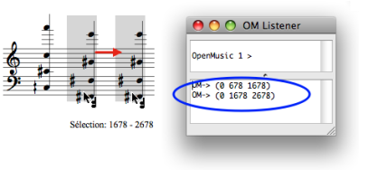
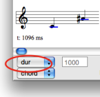

# Editing Other Slots

## Displaying Modes

Features

|

The editor control upper menu gives access to each slot of the object.

The displaying of a slot value can be combined with displaying mode of the
lower menu.  
  
---|---  
  
## Edition

Chords : Duration, MidiChannel, Dynamics

The duration of one or more selected note can be modified with the same
procedures as for notes.

  1. Select the `duration` menu item.

  2. Select the note tool.

  3. Select one or more notes and change their parametric value :

    * use the `->` or `<-` keys 
    * type a value in the editor control frame.

|

  
  
---|---  
  
Chord-Seq : Offsets

The chords onsets in a  chord-seq can be modified from the second chord.

  1. Select the chord tool.

  2. Use one of the following procedure :

    * drag and drop the item(s) 
    * use the `->` or `<-` keys : the offset value is decreased or increased by 100 milliseconds steps. Add `SHIFT` to change the value by 1000 midicents steps.

Modifying the offset of a chord "manually".

Legato

To display the legato value of notes in a chord-seq, select the `duration`
menu item in the editor control.

|

  
  
---|---  
  
Reminder : Pitch

|

Modifications can apply to notes, or to whole  chords or  chord-seqs .

  1. Select the tool corresponding to the item you want to transpose. 

  2. Transposing can be done : 

    * with a drag and drop
    * from the staff's scale : `↑` or `↓` keys,
    * from the midicents scale : click in the editor control frame and scroll the mouse upwards or downwards, or type a value.

  
  
---|---  
  
## Grid

  * To display or hide a grid in the editor, press `g` .
  * To adjust an item to and its duration to the grid, select it and press `a` .

The duration change is effective if the initial duration value is close to
that of the grid's step.

To change the grid's step, press `SHIFT` \+ `g` .

|

  
  
---|---  
  

|

To move the item or change its duration according to the grid's step, press
`SHIFT` \+ `<-` or `->` .  
  
---|---  
  
References :

Plan :

  * [OpenMusic Documentation](OM-Documentation)
  * [OM 6.6 User Manual](OM-User-Manual)
    * [Introduction](00-Sommaire)
    * [System Configuration and Installation](Installation)
    * [Going Through an OM Session](Goingthrough)
    * [The OM Environment](Environment)
    * [Visual Programming I](BasicVisualProgramming)
    * [Visual Programming II](AdvancedVisualProgramming)
    * [Basic Tools](BasicObjects)
    * [Score Objects](ScoreObjects)
      * [Presentation](Score-Objects-Intro)
      * [Rhythm Trees](RT)
      * [Score Players](ScorePlayer)
      * [Score Editors](ScoreEditors)
        * [Overview](Editor-Overview)
        * [Preferences](Editors-Prefs)
        * [Score Display](Editor-Display)
        * [Basic Editing](Editor-Basics)
        * [Harmonic Objects](Harmonic-Obj-Editor)
          * [Pitches](Editor-Pitch)
          * Other Slots
        * [Rhythmic Objects](Editor-Rhythm)
        * [Polyphonic Objects](Poly-Multi-Editor)
        * [Page Mode](Editor-PageMode)
        * [Tonal Display](Editor-Tonality)
        * [Microintervals Notation](Editor-Microintervals)
        * [Play Controls](Editor-Play)
      * [Quantification](Quantification)
      * [Export / Import](ImportExport)
    * [Maquettes](Maquettes)
    * [Sheet](Sheet)
    * [MIDI](MIDI)
    * [Audio](Audio)
    * [SDIF](SDIF)
    * [Lisp Programming](Lisp)
    * [Errors and Problems](errors)
  * [OpenMusic QuickStart](QuickStart-Chapters)

Navigation : [page precedente](Editor-Pitch "page précédente\(Pitches\)")
| [page suivante](Editor-Rhythm "page suivante\(Rhythmic Objects\)")

