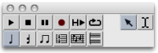

# Overview

Score editors allow to **visualize, listen to, modify, or create** instances.
Each score object - note ,  chord ,  chord-seq ,  voice ,  poly - has a
specific score editor. Editors open with a double click on a factory box.

The displaying and parametric values of a note object can be controled
directly via its editor.

Score objects are organized in a simple hierarchy with growing levels of
complexity, like in a matriochka. From the  note to the  poly , the panel of
score editors shows a growing number of editing tools. All editors follow the
paradigm of the  note editor.

## Windows Overview

The  editor window opens along with a  **general palette** , and a  **score
inspector** .

It shows a number of pop up menus, which allow to modify the displaying of the
score, and an Editor Control on the lower left corner, dedicated to editing
operations.

Score Inspector

The  ** score inspector ** gives access to all the related data of a selected
object, which can then possibly be modified.

The score inspector appears automatically at the selection of an item.

To display the score inspector, select the `Window / Score Inspector` menu.

|

  
  
---|---  
  
Modifying Parametric Values via the Editor Control

  * [Score Display](Editor-Display)

General Palette

|

The general palette is declined over the set of score editors. It provides :

  * **edition tools**  :  note ,  chord ,  group ,  measure ,  voice and  poly tools,
  * a  **player**
  * and two selection  **cursors** .

  
  
---|---  
  
The selected edition tool is displayed as small tag when hovering the mouse
over the score  : 

## Objects and Edition Levels

Edition Tools Overview

Each of these levels can be accessed via dedicated edition tools.

|

Tool

|

Applies to

|

Editors  
  
---|---|---|---  
  

|

** **Note** **

|

notes - within chords -

|

all editors  
  

|

** **Chord** **

|

chords

|

all editors but  note editors  
  

|

** **Group** **

|

 rhythmic groups within measures

|

voice and  poly editors  
  

|

** **Measure** **

|

entire measures within a voice

|

voice and  poly editors  
  

|

** **Voice** **

|

 one or more voices at once

|

voice and  poly editors  
  

|

** **Poly** **

|

a whole stack of voices at once

|

poly editors  
  
Example

The poly object integrates all edition levels :  note ,  chord ,  group ,
measure ,  voice .

[Zoom](../res/polystructure1_scr_1.png "Zoom \(nouvelle fenêtre\)")

References :

Plan :

  * [OpenMusic Documentation](OM-Documentation)
  * [OM 6.6 User Manual](OM-User-Manual)
    * [Introduction](00-Sommaire)
    * [System Configuration and Installation](Installation)
    * [Going Through an OM Session](Goingthrough)
    * [The OM Environment](Environment)
    * [Visual Programming I](BasicVisualProgramming)
    * [Visual Programming II](AdvancedVisualProgramming)
    * [Basic Tools](BasicObjects)
    * [Score Objects](ScoreObjects)
      * [Presentation](Score-Objects-Intro)
      * [Rhythm Trees](RT)
      * [Score Players](ScorePlayer)
      * [Score Editors](ScoreEditors)
        * Overview
        * [Preferences](Editors-Prefs)
        * [Score Display](Editor-Display)
        * [Basic Editing](Editor-Basics)
        * [Harmonic Objects](Harmonic-Obj-Editor)
        * [Rhythmic Objects](Editor-Rhythm)
        * [Polyphonic Objects](Poly-Multi-Editor)
        * [Page Mode](Editor-PageMode)
        * [Tonal Display](Editor-Tonality)
        * [Microintervals Notation](Editor-Microintervals)
        * [Play Controls](Editor-Play)
      * [Quantification](Quantification)
      * [Export / Import](ImportExport)
    * [Maquettes](Maquettes)
    * [Sheet](Sheet)
    * [MIDI](MIDI)
    * [Audio](Audio)
    * [SDIF](SDIF)
    * [Lisp Programming](Lisp)
    * [Errors and Problems](errors)
  * [OpenMusic QuickStart](QuickStart-Chapters)

Navigation : [page precedente](ScoreEditors "page précédente\(Score
Editors\)") | [page suivante](Editors-Prefs "page
suivante\(Preferences\)")

