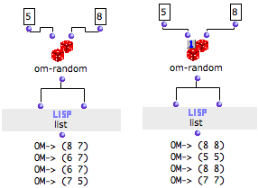

# Evaluate-Once Mode

## Properties

Use

[1]A box on "evaluate-once" mode is locked at each user-evaluation[2] after
the **first internal evaluation**. It remains locked for all subsequent
internal-evaluations[1]. When the **next user-evaluation** takes place, the
box is evaluated again.

A box on "eval-once" mode is evaluated once, and only once. This is valid :

  * if this box has multiple outputs,

  * if this box is connected to several upstream boxes,

  * for all upstream connected boxes.

Multiple Internal Evaluations

A box connected to several downstream boxes can be  evaluated several times at
a single evaluation : in this case, reproducing the evaluation of a box can be
either useless and lengthy. It can also be or a source of miscalculation,
when a box is likely to return different results , while it must return the
same values to all connected boxes.

A box set on "evaluate-once" mode returns the same values to all the boxes it
is connected to at a single evaluation.

Procedure

To set a box on "once" mode, press `b` and click on the upper left cross once.
A small  icon appears.

## Example

|

In the example below, the output of om-random is connected to the two inputs
of list. In both cases, om-random returns a different value every time is is
called. But :

  * when the evaluation mode is not specified,  **one** **** user evaluation of list triggers t **wo** internal evaluations of om-random, that is, one per input of the list function ;

  * on "once" mode, ** one ** user evaluation triggers a ** single ** internal evaluation, and both inputs of list get the same value. 

  
  
---|---  
  
References :

  1. Internal Evaluation

Evaluation of a box by OM, triggered by a user evaluation, or by the internal
evaluation of an upstream box connected to it.

  2. User Evaluation

A user evaluation triggers one or more internal evaluation of the box and of
possible upstream boxes connected to it.

Plan :

  * [OpenMusic Documentation](OM-Documentation)
  * [OM 6.6 User Manual](OM-User-Manual)
    * [Introduction](00-Sommaire)
    * [System Configuration and Installation](Installation)
    * [Going Through an OM Session](Goingthrough)
    * [The OM Environment](Environment)
    * [Visual Programming I](BasicVisualProgramming)
    * [Visual Programming II](AdvancedVisualProgramming)
      * [Abstraction](Abstraction)
      * [Evaluation Modes](EvalModes)
        * [Lock Mode](LockMode)
        * Evaluate-Once Mode
        * [Lambda Mode](LambdaMode)
        * [Reference Mode](RefMode)
      * [Higher-Order Functions](HighOrder)
      * [Control Structures](Control)
      * [Iterations: OMLoop](OMLoop)
      * [Instances](Instances)
      * [Interface Boxes](InterfaceBoxes)
      * [Files](Files)
    * [Basic Tools](BasicObjects)
    * [Score Objects](ScoreObjects)
    * [Maquettes](Maquettes)
    * [Sheet](Sheet)
    * [MIDI](MIDI)
    * [Audio](Audio)
    * [SDIF](SDIF)
    * [Lisp Programming](Lisp)
    * [Errors and Problems](errors)
  * [OpenMusic QuickStart](QuickStart-Chapters)

Navigation : [page precedente](LockMode "page précédente\(Lock Mode\)") |
[page suivante](LambdaMode "page suivante\(Lambda Mode\)")

