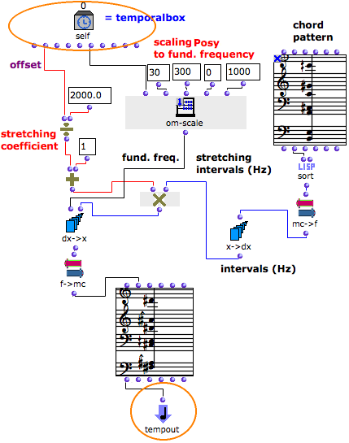

ci a ete desactive. Certaines fonctionnalites de ce guide sont restreintes.

# Example 1 : Programming With the Self Input Box

## Adding a TemporalBox into a Maquette

|

Each output of the Self Input Box can be connected to other boxes within the
patch of a TemporalBox.

This internal maquette contains one TemporalBox.

  * The program of the box integrates its vertical and temporal position in the conception of a chord sequence.
  * The fundamental pitch and structure of the resulting chord sequence can evolve according to the position of the TemporalBox where it belongs. 

  
  
---|---  
  
## Applying the Self Input Box Values Inside a Temporalbox : Programming a
Chord

  1. The " **posy** " - of the box is returned by the Self Input Box in the patch. Om-scale scales it between 30 and 300, range of a fundamental frequency. 

  2. A "pattern-chord" provides a harmonic structure that can be modified by the program. 

    * Mc->f converts the pitches of the chord into frequencies.
    * X->dx returns the intervals of the chord, starting from the fundamental. 
  3. The box's " **offset** "  is returned by the Self Input Box and converted into a **stretching coefficient** that applies to the intervals of the chord. 

  4. Eventually, these intervals are added to the fundamental frequency. 

  5. The resulting list of frequencies is converted into midicents by f->mc and returned to a chord box. This chord becomes the musical value of the box via a connection to the Tempout. 

References :

Plan :

  * [OpenMusic Documentation](OM-Documentation)
  * [OM 6.6 User Manual](OM-User-Manual)
    * [Introduction](00-Sommaire)
    * [System Configuration and Installation](Installation)
    * [Going Through an OM Session](Goingthrough)
    * [The OM Environment](Environment)
    * [Visual Programming I](BasicVisualProgramming)
    * [Visual Programming II](AdvancedVisualProgramming)
    * [Basic Tools](BasicObjects)
    * [Score Objects](ScoreObjects)
    * [Maquettes](Maquettes)
      * [Creating a Maquette](Maquette)
      * [TemporalBoxes](TemporalBoxes)
      * [The Maquette Editor](Editor)
      * [Maquette Programming](Programming%20Maquette)
        * [Functional Components](InputsOutputs)
        * [Evaluation](MaquetteEvaluation)
        * [The Synthesis Patch](Synthpatchprog)
        * [TempBoxes Programming](TempProgramming)
          * [The Self Input Box - Tempin](SelfInputBox)
          * Programming with the Tempin
          * [Temporal Relations](EX2)
      * [Maquettes in Patches](Maquettes%20in%20Patches)
    * [Sheet](Sheet)
    * [MIDI](MIDI)
    * [Audio](Audio)
    * [SDIF](SDIF)
    * [Lisp Programming](Lisp)
    * [Errors and Problems](errors)
  * [OpenMusic QuickStart](QuickStart-Chapters)

Navigation : [page precedente](SelfInputBox "page précédente\(The Self
Input Box – Tempin\)") | [page suivante](EX2 "page suivante\(Temporal
Relations\)")

