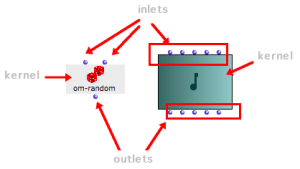
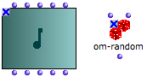
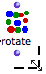
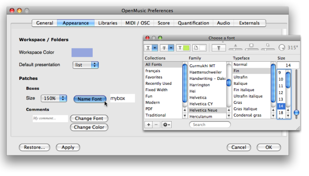

# Boxes Graphic Features and Components

This section deals with function boxes and factory boxes[1]. A [factory
box](FactoryBoxes) represents a  **class of objects** in a program, such
as notes, sounds, rhythms. A [function box](FunctionBoxes) refers to a
**function** that is designed to perform an operation upon objects.

## Main Layout

Kernel, Inlet(s), Outlet(s)

All boxes have :

  * a  **kernel** or "body" represented by an icon, 
  * at least one  **inlet** - a few rare functions have no inlet - which takes data,
  * at least one  **outlet** , which returns the data computed by the box,

|

  
  
---|---  
  
Inlets and outlets are used for connecting boxes. They are represented by
small blue balls and located on the upper and lower parts of the box. Each of
them is assigned a specific parameter that characterizes the function[2] or
the class[3] the box refers to.

Several functions or factory boxes belonging to a same category of operators
often share the same icon.

Factory boxes are often characterized by a blue-green background layer.

|

Function boxes and factory boxes belonging to the "combinatorial" and "score"
categories.  
  
---|---  
  
Boxes Names

The name of factory boxes is not displayed by default.

A number of simple functions - such as om+, om-, om/ ... show no name either.

Specific Graphic Features of Factory Boxes : Displaying Names

  * [Visualization](1-Visualization)

## Additional Characteristics

Evaluation Mode Label

  A  **small label** located on the upper left corner of the box can show the
possible evaluation[4] mode of a box. Evaluation modes are used for
**controlling the transmission** of resulting data in a program, or for
**performing specific tasks** .

|

Boxes on lock mode : computed values can't be changed.  
  
---|---  
  
Evaluation Modes of a Box :

  * [Evaluation Modes](EvalModes)

Resizing Area

|

All boxes have an invisible square resizing area in their bottom-right corner.  
  
---|---  
  
Manipulating Objects in a Patch Editor

  * [Elementary Manipulations](ElementaryManips)

## Boxes Appearance

The font style and icon size can be globally specified via the OM preferences.

  1. Select the `OM 6.X.X. / Preferences menu`. 

  2. Click on the `Appearance` tab and go to the **Patches - Boxes** section

[Zoom](../res/boxesstyle_scr_1.png "Zoom \(nouvelle fenêtre\)")

  1.     * To change the default size of the boxes icons, select a value in the `Boxes Size` pop up menu.

    * To change the font style of the boxes names, click on `Name Font`, and define a style in the font dialogue window.

  2.     * Press `Apply` and/or `OK` to validate the modifications.

    * Press `Restore` to get back to the OM default preferences. 

Applying Changes

The rotate function box, with the default appearance and with new appearance
preferences.

|

New preferences will apply to new items only. Close and reopen your patch
windows to see all box resized.  
  
---|---  
  
References :

  1. Factory Box

A box used for creating an instance, or exemplar, of a given class within a
visual program.

  2. Function

A  portion of code within a larger program, which performs a specific task.
Operates upon 0 or more parameters and returns a value.

  3. Class

A category of objects sharing common properties - characteristics and
behaviour. A class specifies the internal structure and behaviour of an
object. In OM, it is represented in a patch by a factory box that can produce
an instance of a class.

See also : Object, Instance

  4. Evaluation

In Lisp, evaluating an expression amounts to interpreting and reducing its
contents in order to return a result.

In OM, visual programs represent Lisp expressions and evaluating a box
triggers the calculus that will determine the value of these expressions.

Any kind of box can be evaluated and return something. To evaluate a box, ⤷
Click and press `v` or `Cmd` click on an outlet.

Plan :

  * [OpenMusic Documentation](OM-Documentation)
  * [OM 6.6 User Manual](OM-User-Manual)
    * [Introduction](00-Sommaire)
    * [System Configuration and Installation](Installation)
    * [Going Through an OM Session](Goingthrough)
    * [The OM Environment](Environment)
    * [Visual Programming I](BasicVisualProgramming)
      * [Patch Introduction](ProgrammingIntro)
      * [Adding Boxes Into a Patch](AddingBoxes)
      * [Elementary Manipulations](ElementaryManips)
      * [Boxes](Boxes)
        * Boxes Features
        * [Data Boxes](DataBox)
        * [Function Boxes](FunctionBoxes)
        * [Objects - Factory Boxes](FactoryBoxes)
        * [Abstraction Boxes](AbsBoxesIntro)
        * [Other Boxes](OtherBoxes)
      * [Box Inputs](BoxInputs)
      * [Connections](Connections)
      * [Evaluation](Evaluation)
      * [Documentation and Info](DocAndInfo)
      * [Comments](Comments)
      * [Pictures](Pictures)
      * [Saving / Reloading a Patch](SavingPatch)
      * [Dead Boxes](DeadBox)
    * [Visual Programming II](AdvancedVisualProgramming)
    * [Basic Tools](BasicObjects)
    * [Score Objects](ScoreObjects)
    * [Maquettes](Maquettes)
    * [Sheet](Sheet)
    * [MIDI](MIDI)
    * [Audio](Audio)
    * [SDIF](SDIF)
    * [Lisp Programming](Lisp)
    * [Errors and Problems](errors)
  * [OpenMusic QuickStart](QuickStart-Chapters)

Navigation : [page precedente](Boxes "page précédente\(Boxes\)") | [page
suivante](DataBox "page suivante\(Data Boxes\)")

